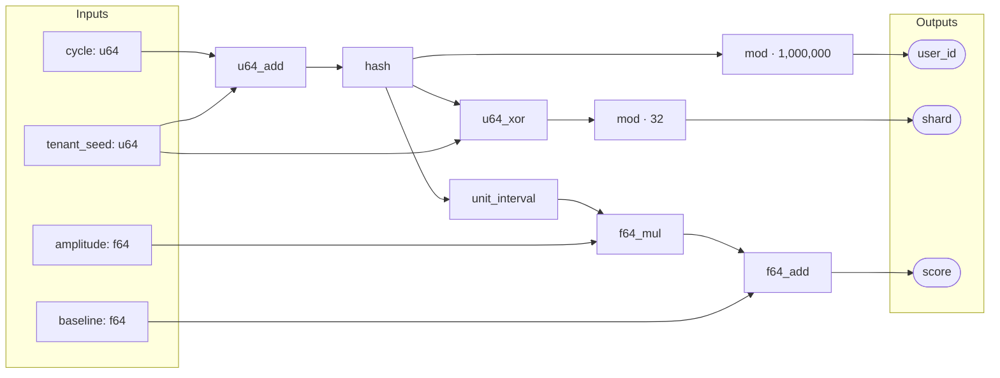
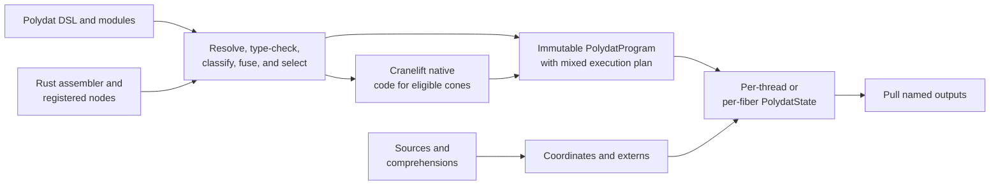

# Polydat

Polydat is a type-safe, native-code JIT compiler and function-graph runtime for
deterministic procedural data generation, parameter-space traversal, and
workload simulation in Rust. It compiles named inputs and composable functions
into a reusable kernel whose named outputs are evaluated on demand.

Graphs can be authored in the Polydat DSL or assembled directly from Rust.
The compiler resolves and checks every wire, inserts safe type adapters,
classifies value lifecycles, tracks provenance, and selects an execution form.
An immutable `PolydatProgram` can be shared across threads while each execution
context owns its own `PolydatState`.

Polydat is not a string evaluator wrapped around a collection of generators.
Its port types and node signatures are reified through compilation, allowing
eligible graph cones to be lowered through Cranelift to host-native machine code.
The default mixed engine targets native performance where the graph permits it
and keeps the complete typed interpreter as the semantic host and fallback.

Polydat is currently version 0.2.0 and is under active development. The source
and tests are authoritative; design documents describe both implemented
behavior and explicitly marked staged work.

## Quick start

Add Polydat to a Rust 2024 project:

```toml
[dependencies]
polydat = "0.2"
```

Compile a graph from DSL source and pull named results:

```rust
use polydat::dsl::compile_polydat;

fn main() -> Result<(), String> {
    let mut kernel = compile_polydat(r#"
        input cycle: u64

        hashed := hash(cycle)
        user_id := mod(hashed, 1000000)
        bucket := mod(hashed, 64)
    "#)?;

    for cycle in 0..10 {
        kernel.set_inputs(&[cycle]);
        let user_id = kernel.pull("user_id").as_u64();
        let bucket = kernel.pull("bucket").as_u64();
        println!("{cycle}: user={user_id}, bucket={bucket}");
    }

    Ok(())
}
```

From this repository:

```text
cargo run -p polydat --example basic
```

The [examples directory](crates/polydat/examples) also demonstrates the
programmatic assembler, expression syntax, module loading, context layering,
parameter-space projection, type safety, and sharing programs across threads.

## A function graph at a glance

A Polydat program is a directed graph of typed inputs, function nodes, and named
outputs. This conceptual graph derives three related values from four inputs:



The graph is more than a sequence of calls. `hash` fans out into three result
paths, `tenant_seed` participates in two different stages, and the floating-point
path joins derived and external values. Polydat type-checks each arrow, evaluates
shared intermediates once per input state, and tracks which input can invalidate
which output. Pulling `score` does not require evaluating the `user_id` or `shard`
suffixes; pulling them later can reuse the cached `hash` value.

## The model



The important separation is between the graph and its mutable evaluation
state. Nodes and wiring belong to the shared program. Input values, cached
outputs, invalidation state, scope bindings, and buffered iteration state
belong to an individual state or fiber.

For pure deterministic graphs, the same input coordinate and scope produce the
same result. Nodes with side effects or nondeterministic behavior must declare
that behavior in their metadata so the compiler does not apply invalid
optimizations.

## Why one graph?

Workload systems often separate command-line parameters, template variables,
procedural data recipes, operation bindings, and dimensional coordinates into
unrelated mechanisms. That makes precedence, type conversion, caching, and
diagnostics inconsistent.

Polydat puts those values on one typed substrate. The same rules answer where a
value came from, which inputs it depends on, when it may change, how it is
converted, and which outputs must be invalidated. That unified model is the
reason the project includes a language, compiler, runtime, iteration algebra,
and node library rather than being only a collection of random generators.

## What is implemented

| Area | Current capability |
| --- | --- |
| Graph construction | A typed DSL, nested expressions, modules, an assembler API, named multi-output nodes, constants, externs, and output selection. |
| Compilation | Wire resolution, type checking, safe adapter insertion, constant and scope-init handling, node fusion, lifecycle analysis, provenance, dead-code elimination, strict-wire validation, JIT-cone extraction, and Cranelift native code generation. |
| Runtime | Demand-driven named pulls, per-state caching, selective invalidation, shared immutable programs, per-fiber state, scope layering, cross-fiber cells, and structured diagnostics. |
| Iteration | Data-source factories, ranges and extending sources, cursor partitioning, typed projections, and structural comprehensions over Cartesian, zip, union, filter, and order forms. |
| Function library | Numeric and bitwise operations, hashes and digests, probability and sampling, strings and formatting, JSON, bytes and encodings, datetime, noise, interpolation, vector math, assertions, data files, and context-aware nodes. |
| Extensibility | `#[polydat_node]` derives node metadata and adapters from typed Rust functions and registers nodes through link-time inventory. Host applications can also provide reflected values, handles, resources, and logging bridges. |
| Inspection | Compiler events, program manifests, source-aware errors, graph round-trip checks, and DOT/Mermaid visualization. |

The compiler also embeds reusable `.polydat` modules for hashing, strings,
distributions, latency, time series, waves, Fourier helpers, and modeling.

## Types and wiring

Every node port has a `PortType`, and wiring is checked before a kernel can run.
The type plane includes:

- signed and unsigned integers from 8 through 128 bits;
- `f16`, `f32`, and `f64`;
- booleans, strings, bytes, JSON, reflected extension values, and resource
  handles;
- typed numeric vectors; and
- internal 128-bit register views with homogeneous integer and floating-point
  lanes.

Lossless widening adapters can be inserted automatically. Narrowing and other
potentially lossy conversions remain explicit. Runtime carriers use compact
representations where possible, while the port types preserve the exact wire
contract during compilation. See the [type-system
design](crates/polydat/docs/design/type_system.md) and [alignment
contract](crates/polydat/docs/design/type_system_alignment.md).

Values are also lifecycle-classified. Compile constants, values frozen once per
scope activation, and dynamic cycle values are kept distinct so caching,
invalidation, JIT selection, and nested scopes agree on when computation is
allowed to run.

## Execution engines

Polydat uses static wire types, node signatures, lifecycle metadata, and purity
contracts to determine which graph regions can run as native code. The normal
production form is an interpreter-hosted mixed kernel:

- P1 owns the complete semantic graph and supports the full value and node
  model.
- With the default `jit` feature and `JitMode::Auto`, eligible dynamic cones can
  be compiled as embedded P3 Cranelift segments containing native machine code.
- Unsupported nodes and boundary types stay in the interpreter; JIT eligibility
  is an optimization decision, not a requirement for a valid graph.
- P2 closure kernels and whole-kernel P3 variants remain available for testing,
  equivalence work, and specialized callers.
- Provenance-aware pull guards and push-side invalidation avoid recomputing
  unaffected graph regions.

The JIT uses the effective host ISA reported by Cranelift. Polydat's native
register type plane is currently 128 bits even on AVX2- or AVX-512-capable
hosts; it does not invent wider values that the installed backend cannot lower.

SIMD scalar-flow promotion is an explicit, opt-in Tier-1 path today. It can
discover and compile a sealed `u64` flow into `RegI64x2`, reserve an owned
perfect-ordinal input range, and drain results in scalar order across arbitrary
bursts with forward-only recovery. Normal `compile_polydat`/`pull` execution
does not silently enable this path. Broader lane types and automatic cost-based
selection remain gated by the [SIMD ISA and auto-promotion
SRD](crates/polydat/docs/design/simd_isa_autopromotion.md).

See [Engines](crates/polydat/docs/design/engines.md) and the [JIT boundary
design](crates/polydat/docs/design/jit_boundary.md) for the detailed execution
contracts.

For a reproducible example of one non-trivial graph running through all three
levels, see [Engine-ladder performance](crates/polydat/docs/performance.md). It
includes the source graph, P1/P2/P3 measurement contract, correctness gate, and
Criterion benchmark command.

## Iteration and parameter spaces

Polydat includes a coordinate algebra rather than treating iteration as an
external loop bolted onto the graph. Its comprehension subsystem compiles
structural Cartesian, zip, union, filter, and ordering forms into streams of
typed coordinate tuples. Cursor sources can be partitioned across concurrent
fibers, extended by policy, and projected into graph inputs.

Traversal strategies include lexicographic and reverse order, diagonal and
shell forms, deterministic shuffles, PRNG traversal, Latin hypercube sampling,
Halton sequences, and Sobol sequences. Cardinality, predicate analysis,
optimization, serialization, and legacy conversion live in the same subsystem.

The authoritative contracts are [Comprehension
Forms](crates/polydat/docs/design/comprehension_forms.md) for coordinate algebra
and [Cursor Partitions](crates/polydat/docs/design/cursor_partitions.md) for the
partition language, resolution math, ordering, and `cursor ... over ...`
semantics.

## Defining nodes in Rust

The `polydat-derive` workspace crate provides `#[polydat_node]`, re-exported as
`polydat::polydat_node`. The macro turns typed Rust functions into registered
Polydat nodes, including signatures, runtime conversion adapters, metadata, and
compiled hooks when the function shape supports them.

Node metadata can describe purity, commutativity, identity values, variadic
arity, constants and setup state, lifecycle behavior, and an exact typed SIMD
variant. Most consumers only need the `polydat` crate; they do not need a direct
dependency on `polydat-derive`.

The built-in catalog and source locations are summarized in [Node
Library](crates/polydat/docs/nodes.md).

## Cargo features

| Feature | Default | Purpose |
| --- | ---: | --- |
| `jit` | yes | Cranelift-backed P3 cones and explicit native-kernel APIs. |
| `vectordata` | no | Vector-dataset access nodes for ML/AI-oriented workloads. |

For an interpreter-capable build without Cranelift:

```toml
[dependencies]
polydat = { version = "0.2", default-features = false }
```

## Workspace and development

This repository contains two Rust 2024 crates:

- [`polydat`](crates/polydat) — public types, DSL, graph compiler, execution
  engines, iteration/comprehension system, standard node library, and runtime.
- [`polydat-derive`](crates/polydat-derive) — implementation of the
  `#[polydat_node]` procedural macro.

Useful commands:

```text
# Full workspace correctness suite
cargo test --workspace

# Verify the non-JIT build
cargo check -p polydat --no-default-features

# Run an example
cargo run -p polydat --example expression_language

# Build API documentation
cargo doc --workspace --no-deps

# Criterion suites; these are intentionally performance-intensive
cargo bench -p polydat --bench polydat_throughput
cargo bench -p polydat --bench cell_throughput
cargo bench -p polydat --bench simd_autopromotion
```

## Documentation map

Good starting points:

- [Illustrations](crates/polydat/docs/illustrations.md) — runnable DSL and
  assembler examples.
- [Language Spec](crates/polydat/docs/design/language_spec.md) — syntax, type
  inference, node contracts, wiring, and invalidation.
- [Node Library](crates/polydat/docs/nodes.md) — built-in function families and
  their source modules.
- [Runtime Model](crates/polydat/docs/design/runtime_model.md) — ownership,
  caching, invalidation, layering, and determinism axioms.
- [Graph Compiler](crates/polydat/docs/design/graph_compiler.md) — compiler
  passes and their ordering.
- [Engines](crates/polydat/docs/design/engines.md) — P1/P2/P3 execution and
  provenance optimization.
- [Engine-ladder Performance](crates/polydat/docs/performance.md) — one typed
  graph measured consistently through P1, P2, and P3.
- [Comprehension Forms](crates/polydat/docs/design/comprehension_forms.md) —
  coordinate algebra and dispense semantics.
- [Cursor Partitions](crates/polydat/docs/design/cursor_partitions.md) — partition
  grammar, resolution, ordering, metadata, and cursor narrowing.
- [Type System](crates/polydat/docs/design/type_system.md) — scalar, vector,
  register, extension, and handle types.
- [SIMD ISA Selection and Scalar-Flow
  Auto-Promotion](crates/polydat/docs/design/simd_isa_autopromotion.md) — current
  native-width policy, landed Tier-1 slice, and remaining gates.
- [All design documents](crates/polydat/docs/design) — the complete SRD set.

Published API documentation is configured for
[docs.rs/polydat](https://docs.rs/polydat).

## History and license

Polydat originated as a reduction of the variate-generation and parameter
machinery used by NoSQLBench and was extracted from the
[nb-rs](https://github.com/nosqlbench/nb-rs) workspace. It now evolves as an
independent crate and repository.

Licensed under Apache-2.0. See [LICENSE](LICENSE).
