# Polydat

Polydat is a compiler and runtime for deterministic procedural data in Rust.
You declare typed inputs and a graph of named functions; Polydat compiles the
graph into a reusable kernel whose named outputs are pulled on demand, as
native machine code where the graph permits it.

Polydat powers the variates subsystem for [nmbrs](https://github.com/nosqlbench/nmbrs), the
successor to NoSQLBench.

## Quick start

Add Polydat to a Rust 2024 project:

```toml
[dependencies]
polydat = "0.2"
```

Compile a graph from DSL source and pull named results:

```rust
use polydat::dsl::compile_polydat_kernel;

fn main() -> Result<(), polydat::KernelError> {
    let mut kernel = compile_polydat_kernel(r#"
        input cycle: u64

        hashed := hash(cycle)
        user_id := mod(hashed, 1000000)
        bucket := mod(hashed, 64)
    "#)?;

    println!("cycle  user_id  bucket");
    for cycle in 0..5 {
        kernel.set_inputs(&[cycle]);
        let user_id = kernel.pull("user_id").as_u64();
        let bucket = kernel.pull("bucket").as_u64();
        println!("{cycle:>5}  {user_id:>7}  {bucket:>6}");
    }

    Ok(())
}
```

```text
cycle  user_id  bucket
    0   607535      47
    1   822465       1
    2   348110      14
    3   139053      45
    4   603978      10
```

The same cycle always yields the same values, on any thread and any host,
with no state carried between cycles. Run this from the repository with
`cargo run -p polydat --example basic`. The
[examples directory](crates/polydat/examples) also covers the programmatic
assembler, expression syntax, module loading, context layering, parameter-space
projection, cursor partitions, traversal strategies, type safety, and sharing
programs across threads.

For everything in one place, [A toy test
definition](crates/polydat/docs/tutorials/toy_test_definition.md) is a single grammar
file that declares its parameters, describes itself, binds its test flow as
a comprehension, traverses it with `for`, unwinds a hierarchic dataset in
each activation, and derives the load, read, and verify statements of a
test flow. The `polydat` binary runs it directly.

## A function graph at a glance

The DSL is a literal notation for a directed graph. Each `name := expr` line
declares a named wire, and each function call in the expression declares a
node that feeds it. This program derives three related values from four typed
inputs:

```text
input cycle: u64
input tenant_seed: u64
input amplitude: f64
input baseline: f64

hashed  := hash(u64_add(cycle, tenant_seed))
user_id := mod(hashed, 1000000)
shard   := mod(u64_xor(hashed, tenant_seed), 32)
score   := f64_add(f64_mul(unit_interval(hashed), amplitude), baseline)
```



The graph is more than a sequence of calls. `hashed` fans out into three result
paths, `tenant_seed` participates in two different stages, and the floating-point
path joins derived and external values. Polydat type-checks each arrow, evaluates
shared intermediates once per input state, and tracks which input can invalidate
which output. Pulling `score` does not evaluate `user_id` or `shard`; pulling
them later reuses the cached `hashed` value.

## Why it is built this way

Three limits shape the design.

**Data complexity lives in the graph, not in the data.** A record is a pure
function of its input coordinate. However rich the record, the work to produce
it is bounded by the size of the graph cone that its outputs reach, and each
node in that cone is evaluated at most once per input state. Adding a million
records adds nothing to the program; adding a field adds one node.

**Scale is the size of the coordinate space, not of anything stored.** A
kernel with a `u64` cycle addresses 2^64 records that never need to exist at
once. Any record can be regenerated from its coordinate in isolation. A PRNG
stream must be advanced through records 1 to N-1 to reach record N; a Polydat
kernel reaches it directly. Because nothing mutable is shared, a domain can be
split across fibers, threads, or hosts with interval arithmetic alone, and the
partitions can be traversed in any order and verified by regeneration.

**Efficiency has a floor set by the arithmetic itself.** Once the graph is
typed and its purity known, the remaining costs are interpretation, dispatch,
and repeated work. Polydat removes repeated work through memoization and
selective invalidation, removes dispatch by fusing nodes, and removes
interpretation by lowering eligible cones to native code. What is left is the
cost of the hashes and arithmetic, which is the same cost a hand-written
generator would pay.

These limits are why Polydat is a compiler and a runtime rather than a library
of generators. Determinism, cost bounds, and cross-fiber equivalence are stated
as named axioms in the
[Runtime Model](crates/polydat/docs/design/runtime_model.md), and every engine
must satisfy them.

## The model



The compiler resolves and checks every wire, inserts safe type adapters,
classifies value lifecycles, tracks provenance, and selects an execution form.
The result is an immutable `PolydatProgram` that can be shared across threads,
while each execution context owns its own `PolydatState`.

That separation is the important one. Nodes and wiring belong to the shared
program. Input values, cached outputs, invalidation state, scope bindings, and
buffered iteration state belong to an individual state or fiber.

For pure deterministic graphs, the same input coordinate and scope produce the
same result. Nodes with side effects or nondeterministic behavior must declare
that behavior in their metadata so the compiler does not apply invalid
optimizations.

## Engines at a glance

Three engines share one semantic model:

- **P1** is the typed interpreter. It supports the complete value and node
  model and is the semantic host and fallback for everything else.
- **P2** compiles nodes to closures over flat slots. It is used for testing,
  equivalence work, and specialized callers.
- **P3** lowers eligible graph cones through Cranelift to host-native machine
  code.

With the default `jit` feature, the kernel a host gets by default is P3: native
segments for every run of nodes with a lowering, closure steps for the rest,
over one slot buffer. Every engine accepts every program, so native
eligibility is an optimization, not a requirement for a valid graph, and the
interpreter is the oracle the others are checked against.

One eleven-node graph with three inputs and four outputs is measured through
every engine on one core, and one JSON document with a projection is rendered
through them. The graphs, the measurement contract, the correctness gate, the
benchmark commands, and the current numbers with their confidence intervals are
in [Engine-ladder performance](crates/polydat/docs/guides/performance.md); the
README keeps no copy of the table, so the two cannot disagree.

## Why one graph?

Workload systems often separate command-line parameters, template variables,
procedural data recipes, operation bindings, and dimensional coordinates into
unrelated mechanisms. That makes precedence, type conversion, caching, and
diagnostics inconsistent.

Polydat puts those values on one typed substrate. The same rules answer where a
value came from, which inputs it depends on, when it may change, how it is
converted, and which outputs must be invalidated. That unified model is the
reason the project includes a language, compiler, runtime, iteration algebra,
and node library rather than being only a collection of random generators.

## Capabilities

| Area | Capability |
| --- | --- |
| Graph construction | A typed DSL, nested expressions, modules, an assembler API, named multi-output nodes, constants, externs, and output selection. |
| Compilation | Wire resolution, type checking, safe adapter insertion, constant and scope-init handling, node fusion, lifecycle analysis, provenance, dead-code elimination, strict-wire validation, JIT-cone extraction, and Cranelift native code generation. |
| Runtime | Demand-driven named pulls, per-state caching, selective invalidation, shared immutable programs, per-fiber state, scope layering, cross-fiber cells, and structured diagnostics. |
| Iteration | Data-source factories, ranges and extending sources, cursor partitioning, typed projections, and structural comprehensions over Cartesian, zip, union, filter, and order forms. |
| Function library | Numeric and bitwise operations, hashes and digests, probability and sampling, strings and formatting, JSON, bytes and encodings, datetime, noise, interpolation, vector math, assertions, data files, and context-aware nodes. |
| Extensibility | `#[polydat_node]` derives node metadata and adapters from typed Rust functions and registers nodes through link-time inventory. Host applications can also provide reflected values, handles, resources, and logging bridges. |
| Inspection | Compiler events, program manifests, source-aware errors, graph round-trip checks, and DOT/Mermaid visualization. |

The compiler also embeds reusable `.polydat` modules for hashing, strings,
distributions, latency, time series, waves, Fourier helpers, and modeling.

## Types and wiring

Every node port has a `PortType`, and wiring is checked before a kernel can run.
The type plane includes:

- signed and unsigned integers from 8 through 128 bits;
- `f16`, `f32`, and `f64`;
- booleans, strings, bytes, JSON, reflected extension values, and resource
  handles;
- typed numeric vectors; and
- internal 128-bit register views with homogeneous integer and floating-point
  lanes.

Lossless widening adapters can be inserted automatically. Narrowing and other
potentially lossy conversions remain explicit. Runtime carriers use compact
representations where possible, while the port types preserve the exact wire
contract during compilation. See the [type-system
design](crates/polydat/docs/design/type_system.md) and [alignment
contract](crates/polydat/docs/design/type_system_alignment.md).

Values are also lifecycle-classified. Compile constants, values frozen once per
scope activation, and dynamic cycle values are kept distinct so caching,
invalidation, JIT selection, and nested scopes agree on when computation is
allowed to run.

## Execution engines

Polydat uses static wire types, node signatures, lifecycle metadata, and purity
contracts to determine which graph regions can run as native code. The normal
production form is an interpreter-hosted mixed kernel:

- P1 owns the complete semantic graph and supports the full value and node
  model.
- With the default `jit` feature and `JitMode::Auto`, eligible dynamic cones can
  be compiled as embedded P3 Cranelift segments containing native machine code.
- Unsupported nodes and boundary types stay in the interpreter; JIT eligibility
  is an optimization decision, not a requirement for a valid graph.
- P2 closure kernels and whole-kernel P3 variants remain available for testing,
  equivalence work, and specialized callers.
- Provenance-aware pull guards and push-side invalidation avoid recomputing
  unaffected graph regions.

The JIT uses the effective host ISA reported by Cranelift. Polydat's native
register type plane is currently 128 bits even on AVX2- or AVX-512-capable
hosts; it does not invent wider values that the installed backend cannot lower.

SIMD scalar-flow promotion is an explicit, opt-in Tier-1 path. It can
discover and compile a sealed `u64` flow into `RegI64x2`, reserve an owned
perfect-ordinal input range, and drain results in scalar order across arbitrary
bursts with forward-only recovery. Normal `compile_polydat_kernel`/`pull`
execution does not silently enable this path. Broader lane types and automatic cost-based
selection are outside the current [SIMD ISA and auto-promotion
specification](crates/polydat/docs/design/simd_isa_autopromotion.md).

See [Engines](crates/polydat/docs/design/engines.md) and the [JIT boundary
design](crates/polydat/docs/design/jit_boundary.md) for the detailed execution
contracts.

For a reproducible example of one non-trivial graph running through all three
levels, see [Engine-ladder performance](crates/polydat/docs/guides/performance.md). It
includes the source graph, P1/P2/P3 measurement contract, correctness gate, and
Criterion benchmark command.

## Iteration and parameter spaces

Polydat includes a coordinate algebra rather than treating iteration as an
external loop bolted onto the graph. Its comprehension subsystem compiles
structural Cartesian, zip, union, filter, and ordering forms into streams of
typed coordinate tuples. Cursor sources can be partitioned across concurrent
fibers, extended by policy, and projected into graph inputs.

Traversal strategies include lexicographic and reverse order, diagonal and
shell forms, deterministic shuffles, PRNG traversal, Latin hypercube sampling,
Halton sequences, and Sobol sequences. Cardinality, predicate analysis,
optimization, serialization, and legacy conversion live in the same subsystem.

The `for` construct brings comprehensions into the grammar. `name := for ...`
binds a comprehension as a value with independent stream factories, and
`for ... { body }` traverses one: the body compiles once into a child
program, and each tuple activates a fresh state over it with the element
names as typed wires, outer wires cascaded in, and any cursor declared
`over` an element narrowed to that element's slice. A three-level traversal
compiles three body programs however many tuples flow through it.

```text
flow := for phase in load,verify, p in partitions("*/4", {rows_total})

for flow {
    cursor rows = range(0, 1000000) over p
    row  := mod_in(cycle, rows.cursor)
    stmt := select_str(str_eq(phase, "load"), load_stmt, verify_stmt)
}
```

The authoritative contracts are [Comprehension
Forms](crates/polydat/docs/design/comprehension_forms.md) for coordinate algebra
and [Cursor Partitions](crates/polydat/docs/design/cursor_partitions.md) for the
partition language, resolution math, ordering, and `cursor ... over ...`
semantics.

## Defining nodes in Rust

The `polydat-derive` workspace crate provides `#[polydat_node]`, re-exported as
`polydat::polydat_node`. The macro turns typed Rust functions into registered
Polydat nodes, including signatures, runtime conversion adapters, metadata, and
compiled hooks when the function shape supports them.

Node metadata can describe purity, commutativity, identity values, variadic
arity, constants and setup state, lifecycle behavior, and an exact typed SIMD
variant. Most consumers only need the `polydat` crate; they do not need a direct
dependency on `polydat-derive`.

The built-in catalog and source locations are summarized in [Node
Library](crates/polydat/docs/reference/nodes.md).

## Command line

The crate ships a `polydat` binary for compiling, explaining, and running
programs without writing a host. Install it from crates.io with
`cargo install polydat`. From a checkout, the repository root is a workspace
rather than a package, so point at the crate:

```text
cargo install --path crates/polydat
cargo run -p polydat -- run graph.polydat --cycles 10 --emit csv
```

```text
polydat run graph.polydat --cycles 1000000 --fibers 8 --emit csv --timing
polydat run graph.polydat tenant_seed=7 --emit jsonl --outputs user_id,score
polydat check graph.polydat --stats --manifest
polydat explain graph.polydat
polydat explain graph.polydat wires engines provenance
polydat viz graph.polydat --format mermaid
```

`viz` renders the program's graph as DOT, Mermaid, or SVG. Coordinates share
one `INPUTS` register, and each `extern` port is drawn as its own port node
labeled with its kind, name, type, and default, wired to every node that reads
it.

Optional behaviors are graph transforms rather than runtime decorators.
`--emit` appends one `emit_row` binding that names the selected wires, so
emission is an ordinary side-channel node inside the kernel with access to
the local scope. Bare `name=value` arguments assign externs and inputs by
rewriting their declarations, and the program's own typing fuses the text
to the declared type.
Fibers each own a state over the shared program and claim
chunks of cycles; rows come out in cycle order unless `--unordered` is
given. `--timing` reports compile time, wall time, throughput, and per-fiber
busy time as text or JSON. `explain` narrates each compilation phase, from
tokens through wires, types, lifecycle, constants, fusion, engine
selection, provenance, and traversals, and accepts phase names to narrate
one at a time.

A program with top-level `for` traversals runs in traversal mode: the emit
binding is inserted into each body, fibers take activations by index, and
each activation runs its cycles under the traversal rule, capped by
`--cycles`. See [The `for` Construct](crates/polydat/docs/design/for_traversal.md).

The binary is behind the default `cli` feature. Library consumers who
disable default features do not pull in its dependencies.

## Cargo features

| Feature | Default | Purpose |
| --- | ---: | --- |
| `jit` | yes | Cranelift-backed P3 cones and explicit native-kernel APIs. |
| `cli` | yes | The `polydat` command-line harness. |
| `vectordata` | no | Vector-dataset access nodes for ML/AI-oriented workloads. |

For an interpreter-capable library build without Cranelift or the binary:

```toml
[dependencies]
polydat = { version = "0.2", default-features = false }
```

## Workspace and development

This repository contains three Rust 2024 crates:

- [`polydat`](crates/polydat) — public types, graph compiler, execution
  engines, iteration/comprehension runtime, standard node library, and
  runtime. It re-exports the grammar crate at the paths below.
- [`polydat-grammar`](crates/polydat-grammar) — the language without the
  runtime: lexer, parser, AST and projector, the comprehension
  sub-language and its algebra, the tile template parsers, and the port
  type vocabulary. Reachable through `polydat::dsl`,
  `polydat::iteration::comprehension`, and `polydat::ast::PortType`; a
  tool that only reads or prints Polydat source links this crate alone.
- [`polydat-derive`](crates/polydat-derive) — implementation of the
  `#[polydat_node]` procedural macro.

Useful commands:

```text
# Full workspace correctness suite (one process per test; the crates
# run no doctests, their rustdoc examples are tests of their own)
cargo nextest run --workspace

# Verify the non-JIT build
cargo check -p polydat --no-default-features

# Run an example
cargo run -p polydat --example expression_language

# Build API documentation
cargo doc --workspace --no-deps

# Criterion suites; these are intentionally performance-intensive
cargo bench -p polydat --bench polydat_throughput
cargo bench -p polydat --bench cell_throughput
cargo bench -p polydat --bench simd_autopromotion
```

## Documentation map

The [documentation index](crates/polydat/docs/README.md) lists every
document by section: tutorials, guides, reference, and design.

Tutorials:

- [A toy test definition](crates/polydat/docs/tutorials/toy_test_definition.md) — one
  grammar file combining parameters, self-description, hierarchy, modules,
  partitions, and a test flow.
- [Illustrations](crates/polydat/docs/tutorials/illustrations.md) — runnable DSL and
  assembler examples, including cursor partitions and traversal strategies.
- [Polytile tutorial](crates/polydat/docs/tutorials/polytile_tutorial.md) —
  templates whose holes are wires, from a one-line text tile to nested
  projections and the compiler's refusals.

Guides:

- [Embedding Polydat](crates/polydat/docs/guides/embedding.md) — what a
  host owns and what Polydat owns, the APIs for compiling, driving,
  sharing, and extending a kernel, and the extension points.
- [Compilation levels](crates/polydat/docs/guides/compilation.md) — the
  interpreter, the closure tier, the hybrid kernel, and native code.
- [Engine-ladder Performance](crates/polydat/docs/guides/performance.md) — one typed
  graph measured consistently through P1, P2, and P3.

Reference:

- [Node Library](crates/polydat/docs/reference/nodes.md) — built-in function families and
  their source modules.

Design:

- [Language Spec](crates/polydat/docs/design/language_spec.md) — syntax, type
  inference, node contracts, wiring, and invalidation.
- [Runtime Model](crates/polydat/docs/design/runtime_model.md) — ownership,
  caching, invalidation, layering, and determinism axioms.
- [Graph Compiler](crates/polydat/docs/design/graph_compiler.md) — compiler
  passes and their ordering.
- [Engines](crates/polydat/docs/design/engines.md) — P1/P2/P3 execution and
  provenance optimization.
- [Comprehension Forms](crates/polydat/docs/design/comprehension_forms.md) —
  coordinate algebra and dispense semantics.
- [The `for` Construct](crates/polydat/docs/design/for_traversal.md) —
  comprehension producers and traversal scopes in the grammar: typing,
  activation, cursors, and the one-program-per-position property.
- [Polytile](crates/polydat/docs/design/polytile.md) — compiled variate
  templates: static skeletons with typed holes, encodings, projections
  over comprehensions, and native lowering.
- [Compiled Non-Scalar Slots](crates/polydat/docs/design/compiled_handles.md) —
  how strings, JSON, and tiles flow through the compiled engines.
- [Cursor Partitions](crates/polydat/docs/design/cursor_partitions.md) — partition
  grammar, resolution, ordering, metadata, and cursor narrowing.
- [Type System](crates/polydat/docs/design/type_system.md) — scalar, vector,
  register, extension, and handle types.
- [SIMD ISA Selection and Scalar-Flow
  Auto-Promotion](crates/polydat/docs/design/simd_isa_autopromotion.md) — current
  native-width policy, landed Tier-1 slice, and remaining gates.
- [All design documents](crates/polydat/docs/design) — the complete SRD set.

Published API documentation is configured for
[docs.rs/polydat](https://docs.rs/polydat).

## History and license

Polydat originated as a reduction of the variate-generation and parameter
machinery used by NoSQLBench and was extracted from the
[nb-rs](https://github.com/nosqlbench/nb-rs) workspace. It now evolves as an
independent crate and repository, and powers the variates subsystem for
[nmbrs](https://github.com/nosqlbench/nmbrs), the successor to NoSQLBench.

Licensed under Apache-2.0. See [LICENSE](LICENSE).
