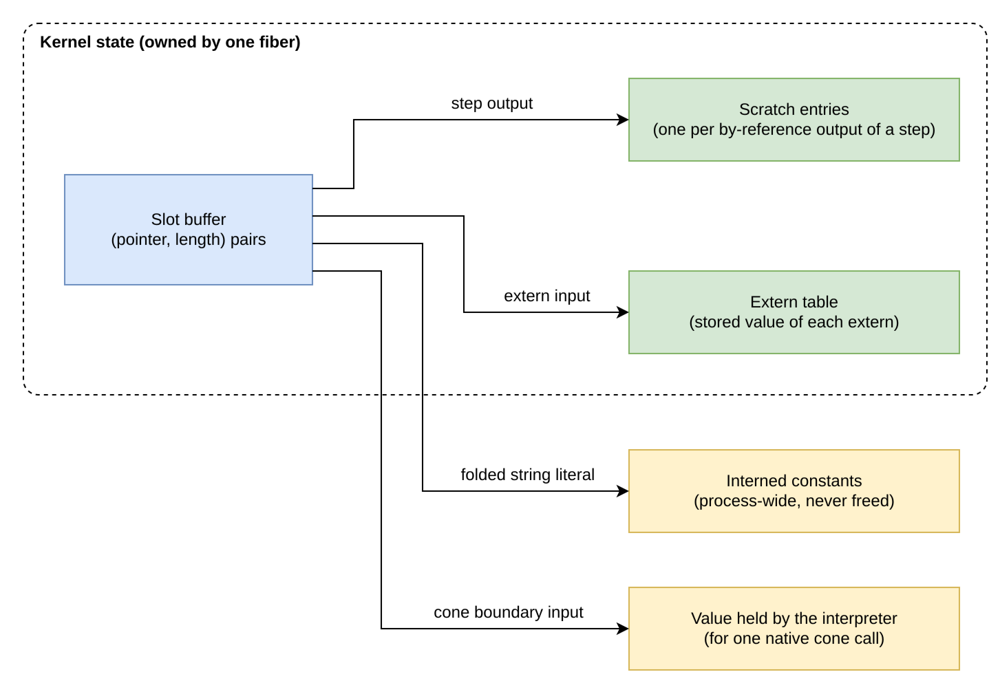

# Compiled By-Reference Slots

This document specifies how the five by-reference types (`Str`,
`Bytes`, `Json`, `Ext`, and `Handle`) are represented in the slots of
the compiled tiers: the closure tier P2, the native tier P3, and the
pure native tier. The compiled tiers run over a flat buffer of `u64`
slots, and a value of these types does not fit one slot. The document
fixes the slot representation, which storage each pair points into and
who owns it, and what is copied across the boundary between the
interpreter and the compiled tiers. The representation obeys R1 of the
[Runtime Model](runtime_model.md): a step's output is kept and returned
by every pull until an input in its provenance changes, and nothing
else reclaims its storage. This document amends [Engines](engines.md)
§6, [Type-System Alignment](type_system_alignment.md) §5–§7, and the
S-axioms of [JIT Boundary](jit_boundary.md).

**Ownership.** Polydat owns the slot color, the scratch ownership rule,
the boundary marshalling, the closure kit, and the equivalence tests.
Hosts own nothing here: a host reads the same `Value`s from all four
engines (the interpreter P1, the closure tier P2, native P3, and pure
native), at the P1 boundary, and every read is a copy.

**Related specifications.**
[Runtime Model](runtime_model.md) (R1, the currency rule; L1, state per
fiber), [Composition Substrate](composition_substrate.md) (L1, each
layer owns its state), [Engines](engines.md) (the engine lattice and
the slot colors), [JIT Boundary](jit_boundary.md) (axioms S1–S10),
[Type-System Alignment](type_system_alignment.md) (type planes),
[Polytile](polytile.md) §7 (the first consumer).

## Terms

The terms of the [Runtime Model](runtime_model.md) (program, kernel,
node, wire, input, write, change, pull, cone, provenance, fusion unit,
step, current, round, volatile) apply. This document also uses the
following.

- **Slot and slot buffer.** A compiled kernel stores every wire's
  value in a flat array of `u64` words, its slot buffer. Each port
  occupies one or two consecutive words, its slots.
- **Slot color.** The way a port's type is laid out in its slots,
  fixed by the type alone. `Imm1` is one word holding the value
  itself; `Imm2` is two words holding the value itself (a 128-bit
  integer or register); `Ref2` is two words holding a pointer and a
  length that refer to the value stored elsewhere.
- **Reference pair.** The two words of a `Ref2` slot: `ptr`, the
  address of the value's first element, and `len`, its element count.
  A reference pair does not own what it points to; §3 states what
  does.
- **Scratch entry.** A piece of storage, such as a byte buffer or a
  `Value`, that a kernel's state allocates for one step and keeps
  beside its slot buffer. A step writes its by-reference outputs into
  its scratch entries.
- **Publish.** To write a reference pair into an output's slots after
  the value it points to has been written. A consumer reads a pair
  only after its producer has published it.
- **Extern.** An input written by name by the host (`set_input`),
  rather than a coordinate.
- **Closure kit (kit).** A function the `#[polydat_node]` macro
  generates for each node, which runs the node's body directly on the
  slot buffer: it reads the node's arguments from their slots, calls
  the body, and writes the result into the output slots and scratch
  entries. §5 specifies it.
- **Lowering.** A translation of a node into native code. A *named
  lowering* is one written for a specific node; a node without one can
  still run natively by calling its kit (§6).
- **Classifier.** The compiler pass that decides, for each node, which
  engine tier runs it and by which lowering.
- **Segment and native cone.** A segment is a fusion unit of the
  native engine (P3): a group of nodes compiled to one native
  function. A native cone is
  a group of nodes that the interpreter compiles to one native
  function and calls as a single node.
- **Marshalling.** Converting a `Value` into its slot form, or a slot
  form back into a `Value`, where a compiled kernel meets the host or
  the interpreter (§4).

## 1. Constraints on the representation

Every port has a slot color fixed at build. `Imm1` and `Imm2` slots
hold the value itself, and a `Ref2` slot holds a reference pair whose
target has an owner the build can identify. The classifier admits a
node to a compiled tier only when each of its ports has a lowering.
The five by-reference types need a slot representation, and three
constraints restrict which one it can be.

- **There is no cycle.** Under R1 a step is current until an input in
  its provenance changes, and invalidation is per input, never all at
  once. A representation whose storage is reclaimed at a periodic reset
  would be an all-or-none invalidation, which the runtime model does
  not have. Exempting a step from R1 so that its output survives such a
  reset would break the model's caching rule rather than refine it.
- **No storage belongs to a thread.** L1
  ([Composition Substrate](composition_substrate.md)) puts every piece
  of state in the fiber's own `PolydatState`; the program is shared and
  read-only. Storage that belongs to no state would need an axiom to
  define its lifetime, where storage owned by a state gets its lifetime
  from that ownership.
- **A reference is one dereference.** S7
  ([JIT Boundary](jit_boundary.md)) allows exactly one static
  dereference per reference access, and for that reason forbids index
  tables and arena handles. A table handle is looked up in a table and
  an arena handle is decoded against a chunk list; both are the second
  dereference S7 forbids.

The typed vectors already satisfy all three constraints. A `VecF32`
output is a `Ref2` pair into a scratch buffer that the kernel's state
owns for exactly that (step, port); the pair is republished when the
step runs and is valid until the step runs again (S3, S4). This
document applies the same representation to the five by-reference
types: they are `Ref2` too.

## 2. The slot color

`SlotColor` has three members, and every port type has exactly one of
them (S1):

| Color | Width | Members | Meaning |
|---|---:|---|---|
| `Imm1` | 1 | scalars | Immediate data; never an address. |
| `Imm2` | 2 | `U128/I128`, `Reg128` views | Two immediate limbs; never an address. |
| `Ref2` | 2 | all `Vec*` types, `Str`, `Bytes`, `Json`, `Ext`, `Handle` | Engine-internal `(ptr, len)` with a proven owner. |

For a string or byte string the pair is the bytes: `ptr` to the first
byte, `len` the byte count, the same view a `&str` or `&[u8]` is. For
a JSON, extension, or handle value the pair is a one-element slice of
`Value`: `ptr` to the `Value`, `len` one. A `len` of zero on such a
slot is the empty string, the empty byte string, or `None`, which is
how an unset extern of these types reads where nothing keeps a `None`
mask.

`PortType::scratch_elem()` names the scratch entry a producer of each
`Ref2` type owns (§3): `Str`, `Bytes`, or `Value` beside the seven
vector element types. Generated native code treats a pair as it treats
a vector's: it loads and stores the two slots and passes them to a
helper; it never dereferences one (S7 belongs to the helper) and never
compares two pairs for the equality of what they name.

## 3. Ownership

Every reference pair in a slot buffer points into storage that has
exactly one owner, decided at build. The owner is always part of the
state the buffer belongs to, or something that outlives that state.
There are four kinds of owner:

- **A step's own scratch (S3).** A step that produces a `Ref2` value
  owns one scratch entry per `Ref2` output port, in port order, held by
  the kernel's state beside its slot buffer. When the step runs it
  writes the value into its entry (a string's bytes in place, reusing
  the allocation; a value replaced) and republishes the pair. The pair
  is valid from that publish until the step's next run (S4), which is
  exactly the interval R1 gives the output: the step runs again only
  when an input in its provenance is written.
- **An extern's stored value.** An extern of a `Ref2` type keeps its
  `Value` in the state's extern table; its slots hold the pair into
  that value, written through at every `set_input` and at build. The
  pair is valid until the host writes the extern again, which is when
  R1 invalidates the extern's dependents anyway.
- **An interned constant.** A string literal folded at build is interned
  once for the process (`kernel::intern`), and its step publishes the
  pair into the interned bytes, which never move and are never freed.
  The step owns no scratch and copies nothing.
- **A boundary value, for the call.** When the interpreter evaluates a
  native cone, each `Ref2` boundary input is borrowed into its slot for
  the duration of the call: the pair points into the `Value` the
  interpreter holds, which outlives the call. Every `Ref2` boundary
  output is copied out to an owned `Value` before the call returns (§4).

The following diagram shows the four kinds of storage a reference pair
in a state's slot buffer can point into.

A pair is never forwarded. A copy step (`identity`, the compiler's
`__port_` passthrough, a type assertion) of a `Ref2` value copies the
elements into its own scratch entry and publishes its own pair, as S3
requires for vectors; an upstream pair reached through a copy would tie
the copy's validity to a producer it does not depend on.

Storage never belongs to a thread. Where a node needs state of its own
to evaluate (a native cone's slot buffer; the kernels a tile render
keeps over its projection bodies; the memo of the last spec a
`dynamic_weighted_select` parsed, in a `ScratchElem::State` entry the
node types for itself and fills on first use), it declares that state
as scratch entries through `PolydatNode::scratch_layout`, and the
state that evaluates it hands them in through `PolydatNode::eval_in`.
The node itself is shared by every state of the program and holds
nothing that changes. A clone of a state is a new state: its scratch entries and
extern values are copies of its own, and every pair in its buffer is
republished into them as it is made, so no state's buffer points into
another's storage (S3); an entry that holds kernels starts empty.

The interpreter holds owned `Value`s in its buffers and needs none of
this; its by-reference outputs are cached under R1 like every other
output.

## 4. Boundary marshalling

`compile::marshal` is the one place that turns a `Value` into slots and
slots into a `Value`, and every compiled kernel's typed reader
(`get_value`, `pull`) and every cone boundary decodes with it by the
port's type:

| Direction | scalar | `Ref2` kind |
|---|---|---|
| `Value` → slots | the bits | the pair into the value (`borrow_pair`); valid while the value is |
| slots → `Value` | the bits | copied out (`decode_pair`): a fresh `Arc<str>`, `Arc<[u8]>`, `SliceArc`, or a clone of the `Value` |

The outbound copy is required by the host contract: a value read from
any of the four engines belongs to the reader and stays valid for as long as the
reader holds it, whatever the kernel does next. The interpreter never
holds a pair, and no public API returns a borrow into a state's
buffers. Raw readers (`get`, `get_slot`) refuse a `Ref2` slot (S2), as
they do for vectors.

Inside a cone every wire is exactly its port's type; there is no
lowering that fixes wire types itself.

## 5. The closure kit

A closure kit lets a compiled tier run a node's body without
converting its arguments to `Value`s. The `#[polydat_node]` macro
emits one of two kits for a node. The `compiled_u64` kit serves a node
whose ports all hold their value directly in the slots (`Imm1` or
`Imm2`). The `compiled_slot` kit serves every other node:
`compiled_slot(wire_types) -> CompiledSlotKit` takes the types of the
wires connected to the node's ports and returns a kit that reads those
wires from the slot buffer, writes by-reference results into the
step's scratch entries, which the kernel passes in, and publishes
their pairs. The kit's rules are these:

- **Eligibility.** Every argument is an immediate of one or two slots,
  a typed vector slice, a `&str` or owned string, a `&[u8]` or owned
  byte string, a JSON port (`&serde_json::Value` or
  `Arc<serde_json::Value>`), an `Ext<T>` port, a polymorphic `Value`
  port, a variadic (a split variadic included), an `Option<T>` over an
  immediate, a `Config<T>` over an immediate or an owned string or byte
  string, a const, a const list, or a setup; and
  the return is an immediate, a vector, a string, a byte string, a JSON
  value, an `Ext<T>`, a polymorphic value, or a tuple of these. A
  fallible body (`-> Result<T, E>`, const arguments only) runs once at
  construction, and its cached value is written by whichever kit its
  shape names. Dynamic returns and `Handle` downcasts stay on P1.
- **Scratch from the kit.** The kit declares one scratch entry per
  `Ref2` output, in port order (`ScratchElem::Str`, `Bytes`, `Value`,
  or a vector element), beside any entry the node keeps for itself
  (`Slots`, `Kernels`, `State`, which publish no pair), and the kernel
  allocates them in its state. A
  `Ref2` return is written into its entry and its pair republished; a
  polymorphic return encodes by the node's resolved output type
  (`derive_support::write_poly`), which is the type of the first value
  wire for a split variadic. A polymorphic return whose resolved color
  differs from the declared port's has no slot to land in, and the node
  stays interpreted.
- **Reads through the pair.** A `&str`, `&[u8]`, or `&[T]` argument is
  the pair's slice, borrowed for the closure's run (S4 keeps the
  producer's storage alive); an owned `String` or `Vec<u8>` argument is
  copied from it. A JSON or `Ext<T>` argument reads the `Value` the
  pair names (`derive_support::ref_value`) and downcasts by the same
  `Wire::extract` the interpreter uses. A polymorphic or variadic
  argument decodes by the wire types the kernel hands the kit
  (`derive_support::read_poly`), walking the slots by each wire's
  width.
- **Setup recomputed or captured.** A `#[poly_const]` value derived
  from consts is a pure function of them, so the kit recomputes it from
  the captured consts at construction, once. A session-static setup
  (`from = ()`) is cloned from the node.
- **`Option<T>` reads as `Some` in the kit.** The kit sees slot bits
  and no mask; a `None` on the closure tier and P3 is the kernel's
  per-slot mask (a step whose node does not accept `None` emits `None`
  without running), and pure
  native code refuses to run with an unset extern.

A node that supplies its own closure names it with
`compiled_slot = <path>` (`fn(&Node, &[PortType]) -> CompiledSlotKit`);
a node that keeps state per evaluating kernel names it with
`state = <path>` (a module with `layout(&Node) -> Vec<ScratchElem>` and
`eval(&Node, &mut [ScratchBuf], &[Value], &mut [Value])`). The tile
render node uses both: its closure renders straight into its own
string entry, and its body kernels live in a `ScratchElem::Kernels`
entry of the rendering state.

## 6. The native tier

Native code handles a reference pair as it handles any slot: it loads
the two words, passes them, and stores them, and never dereferences
one. The work on a by-reference value is done by the node's own kit
(§5), which native code calls through one helper, `jit_slot_call`. For
such a step (a *slot call*) the generated code does three things:

1. It gathers the step's input slots into an array in its stack
   frame.
2. It calls `jit_slot_call` with the kit's address, the input array
   and its length, an output array in the frame and its length, the
   evaluating state's scratch entries, the index of the step's first
   entry, and the step's entry count. The helper runs the kit, which
   writes each by-reference result into the step's own entry and
   publishes its pair into the output array, exactly as it does when
   the step is a closure step. A panic in the kit is the node's
   failure and is raised through the same path as every other
   helper's failure.
3. It scatters the output array back into the step's output slots.

§3 therefore holds unchanged: the owner of every pair that native code
produces is the entry the builder placed for that step in the state
that runs it. Every native function takes the state's scratch beside
its slot buffer (`fn(coords, buffer, scratch)`), and every site that
runs native code passes its own: a hybrid kernel its scratch vector, a
pure native kernel its own, and a native cone node the entries its
`scratch_layout` declares after its slot buffer.

The following diagram shows the order of operations in one slot call.

A helper reads its arguments as **borrowed views over the slots**
(`marshal::arg_ref`, yielding a `ValueRef` by the wire's type) and
never reconstitutes an owned `Value` on the way in. A pair is two
words naming bytes that S4 keeps alive for the call, so a view costs
only the two loads the native code already performed. Decoding to a
`Value` instead costs an allocation and a copy per argument, and the
body usually copies again to do its work. A differential test does not
detect that cost, because the output bytes are identical; it appears
only as a per-call cost that grows with the argument count. A helper's
result is likewise written into the step's own entry rather than
returned as a value to be stored, so no by-reference value is owned
twice between the slots and the sink.

The classifier lowers a pure node this way whenever it has no named
native lowering and a kit exists (`JitOp::SlotCall`), whatever the
colors of its ports, so the twelve `Ref2` types and every immediate
shape a kit accepts join segments and cones alike; a variadic or
polymorphic node's kit is built for the types of its wires, so inside a
cone its wires are read as the graph typed them, not as its ports
advertise. A nondeterministic node or a side channel lowers the same
way, and the kernel that runs the code tracks its currency separately.
On the hybrid kernel such a node is a segment by itself, so it never
makes a segment of pure nodes never-current or causes an observable
rerun of one. On pure native code a side channel is a fusion unit by
itself as well; a never-current step's unit is cleared at every write,
and while one exists the cone guard yields to a write (R1.v). A side
channel runs at every evaluation in which it is not current, which on
that tier means every pull of a cone containing it. A node with no kit
stays interpreted, and only such a node keeps a program off pure
native code. The kits a function calls are
kept alive beside its code (`JitCode`), shared by every kernel
compiled from the program.

A slot call costs what the closure step it replaces cost, less the
step runner: one helper call, a gather and a scatter through the frame.
The string producers whose kits allocate an intermediate `String`
have a named lowering on the same ownership that writes into the
step's entry directly: `__u64_to_string`, `__i64_to_string`, and
`__f64_to_string` format their digits into the entry, `str_concat`
over string wires appends each input pair's bytes, and `json_to_str`
serializes the value the pair names into the entry
(`jit_u64_to_str` and siblings, jit_boundary.md). Each takes the
state's scratch and the step's entry index, the buffer and the output
slot, and its typed arguments, and publishes the pair itself; the
bytes are the ones the node's body produces on the interpreter, since
each uses the same formatter. Nothing in §3 changes for them, and a
shape the named lowering does not take (a concatenation over a mixed
wire) takes the slot call.

The vector and register groups have named lowerings on the same
ownership. A vector producer (`vec_add`, `vec_scale`, `vec_norm`,
`hash_vec`, `xxhash3_vec`, `reg_to_vec_f32`) owns one `F32` entry and
its helper writes the result there and publishes the pair; a vector
reduction (`vec_dot`, `vec_l2`, `vec_cosine`, `lid_mle`) returns its
`f64` bits; a register lane read (`reg_lane_f32`, `reg_lane_i16`,
`reg_lane_i64`) returns the lane as the word its port stores, and a
register producer whose body checks a bound or does what Cranelift has
no instruction for (`reg_with_lane_f32`, `reg_gather_f32`,
`vec_to_reg_f32`, `reg_mul_i8`) writes its word into the output slots.
Each helper takes the step's input words in order, and each runs the
function the node's body runs (`polydat_core::numeric::vector` and
`numeric::register` hold those functions; the node bodies in
`polydat-nodes` and the helpers both call them), so the bytes and the
failure messages are the body's,
including which SIMD kernel or scalar loop computed a dot product.
`reg_dot_f32` and `reg_shuffle_bytes` are inline instructions: the
former the body's fixed tree at f32 precision (`fmul.f32x4`, four
lane extracts, three adds, a promotion), the latter one `shuffle` with
the mask the node exposes as its constants. Each lowering is keyed on
the exact wire types its body is written for, and any adapted shape
takes the slot call.

## 7. Axioms

The slot-state axioms S1–S10 of [JIT Boundary](jit_boundary.md) are
the complete contract; this document adds no axioms of its own. The
citations a SAFETY comment or a test needs are:

- **S1** — `Str`, `Bytes`, `Json`, `Ext`, and `Handle` are `Ref2`, two
  slots, total and static. *Chokepoint: `PortType::slot_color()`;
  `PortType::scratch_elem()` names the entry.*
- **S2** — raw readers refuse the pair; the typed readers copy out.
- **S3** — one scratch entry per producing (step, port), republished
  every run; a copy step owns an entry of its own. *Tripwire: a kit
  with more publishing entries than `Ref2` outputs fails at
  construction (`assembly::scratch_pairs`).*
- **S4** — a pair is valid from its publish until its producer's next
  run, which R1 makes the output's own lifetime.
- **S7** — one dereference, in the closure or the boundary decode,
  never in generated code. *Tripwire: S10's source scan lists
  `compile::marshal`, the copy step, the string assertion, the
  slot-call helper's frame view in `jit/codegen.rs`, and the pair view
  the node macro emits in its slot kit as the only
  `from_raw_parts` sites outside the vector substrate.*
- **S8** — the interpreter is the oracle. *Tripwire: the random and
  corpus differentials over the engines §9 lists, and the same for host-defined
  values.*
- **S9(a)** — after every run, every scratch-backed `Ref2` slot equals
  its entry's current `(ptr, len)`, in debug builds. A pair into
  interned bytes or a borrowed boundary value is not scratch-backed and
  is not checked.

## 8. Boundaries

- **Not a change to P1.** This representation does not affect typed
  eval, `Value`, or the host API. A program that never enters a
  compiled tier is unaffected by it, and every read from any of the
  four engines is an owned `Value`.
- **Not a new string type.** `Str` is `Arc<str>` at P1; the pair is its
  compiled representation only.
- **`Ext` and `Handle` stay opaque.** No slot form grants a downcast
  the interpreter would not grant. An `Ext` value crosses a boundary as
  its `Arc`, is forwarded or projected inside a closure, and comes back
  as the same `Arc`.
- **No coercion for eligibility.** The classifier never re-types a
  port to admit a node; a `Ref2` port is admitted as `Ref2`, or the node
  stays on a tier that supports its port types.
- **The None rule of [None Semantics](none_semantics.md) applies
  unchanged.**
  A `None` on a compiled kernel
  is the extern mask; a `Ref2` extern that is unset reads as an empty
  pair where nothing keeps the mask, and the consumers that tolerate
  `None` read it as `None` through `derive_support::ref_value`.

## 9. Verification

Each of these is checked by the suite, by contract:

- The slot color, width, and scratch element of every by-reference
  type; a raw reader refuses the pair on every compiled engine; pure
  native code produces a `Ref2` output through a slot call.
- Strings across the tiers: a read is an owned copy that outlives the
  next write.
- Value-port nodes, JSON, and tiles across the tiers, and a hybrid
  kernel's string output owned by its step.
- The tier differential: random string, JSON, and tile programs over
  the interpreter, forced cones, the closure tier, and the hybrid
  kernel, plus the corpus; repeated coordinates keep reference outputs
  current; a JSON output is replaced in place.
- Extension values and externs of every kind across the tiers.
- Every node at the corners of its inputs, the `u64` edges of a
  coordinate and the special values of an `f64` extern, with every
  output compared bit for bit against the interpreter's on the closure
  tier, the native kernel, and pure native code, and failures compared
  by message.
- The vector and register classifier picking the named lowering for
  each node's wire shape, and a program over both groups compiled as
  one pure native function that agrees with the interpreter.
- A kernel created from a shared program pointing its pairs into its
  own storage, read after the source state is dropped.
- A rendering state's body kernels created once and reused, and a
  clone of the set starting empty.
- S9(a)'s validator, on every closure-tier, hybrid, pure-native, and
  cone run in debug builds.
- S10 by source scan: no `thread_local!` holds a value, a pointer, or
  a state.

