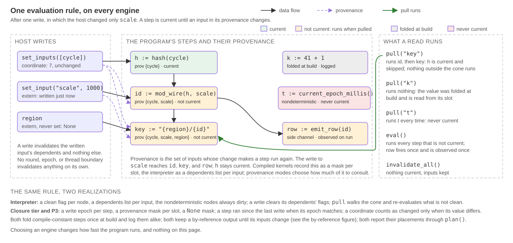

# Polydat Execution Engines

This document defines the engines a program runs on, the rules every engine
follows so that a host's choice of engine changes how fast a program runs and
nothing else, the provenance modes and the selector that picks one, and the
slot representation compiled code shares. The Cranelift call and failure
boundary is specified in [jit_boundary.md](jit_boundary.md); graph
qualification and fusion order in [graph_compiler.md](graph_compiler.md);
the runtime's one evaluation rule and the ownership of every output in
[runtime_model.md](runtime_model.md).

## 1. The engines

| Engine | Representation | Construction |
| --- | --- | --- |
| Interpreter (P1) | `PolydatKernel` over `Box<dyn PolydatNode>` and typed `Value` buffers, with native cones per its `JitMode` | `Engine::Interpreter(mode)`; `compile_polydat` and `PolydatAssembler::compile` for the concrete type |
| Closure tier (P2) | Every node's generated closure over one flat `u64` slot buffer | `Engine::Closures(provenance)` |
| Native (P3) | Cranelift native code for every node with a lowering and the node's closure elsewhere, over the same slot buffer, one native function per run of consecutive eligible nodes | `Engine::Native(provenance)`; refused by a build without the `jit` feature |

A host names an engine with `compile_polydat_with(src, engine)`,
`compile_polydat_with_engine(src, engine, &options, log)`, or
`PolydatAssembler::compile_with(engine)`, and gets a `Box<dyn Kernel>` or one
error type, `KernelError`. A host that names none gets `Engine::default()`:
P3 with the `jit` feature and the closure tier without it, with the
provenance mode left to the selector. Compiled code is the default; the
interpreter is a choice, and the semantic oracle every other engine is
checked against.

Pure native code, one function for the whole program, is a fourth kernel
behind P3: the differential tier that proves the native lowerings against
the closures, and the carrier of the Tier-1 register kernel
([simd_isa_autopromotion.md](simd_isa_autopromotion.md)). It refuses a node
without a lowering, is `#[doc(hidden)]`, and is reachable only through the
`try_compile_pure_jit*` builders; it is not a host surface. The other
`try_compile*` builders and `compile_hybrid` build one engine's kernel as its
concrete type, for the differential suites and the ladder benchmarks.

## 2. The interpreter engine

The interpreter runs native code as cones: regions of eligible nodes fused
into one native function each, when the `jit` feature is enabled. How much of
the graph is fused is the interpreter engine's one knob, `JitMode`, carried by
`Engine::Interpreter(mode)` and settable per assembler with `set_jit_mode`; it
is a property of the kernel being built, never of the process, so two hosts
in one process compiling under different modes each get what they asked for.
The kernel reports the mode it was built with as its engine.

- `Off` leaves the typed P1 graph unchanged;
- `Auto`, what a host gets when it names none, extracts eligible connected
  cones containing at least two nodes; and
- `Force` permits a one-node eligible cone.

An extracted cone is replaced by a synthetic fusion node whose `eval` invokes
the compiled native segment. Unsupported nodes, boundary types, lifecycle
classes, and purity shapes remain in P1. The graph's canonical identity walks
through fusion nodes to their scalar subgraph, so changing the cone mode does
not change program identity.

## 3. The rules every engine follows

There is one feature set, defined by the documented public API and by the
language: every declaration, node, construct, and runtime interaction a
program can express. Every engine accepts every program in that set, with
the two refusals of §8, and produces the same values, the same `None`s, the
same failures, and the same side effects for the same inputs and the same
reads. The rules below are what makes that true; each is stated once, here or
in the document named, and the others cite it.

### 3.1 One evaluation rule

Every engine evaluates under the runtime model's rule (runtime_model.md,
R1): a step is current until an input in its provenance changes; a
nondeterministic step is never current; a compile-constant step is folded
once at build, on every engine, and the fold is logged the same way; a side
channel runs when it is not current and is observed when it runs. `pull`
runs the requested output's cone and nothing else, on every engine; `eval`
runs every step. An unset extern is `None` and propagates as the None rule
says. The provenance modes of §4 are optimizations over this rule: they
change what is recomputed, never a result. No step is exempt, and nothing
but a write to an input invalidates anything: there is no evaluation round
or thread boundary with a meaning of its own (runtime_model.md, R4).



The figure follows one write in which the host changed only `scale`: the
step reading `cycle` alone stays current and is skipped, the steps `scale`
reaches run when pulled, the folded constant is read from its slot, the
nondeterministic step runs every time, and the side channel fires once when
it is pulled or evaluated. The interpreter keeps a clean flag per node and a
dependents list per input; the compiled kernels keep a write epoch per step
and a provenance mask per slot. Those are two bookkeepings of the one rule,
and choosing between them changes nothing a host can observe.

### 3.2 Programs, states, and the kernels a kernel makes

A program is logic and is shared: one `Arc` serves every fiber that runs
it. A state is the register image a program runs over, one per kernel: its
input image (the coordinates and externs as last written), its output image
(every step's slots, the scratch its `Ref2` steps publish into, whatever a
node declared as state of its own), and its currency bookkeeping. Within
one state the rules of §3.1 hold as if the kernel were the only one in the
process; two states of one program on two fibers never share a buffer.
Every read a host makes copies out of the image: a `Value` returned by
`pull` or `get_value` is the reader's own for as long as it holds it, and no
API returns a borrow into a state.

A kernel that a kernel makes is a complete kernel over its own program with
a state of its own, driven by the same `Kernel` calls. A traversal
activation is one kernel per tuple of a `for`, which the host opens with
`traverse` and drives itself. A tile projection body is one kernel per body
program and engine, which the rendering state owns in the render step's
scratch, re-binds per tuple, and reuses across its renders; the host never
sees it. A materialized subscope is a host-composed child with a contract,
built against the parent with new program matter, its shared bindings bound
to the parent's cells. Each is bound from its parent, never from the host
directly: the tuple's own elements, the cascade of outer wires as it was at
open, or cells. Constructing any of them, and compiling any program, writes
nothing in any other state.


### 3.3 The None rule

A `None` is a value the interpreter propagates (none_semantics.md, Rule 1).
The closure tier and P3 carry a `None` mask per slot and propagate it the
same way. Native code cannot carry a `None`, so the one question both the
interpreter's cone planner and P3's segment batcher answer is whether a
`None` may reach a node's inputs: a node that tolerates a `None` input joins
a cone or a segment only when every input is a wire from another member,
where no `None` can arrive; fed by a kernel input or by an extern that may be
unset, it stays a closure or an interpreter node with its exact semantics. A
`None` that reaches native code anyway is a panic naming the extern, the
tripwire of the rule, never a wrong value.

### 3.4 Failures

A node that fails at evaluation fails with one message on every engine. The
enrichment is one function, `kernel::engines::enrich_panic`, which the
interpreter's `eval_node` and every compiled kernel call: the original
payload, the location the capture guard recorded, the node's name, the
outputs it feeds, the program's context, and its input values decoded as the
typed readers decode them. Each compiled kernel carries a
`compile::Attribution` built from the resolved graph, so a failing step is
named as its node; pure native code names the step it is in through a
tracker slot before each helper call; a cone re-raises attributed to the
member, with the program's context and the program's names for the
member's outputs, and the interpreter re-raises that report as it is, so a
failure inside a fused node reads exactly as the same failure reads on the
native engine, and the cone is no frame of its own. Every native helper
runs under `guarded`, so a helper's panic is the longjmp the kernel catches
and never a process abort ([jit_boundary.md](jit_boundary.md)).

### 3.5 The host surface

The `Kernel` trait means the same thing on every engine:

- `set_input` takes a value that satisfies the declared type, a carrier's
  bit-stuffed forms included, or `None`, which clears the extern; a value of
  another type is refused at the write with one message, never healed; a
  coordinate is set with `set_inputs`, never as an extern.
- `invalidate_all` marks every step not current and keeps the inputs, so
  every step reruns at the next pull: the host's way to re-observe a
  nondeterministic program without writing an input.
- `output_names` lists the outputs in declaration order, as the program
  declares them.
- `into_program` yields a program shared across threads, and a kernel
  `create_kernel` makes from it starts from the program: every extern at its
  declared default, every `shared` binding with a cell of its own.
- `cursor_schemas` reports every cursor with the partitions and extent the
  compiler resolved, an extent computed from constants included.
- `plan` reports what the engine decided for the program, as an
  `EnginePlan` of native segments, closure steps, and interpreted nodes, so
  a node's placement is observed, not inferred.
- The compile event log is the same on every engine: assembly events, tile
  events, `ConstantFolded` for every folded node, `ExternWithoutDefault`
  for every extern without one, and the assertion counts strict mode
  inserts.

### 3.6 Cells and traversals

A `shared` binding is a cell on every engine under one protocol
([cross_fiber_invalidation.md](cross_fiber_invalidation.md)): a write
through any holder is what the others read next, a kernel created from a
shared program starts with cells of its own, and `attach_shared_cell` binds
one kernel's cell into another. A `for` traversal opens on every engine
through `Kernel::traverse`, and each activation is a kernel over the body's
program for the engine the host chose, one program per engine per position
([for_traversal.md](for_traversal.md)).

## 4. Provenance modes

A compiled engine is built in one provenance mode, named by
`Provenance` and fixed for the kernel's lifetime.

| Mode | Push-side invalidation | Pull-side guard |
| --- | --- | --- |
| `Raw` | No | No |
| `Push` | Yes | No |
| `Pull` | No | Yes |
| `PushPull` | Yes | Yes |

`Push` exists as a measurement and equivalence surface on the closure tier;
on the native engine it builds the push-pull kernel, since push bookkeeping
without the cone guard has no kernel of its own. Automatic selection returns
only `Raw`, `Pull`, or `PushPull`.

### 4.1 Push-side invalidation

Compiled push kernels store a dependent-step list for each graph input and a
clean flag for each compiled step. `set_inputs` compares the new coordinate
values with the previous ones and marks the dependent steps of changed inputs
dirty. Evaluation skips clean steps inside an otherwise-entered cone.

The interpreter uses the same dependency relation but treats the act of
`set_input` as the invalidation signal; it does not require value equality
before dirtying dependents. That distinction preserves side-channel and
explicit-write semantics in the complete runtime.

### 4.2 Pull-side guard

Every compiled pull kernel, on the closure tier, P3, and the pure tier
alike, stores an exact `ProvMask` for every output slot and a multi-word
changed-input mask, both from one computation (`compile::slot_provenance`).
Before entering evaluation for a slot, the kernel tests whether the slot
provenance intersects the changed-input mask. A disjoint mask returns the
cached slot without executing the compiled body. The mask grows a word per
sixty-four input slots, so a program's input count is not bounded by the
guard.

### 4.3 Composition

For `PushPull`, the pull guard decides whether to enter the requested output's
cone. If entered, the push clean flags suppress unaffected steps within that
cone. The two checks preserve the same result as `Raw`; they change only the
amount of work performed.

## 5. The selector

`analyze_graph` records total node count, input count, output count, and exact
per-output upstream-cone sizes. `select_prov_mode` applies this fixed rule:

```text
if total_nodes < 15 and num_inputs <= 1:
    Raw
else if num_inputs >= 2:
    PushPull
else:
    Pull
```

`Provenance::Auto` on either compiled engine applies this rule to the resolved
graph, through one function both engine arms share; a named provenance is
taken as given. `engine()` reports the mode the kernel was built in, so
`compile_with(Native(Auto))` on a small single-input graph reports
`Native(Raw)`. Cone ratios remain diagnostic metadata; the selector does not
use a `stable_ratio` threshold. The interpreter uses `JitMode` and cone
qualification instead.

## 6. Slot representation

Compiled buffers are arrays of `u64` slots, not arrays of logical values. A
static `SlotColor` maps each port type to one of three layouts:

- `Imm1` — one immediate slot for ordinary scalar bit patterns;
- `Imm2` — two immediate slots for 128-bit integers and register words; and
- `Ref2` — a `(ptr, len)` pair referencing storage with a proven owner: a
  typed vector, a string, or a byte string as a slice of its elements, and a
  `Json`, `Ext`, or `Handle` value as a one-element slice holding the
  `Value`, per [Compiled By-Reference Slots](compiled_handles.md).

Narrow integers and `f16`/`f32` use defined bit-stuffing rules inside `Imm1`.
Signedness and exact width remain properties of `PortType`; the common physical
slot does not permit untyped wiring. Ref-bearing nodes are subject to the
ownership, lifetime, and no-forwarding rules in [jit_boundary.md](jit_boundary.md)
and [type_system_alignment.md](type_system_alignment.md): the step that
produces a `Ref2` value owns the scratch entry its pair names, held in the
kernel's state; it writes the entry and republishes the pair when it runs,
and the pair is valid until it runs again, which under §3.1 is exactly when
an input in its provenance is written. A copy step copies into an entry of
its own; a string constant folded at build publishes a pair into bytes
interned for the process; an extern's pair names the value the state stores
for it, rewritten at every `set_input`. Raw readers refuse a `Ref2` slot, and
the typed readers copy out, so a by-reference value a host reads from a
compiled kernel is the host's own, as it is from the interpreter. Debug
builds validate every scratch-backed pair after every run.


## 7. Engine equivalence

For any program and for the same ordered input and pull sequence:

1. output `Value` semantics are identical on every engine;
2. `None` propagation is identical;
3. typed assertion failures identify the same violated contract, with the
   same message;
4. side-channel and nondeterministic nodes are not moved into an engine form
   whose caching rules would suppress required observations; and
5. provenance modes may reuse cached slots only when their exact dependency
   masks prove the requested result unaffected.

The standing proof is the parity suite: every registered public node, from
one program per node, compiled and run on the interpreter, the closure tier,
P3, and the pure tier, every output compared with the interpreter's, and the
node-by-engine matrix generated into the [node reference](../reference/nodes.md)
so the documented feature set and the tested one are one file. Beside it
stand the corner suite (`tests/equivalence_corners.rs`, run with
`-- --ignored`), which drives every node's program through the edges of
a `u64` coordinate and the special values of an `f64` extern and
compares every output bit for bit with the interpreter's, failures by
message; the differential suites for by-reference nodes (random programs
over the string, JSON, and tile nodes read through the typed readers);
the slot-state axioms; the cone tests; the failure parity suite; the
traversal and shared-cell suites on every engine; and the engine ladder,
which the performance guide records.

## 8. What every engine accepts, and what stays where

Every engine a host can choose accepts every program the interpreter
accepts, with the two refusals named below, and computes what the
interpreter computes. The other distinctions are placements inside an engine,
not refusals:

- A node without a named native lowering runs its kit from native code,
  called in place over the state's own scratch
  ([Compiled By-Reference Slots](compiled_handles.md) §6); a
  nondeterministic node or a side channel does too, as a segment of its
  own on the P3 kernel and a never-current step on pure native code, so
  its currency is its own; a node with no kit runs only on the
  interpreter engine; the closure tier, P3, and pure native code refuse
  a program containing one by name (`KernelError::Refused`); today
  every registered node has a kit.
- A by-reference value crosses a cone boundary borrowed into its pair
  for the call and copied out after it, and a copy of one inside native
  code copies into the copying step's own scratch; a pair is never
  forwarded.
- A variadic or polymorphic node's kit is built for the types of its
  wires, so it reads each wire as the graph typed it; the classifier
  never re-types a wire to admit a named lowering.
- A P3 segment is a run of consecutive native-eligible nodes of one
  lifecycle and one volatility; a compile-constant node never joins a segment
  that is not, or a constant step downstream of it would run at build before
  its producer, and a volatile node never joins pure ones, or the segment
  would be never current and rerun them at every round.
- The two refusals: an extern of a two-slot immediate type (a 128-bit
  integer or a register word) has no compiled form, because the compiled
  engines write an extern through as one carrier or as the pair into the
  value the state stores; and a build without the `jit` feature has no P3.
  Each is refused by name with its reason
  (`KernelError::Refused`); a program with such an extern runs on the
  interpreter.
- SIMD scalar-flow promotion is not selected by ordinary engine choice; it has
  its own explicit qualification and execution contract in
  [simd_isa_autopromotion.md](simd_isa_autopromotion.md).
- Engine selection never changes a graph's public port types or named outputs.
