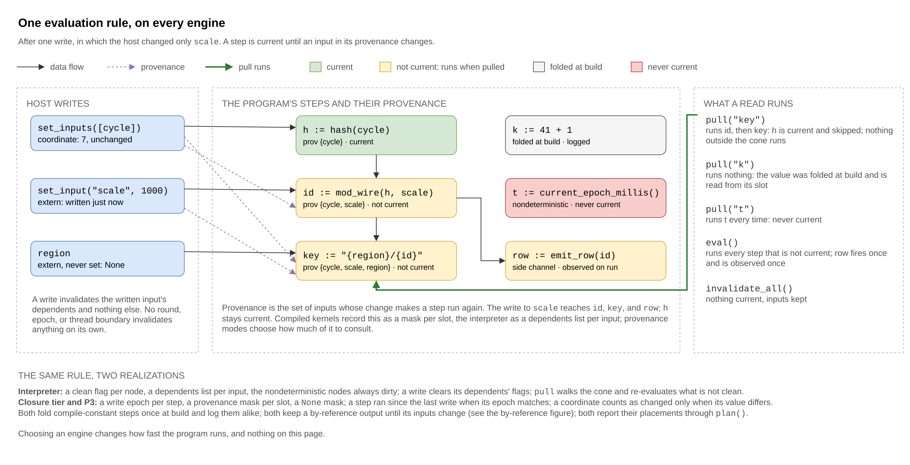

# Execution Engines

This document specifies the four engines a program runs on (the interpreter
(P1), the closure tier (P2), native (P3), and pure native); the rules all four
follow, so that a host's choice of engine changes how fast a program runs and
nothing else; the provenance modes and the selector that picks one; and the
slot representation the three compiled engines share.

**Related specifications:** [jit_boundary.md](jit_boundary.md) (the Cranelift
call and failure boundary); [graph_compiler.md](graph_compiler.md) (graph
qualification and fusion order); [runtime_model.md](runtime_model.md) (the
runtime's evaluation rule and the ownership of every output).

## 1. The engines

| Engine | Representation | Construction |
| --- | --- | --- |
| Interpreter (P1) | `PolydatKernel` over `Box<dyn PolydatNode>` and typed `Value` buffers, with native cones per its `JitMode` | `Engine::Interpreter(mode)`; `compile_polydat_interpreter` and `PolydatAssembler::compile` for the concrete type |
| Closure tier (P2) | Every node's generated closure over one flat `u64` slot buffer | `Engine::Closures(provenance)` |
| Native (P3) | Cranelift native code for every node with a lowering and the node's closure elsewhere, over the same slot buffer, one native function per fusion unit: a connected, convex group of eligible nodes (§8) | `Engine::Native(provenance)`, in every build: without the `jit` feature the same kernel runs with every step a closure and no native segment in it |
| Pure native | Cranelift native code and nothing else: no closure fallback, so a node without a lowering refuses the program | `Engine::PureNative(provenance)`, with `Raw` or `PushPull` only; refused by a build without the `jit` feature |

The closure tier, native, and pure native are the three **compiled engines**;
in this document "every compiled engine" means those three, and "all four
engines" adds the interpreter.

Pure native is the differential tier behind P3 (§8): the engine whose results
are compared with P3's to test the native lowerings. A host may name it; it is
not internal. It differs from `Native` only in what it does with a node that
has neither a native form nor a kit (the function the `#[polydat_node]` macro
generates to run the node's body directly on the slot buffer, which native code
can call; [compiled_handles.md](compiled_handles.md) §5): `Native` runs that node's closure and always succeeds, while
pure native refuses the program and names the node. Pure native is therefore
the only engine that tells a host whether a program is fully native; `Native`
cannot, because it never fails for that reason. Every node in this library
has a native form, so the two tiers accept the same library programs; they
differ only on a host's own registered nodes, which is where a node with no
native form occurs in practice. Pure native supports the two provenance modes
the differential needs, `Raw` and `PushPull`. It refuses any other named mode,
and `Auto` resolves to one of the two.

**A build offers every engine it can realize.** Some architectures have no
code generator, and a build for one still offers three of the four engines:
the interpreter, the closure tier, and the native tier with every step a
closure and no native segment in it. The engine names a kernel architecture;
how much of a program the build lowered to machine code is the *plan*, which
`Kernel::plan` reports on all four engines. Only pure native is refused on
such a build, because it consists solely of native code and cannot exist
without a code generator.

`Engine::default()` is P3 with the `jit` feature and the closure tier without
it. The default is the fastest engine the build has, which is decided by
measurement rather than by which engines are available.

A host names an engine with `compile_polydat_with(src, engine)`,
`compile_polydat_with_engine(src, engine, &options, log)`, or
`PolydatAssembler::compile_with(engine)`, and gets a `Box<dyn Kernel>` or one
error type, `KernelError`. A host that names none gets `Engine::default()`:
P3 with the `jit` feature and the closure tier without it, with the
provenance mode left to the selector. Compiled code is the default. The
interpreter is available by choice, and it is the semantic oracle: the
reference whose results the three compiled engines are checked against.

**The engine is a preference on the compile options**, and the compile
options are the only place a caller states one. The normative path is to
leave `CompileOptions::engine` unset: it defaults to `Engine::default()`, so a
host that never mentions an engine gets the most compiled engine the build
has, and gets a faster one automatically when a build gains a tier. Naming an
engine is for testing, measurement, and demonstration, such as a differential
test that wants the interpreter as its reference or a benchmark that runs each
tier in turn. `compile_polydat_with_engine` takes an engine argument as a
per-call override for a caller that holds one options value across several
tiers.

Two rules keep the reported engine accurate:

- A preference the build cannot realize is **refused** rather than silently
  replaced (§4).
- Every kernel reports the engine it actually runs through `Kernel::engine`,
  so the reported configuration is the one the kernel has rather than the one
  that was asked for. A request for `Auto` asks the factory to choose, and the
  kernel reports the engine and mode chosen.

### The trait is the surface

**A kernel is used through the `Kernel` trait.** Every entry point that
builds a kernel returns a `Box<dyn Kernel>`, and every way of driving one
(coordinates, externs, cursors, evaluation, typed reads, traversals, cells)
is a trait method with the same meaning on all four engines. A host writes
against the trait and never needs to name an engine.

Only two things are outside that rule:

- **Configuring a kernel**, which happens before the kernel exists, through
  `CompileOptions`.
- **Observing an engine's own implementation detail, in testing and
  diagnostics.** The interpreter's concrete `PolydatKernel` exposes its
  program, its `Lookup` view, its subcontext builder, and its constant and
  wire readers. A differential test asserting on the graph that was built,
  and a diagnostic reporting on it, both need these, and nothing else should
  use them. `compile_polydat_interpreter` is the only entry point that
  returns this concrete type, and its name says so.

The compiled engines' implementation detail is exposed through a
**subtrait**, not through hidden methods on `Kernel`. The three compiled
engines lay a program out over one flat `u64` slot buffer (§6), and
`SlotKernel: Kernel` exposes that layout: a slot index instead of an output
name, a raw `u64` instead of a `Value`, and an evaluation that returns one
word. `PolydatAssembler::compile_slots(engine)` returns a
`Box<dyn SlotKernel>`, so a benchmark measuring a tier or a test asserting on
the slot layout uses the extended surface without naming a kernel type, and
the same box upcasts to `Box<dyn Kernel>` wherever the ordinary surface is
enough. One kernel, built once, offers both views.

Because it is a subtrait, the extended surface is opt-in rather than merely
undocumented: a caller that does not write `use SlotKernel` does not have
these methods on its kernel. `#[doc(hidden)]` would hide the rustdoc entry
but leave the method on the type, where autocomplete still offers it and
nothing at the call site marks the intent; the import is that mark. The
interpreter does not implement the trait and cannot, because its buffers
hold typed `Value`s and it has no slot to name, so
`compile_slots(Engine::Interpreter(_))` is refused with that reason.

The entry points state in their names which surface they return:

| Returns | Entry points |
| --- | --- |
| A kernel through the trait on the default engine | `compile_polydat`, which is `compile_polydat_kernel` under a shorter name |
| A kernel through the trait, engine from the options | `compile_polydat_kernel` and its `_with_options` form |
| A kernel through the trait, engine named | `compile_polydat_with`; `compile_polydat_with_engine` and `compile_ast_with_engine`, which take an engine beside options |
| The interpreter's concrete kernel | `compile_polydat_interpreter` and its `_with_options` and `_with_log` forms; every such entry point has `interpreter` in its name |
| No kernel | `compile_polydat_to_assembler` (an assembler, which has no engine until something compiles it); `compile_polydat_checked` (a diagnostic report beside its result); `parse_polydat` (the program tree, which is the form a transform rewrites) |

Every kernel-returning entry point without `interpreter` in its name
builds on the engine the options name, and so defaults to the most
compiled engine the build has; so does the binary, whose default is
`--engine auto`. A differential test that needs the interpreter as its
oracle asks for it by name, through `compile_polydat_interpreter` or
`Engine::Interpreter`.

A host that changes a program before running it takes three steps: parse,
transform, compile. This is deliberate, because a transform composes with
every other transform, while an entry point per host feature composes with
none. `add_tiles` adds tiles a host built from its own configuration,
`assign_values` fixes an extern, and a host that wants both applies both to
one tree and compiles once.

**Every failure on the trait is structured.** No method on `Kernel`
reports a failure as a `String`. A write that cannot be made returns
`WriteError`, which names which of three things went wrong and holds the
facts rather than a sentence: the wire was not found (with the names that
would have resolved), the value did not satisfy the slot's declared type
(with both types), or the slot is a coordinate and is written through
`set_inputs` instead. A caller can branch on the variant, and a test can
assert the variant rather than match message text, so "all four engines
refuse alike" can be checked as equality of values.

**A failed build returns an error, never a kernel.** Every construction path
returns `KernelError` on failure, which distinguishes the four ways a build
fails:

- `Source`: the source did not parse or compile;
- `Assembly`: the graph did not assemble;
- `Refused`: the graph assembled, but this engine cannot run some node in it
  (naming the node and the engine); and
- `ConstantFold`: a value the program computes at build could not be computed
  (§3.1); all four engines report it alike, because no engine can compute it.

Rationale: a kernel returned for a failed build, such as an empty one with no
nodes, inputs, or outputs, looks like a working program that computes nothing
and hides the real error. It is the same fault as reporting a configuration
that was not realized.

Pure native compiles the whole program into one native function. It is the
differential tier that tests the native lowerings against the closures, and
it runs the Tier-1 register kernel
([simd_isa_autopromotion.md](simd_isa_autopromotion.md)). Although it is one
function, a run does not execute the whole program:

- The function is built of the same fusion units as P3's segments (§8), one
  block each, and is entered with a list of units and the units' clean flags.
- The code tests each listed unit's flag itself, skips a current unit,
  dispatches a stale one through a jump table, and marks it current when its
  block ends; a unit that fails stays stale.
- A pull passes its output's cone order, computed at build for every output
  into a table indexed by slot, and `eval` passes every unit. The rule of
  §3.1 therefore holds on pure native as on the other three engines, a pull
  costs its cone and not the program, and no pull hashes, filters, or
  allocates on the way into native code.
- A unit runs whole, so the units a pull passes are closed over every
  member's producers.
- In `raw` mode a write makes every unit dirty, starting a new round in which
  each unit runs at most once. In `pushpull` a write dirties the units that
  depend on what changed.

It refuses a node without a lowering and is `#[doc(hidden)]`: the
differential suites and the ladder benchmarks construct it, and one engine's
concrete kernel, through builders of their own, which are not a host
surface. A host selects an engine with `Engine`.

## 2. The interpreter engine

When the `jit` feature is enabled, the interpreter runs parts of the graph as
native code in cones: connected regions of eligible nodes, each fused into one
native function. `JitMode`, the interpreter engine's only setting, decides how
much of the graph is fused. It is passed in `Engine::Interpreter(mode)` or set
per assembler with `set_jit_mode`, and it applies to the kernel being built,
never to the process, so two hosts in one process compiling under different
modes each get the mode they asked for. The kernel reports the mode it was
built with as its engine.

- `Off` leaves the typed P1 graph unchanged;
- `Auto`, what a host gets when it names none, extracts eligible connected
  cones containing at least two nodes; and
- `Force` permits a one-node eligible cone.

An extracted cone is replaced by a synthetic fusion node whose `eval` invokes
the compiled native segment. Unsupported nodes, boundary types, lifecycle
classes, and purity shapes remain in P1. The graph's canonical identity walks
through fusion nodes to their scalar subgraph, so changing the cone mode does
not change program identity.

## 3. The rules every engine follows

There is one feature set, defined by the documented public API and by the
language: every declaration, node, construct, and runtime interaction a
program can express. All four engines (the interpreter, the closure tier,
native, and pure native) accept every program in that set, with the two
refusals of §8, and produce the same values, the same `None`s, the same
failures, and the same side effects for the same inputs and the same reads,
with the one pure-native exception §8 names. The rules below guarantee this.
Each is stated once, here or in the named document, and other documents cite
it.

### 3.1 One evaluation rule

All four engines evaluate under the runtime model's rule (runtime_model.md,
R1):

- A step is current until an input in its provenance changes.
- A nondeterministic step is never current.
- A compile-constant step is folded once at build on all four engines, and
  the fold is logged the same way. The interpreter, the closure tier, and
  native (P3, whose kernel is the hybrid of native segments and closure
  steps) run their constant steps from the step list they keep. Pure native
  compiles one function over every step and keeps no step list, so it
  compiles its constants a second time into a separate entry point and runs
  that once over the same buffer.
- A side channel runs when it is not current, and is observed when it runs.
- `pull` runs the requested output's cone and nothing else; `eval` runs every
  step.
- An unset extern is `None` and propagates as the None rule (§3.3) says,
  except on pure native (§8).

The provenance modes of §4 are optimizations over this rule: they change
what is recomputed, never a result. No step is exempt, and nothing but a
write to an input invalidates anything; no evaluation round or thread
boundary invalidates anything (runtime_model.md, R4).

A compile-constant step that cannot be computed is a **build error on all
four engines**, reported as `KernelError::ConstantFold` with the node's own
failure message. It is not a `Refused`, because no engine is declining a
program the others accept. A step with no input in its provenance does at
every pull exactly what it does at build, so no later evaluation could make
it succeed, and deferring it would only move the same failure later. When
the failure occurs depends on the step's lifecycle, never on the engine:
`__str_to_u64("nope")` is a build error, while
`__str_to_u64(printf("nope{}", cycle))` builds and fails on the pull that
needs it.



The figure follows one write in which the host changed only `scale`: the
step reading `cycle` alone stays current and is skipped, the steps with
`scale` in their provenance run when pulled, the folded constant is read from
its slot, the nondeterministic step runs every time, and the side channel
fires once when it is pulled or evaluated. The interpreter keeps a clean flag
per node and a dependents list per input; the compiled kernels keep a write
epoch per step and a provenance mask per slot. Both are bookkeeping for the
same rule, and the difference between them is not observable by a host.

### 3.2 Programs, states, and the kernels a kernel makes

A program holds the compiled logic and is shared: one `Arc` serves every
fiber that runs it. A state is the storage a program runs over, one per
kernel. It holds the kernel's input image (the coordinates and externs as
last written), its output image (every step's slots, the scratch its `Ref2`
steps publish into, and whatever a node declared as state of its own), and
its currency bookkeeping. Within one state the rules of §3.1 hold as if the
kernel were the only one in the process, and two states of one program on
two fibers never share a buffer. Every read a host makes copies out of the
state: a `Value` returned by `pull` or `get_value` belongs to the reader for
as long as it holds it, and no API returns a borrow into a state.

A kernel can create other kernels. Each such kernel is complete, runs over a
program of its own with a state of its own, and is driven by the same
`Kernel` calls. There are three kinds:

| Kind | What it is | The host's role |
| --- | --- | --- |
| Traversal activation | One kernel per tuple of a `for` | Opens it with `traverse` and drives it |
| Tile projection body | One kernel per body program and engine, owned by the rendering state in the render step's scratch, re-bound per tuple and reused across renders | None; the host never sees it |
| Materialized subscope | A child with a contract, built against the parent with new program matter, its shared bindings bound to the parent's cells | Composes it |

Each is bound from its parent, never from the host directly: from the
tuple's own elements, from the cascade of outer wires as it was when the
traversal opened, or from cells. Constructing any of them, and compiling
any program, writes nothing in any other state.


### 3.3 The None rule

A `None` is a value the interpreter propagates (none_semantics.md, Rule 1).
The closure tier and P3 keep a `None` mask per slot and propagate it the
same way. Native code cannot represent a `None`, so both the interpreter's
cone planner and P3's segment batcher decide one question: whether a `None`
can arrive at a node's inputs. A node that tolerates a `None` input joins a
cone or a segment only when every input is a wire from another member, where
no `None` can arrive. When it is fed by a kernel input or by an extern that
may be unset, it stays a closure or an interpreter node with its exact
semantics. A `None` that arrives in native code anyway causes a panic naming
the extern, which detects a violation of this rule, and never produces a
wrong value. Pure native has no closures to fall back on; §8 states how it
treats an unset extern.

### 3.4 Failures

A node that fails at evaluation fails with the same message on all four
engines. One function, `kernel::engines::enrich_panic`, builds that message,
and the interpreter's `eval_node` and every compiled kernel call it. The
message holds the original panic payload, the location the capture guard
recorded, the node's name, the outputs it feeds, the program's context, and
the node's input values decoded as the typed readers decode them.

- Each compiled kernel holds a `compile::Attribution` built from the
  resolved graph, so a failing step is reported under its node's name.
- Pure native code records the step it is in by storing the step's index in
  a tracker slot before each helper call.
- An interpreter cone re-raises the failure attributed to the member node,
  with the program's context and the program's names for the member's
  outputs, and the interpreter re-raises that report unchanged. A failure
  inside a fused node therefore reads exactly as the same failure reads on
  the native engine, and the cone does not appear as a frame of its own.
- Every native helper runs under `guarded`, so a helper's panic becomes the
  longjmp the kernel catches and never a process abort
  ([jit_boundary.md](jit_boundary.md)).

### 3.5 The host surface

The `Kernel` trait has the same meaning on all four engines:

- `set_input` writes one extern. It takes a value that satisfies the
  declared type, including a carrier's bit-stuffed forms, or `None`, which
  clears the extern. A value of another type is refused at the write with one
  message and is never converted. A coordinate is set with `set_inputs`,
  never as an extern. An input whose type may vary is converted by a node in
  the program, placed at assembly and only when the host asks
  ([input_variance.md](input_variance.md)).
- A failed pull or evaluation (a node's panic, caught and attributed as §3.4
  states) leaves the kernel usable. The step that failed, and every step its
  failure prevented from running, stay not current, so after the next write
  the kernel returns what a fresh kernel would return. A host does not
  rebuild a kernel because one evaluation failed. `tests/fuzz_conversions.rs`
  checks this on all four engines, reading each program's kernel across the
  inputs its conversions refuse.
- `invalidate_all` marks every step not current and keeps the inputs, so
  every step reruns at the next pull. It is how a host re-observes a
  nondeterministic program without writing an input.
- `output_names` lists the outputs in the order the program declares them.
- `into_program` turns a kernel into a program shared across threads.
  `create_kernel` on that program returns a kernel that starts from the
  program: every extern at its declared default and every `shared` binding
  with a cell of its own, regardless of what was written to the kernel that
  became the program. An extern is per-kernel state, like the coordinates:
  both are writes into declared slots of a running kernel, and neither is
  part of the compiled program. A host that wants a value fixed *for the
  program* fixes it before compiling, with `transform::assign_values` or an
  `extern` default; a host that wants every thread to share one value
  attaches a cell.
- `cursor_schemas` reports every cursor with the partitions and extent the
  compiler resolved, including an extent computed from constants.
- `plan` reports what the engine decided for the program, as an
  `EnginePlan` of native segments, closure steps, and interpreted nodes, so
  a node's placement can be observed rather than inferred.
- The compile event log is the same on all four engines: assembly events,
  tile events, `ConstantFolded` for every folded node, `ExternWithoutDefault`
  for every extern without a default, and the assertion counts strict mode
  inserts.

### 3.6 Cells and traversals

On all four engines, a `shared` binding is a cell under one protocol
([cross_fiber_invalidation.md](cross_fiber_invalidation.md)): a write
through any kernel holding the cell is the value every other holder reads
next, a kernel created from a shared program starts with cells of its own,
and `attach_shared_cell` binds one kernel's cell into another. The broadcast
cell of a computed output (`Kernel::output_cell`) exists on the interpreter,
the closure tier, and native, but not on pure native, whose `output_cell`
returns `None` (runtime_model.md §5). On all four engines a `for` traversal opens through `Kernel::traverse`, and each
activation is a kernel over the body's program for the engine the host
chose, with one program per engine per position
([for_traversal.md](for_traversal.md)).

## 4. Provenance modes

A compiled engine is built in one provenance mode, named by
`Provenance` and fixed for the kernel's lifetime.

| Mode | Push-side invalidation | Pull-side guard |
| --- | --- | --- |
| `Raw` | No | No |
| `Push` | Yes | No |
| `Pull` | No | Yes |
| `PushPull` | Yes | Yes |

`Push` exists as a measurement and equivalence surface on the closure tier.
Native code has no push-only kernel, since push bookkeeping without the cone
guard has no native form, so `Native(Push)` is **refused** with a reason
naming the realizable neighbours rather than built as push-pull. Pure native
has only `Raw` and `PushPull` kernels and refuses `Push` and `Pull` the same
way (§1). These refusals follow the general rule: a kernel reports the
configuration it runs, so a configuration the factory cannot realize is an
error and never a silent substitution. A caller that does not care which mode
it gets asks for `Auto`, which asks the factory to choose and reports the
choice; automatic selection returns only `Raw`, `Pull`, or `PushPull`.

### 4.1 Push-side invalidation

Compiled push kernels store a dependent-step list for each graph input and a
clean flag for each compiled step. `set_inputs` compares the new coordinate
values with the previous ones and marks the dependent steps of changed inputs
dirty. Evaluation skips clean steps inside an otherwise-entered cone.

The interpreter uses the same dependency relation but treats the act of
`set_input` as the invalidation signal: it does not require the value to
differ before dirtying dependents. This preserves side-channel and
explicit-write semantics.

### 4.2 Pull-side guard

Every compiled kernel with a pull-side guard (the `Pull` and `PushPull` modes,
on the closure tier, P3, and pure native alike) stores an exact `ProvMask` for every output slot and a multi-word
changed-input mask, both from one computation (`compile::slot_provenance`).
Before entering evaluation for a slot, the kernel tests whether the slot
provenance intersects the changed-input mask. A disjoint mask returns the
cached slot without executing the compiled body. The mask grows a word per
sixty-four input slots, so a program's input count is not bounded by the
guard.

### 4.3 Composition

For `PushPull`, the pull guard decides whether to enter the requested output's
cone. If entered, the push clean flags suppress unaffected steps within that
cone. The two checks preserve the same result as `Raw`; they change only the
amount of work performed.

## 5. The selector

`analyze_graph` records total node count, input count, output count, and exact
per-output upstream-cone sizes. `select_prov_mode` applies this fixed rule:

```text
if total_nodes < 15 and num_inputs <= 1:
    Raw
else if num_inputs >= 2:
    PushPull
else:
    Pull
```

`Provenance::Auto` on the closure tier or native applies this rule to the
resolved graph, through one function both engine arms share; a named
provenance is taken as given. On pure native, `Auto` applies the same rule
and builds `PushPull` where the rule returns `Pull`, because pure native has
no pull-only kernel and the push-pull guard includes the pull guard. `engine()` reports the mode the kernel was built in, so
`compile_with(Native(Auto))` on a small single-input graph reports
`Native(Raw)`. Cone ratios remain diagnostic metadata; the selector does not
use a `stable_ratio` threshold. The interpreter uses `JitMode` and cone
qualification instead.

## 6. Slot representation

Compiled buffers are arrays of `u64` slots, not arrays of logical values. A
static `SlotColor` maps each port type to one of three layouts:

- `Imm1` — one immediate slot for ordinary scalar bit patterns;
- `Imm2` — two immediate slots for 128-bit integers and register words; and
- `Ref2` — a `(ptr, len)` pair referencing storage with a proven owner: a
  typed vector, a string, or a byte string as a slice of its elements, and a
  `Json`, `Ext`, or `Handle` value as a one-element slice holding the
  `Value`, per [Compiled By-Reference Slots](compiled_handles.md).

Narrow integers and `f16`/`f32` use defined bit-stuffing rules inside `Imm1`.
Signedness and exact width remain properties of `PortType`; sharing one
physical slot width does not permit untyped wiring.

Ref-bearing nodes are subject to the ownership, lifetime, and no-forwarding
rules in [jit_boundary.md](jit_boundary.md) and
[type_system_alignment.md](type_system_alignment.md). Every `Ref2` pair names
storage with one of three owners:

- **A step's scratch entry.** The step that produces a `Ref2` value owns the
  scratch entry its pair names, held in the kernel's state. It writes the
  entry and republishes the pair each time it runs, and the pair is valid
  until the step runs again, which under §3.1 happens only when an input in
  its provenance changes. A copy step copies into an entry of its own.
- **Interned bytes.** A string constant folded at build publishes a pair into
  bytes interned for the life of the process.
- **An extern's stored value.** An extern's pair names the value the state
  stores for it, rewritten at every `set_input`.

Raw readers refuse a `Ref2` slot, and the typed readers copy out, so a
by-reference value a host reads from a compiled kernel belongs to the host,
as it does when read from the interpreter. Debug builds validate every
scratch-backed pair after every run.


## 7. Engine equivalence

For any program and for the same ordered input and pull sequence:

1. output `Value` semantics are identical on all four engines;
2. `None` propagation is identical, except for the unset extern on pure
   native (§8);
3. typed assertion failures identify the same violated contract, with the
   same message;
4. side-channel and nondeterministic nodes are not moved into an engine form
   whose caching rules would suppress required observations; and
5. provenance modes may reuse cached slots only when their exact dependency
   masks prove the requested result unaffected.

These properties are verified by the following tests:

- **The parity suite.** Every registered public node, one program per node,
  is compiled and run on all four engines, and every output is compared with
  the interpreter's. The suite generates the node-by-engine matrix in the
  [node reference](../reference/nodes.md), so the documented feature set and
  the tested one are the same file.
- **The corner suite**, run on request, drives every node's program through
  the edge values of a `u64` coordinate and the special values of an `f64`
  extern, and compares every output bit for bit with the interpreter's, and
  every failure by message.
- **The per-commit edge test**
  (`every_node_reads_the_same_on_every_engine_at_the_edges`) drives every
  node's program through the edge values on all four engines.
- **The conversion fuzzer** (`fuzz_conversions`) runs every entry of the
  assembler's conversion table, and seeded chains through it, the same way.
  It reads the table from `boundary_adapter` and keeps no list of its own.
- **The differential suites for by-reference nodes** run random programs over
  the string, JSON, and tile nodes, read through the typed readers.
- The slot-state axiom tests, the cone tests, and the failure parity suite.
- The traversal and shared-cell suites, run on all four engines.
- **The engine ladder**, a benchmark whose results the performance guide
  records.

### 7.1 One copy of each rule

A native lowering is the node's rule in another form, never a second
statement of it. The node declares its rule once, in its body, its
declared constraints, and its port types, and a lowering either derives
from that declaration or is exactly equal to it on every input. Where
neither can be shown, the node has no lowering and runs its body
through a slot call (a call from native code into the node's kit).

Rationale: a slot call costs one call, while a second copy of the rule can
drift from the first in ways no test of the node itself detects, such as a
lowering that skips a range check the node performs, divides by a zero the
node guards against, or returns a different identity for an empty input.
Every disagreement found between engines has had this shape.

Conversions are lowered from the conversion table and their types, not
from a list of node names. A node is the conversion from `X` to `Y` when it
is the node the assembler's own conversion table names for that pair,
and its native form is derived from how `X` and `Y` are stored in their
slots:

- A total conversion is inline: a widening keeps the stored word, an
  integer becomes a float with the rounding `as` uses, `f32` and `f64`
  promote and demote, and any value becomes a `bool` by being non-zero and
  not NaN.
- A checked conversion is inline only inside a domain where the
  instruction provably equals the node: a narrowing whose value fits the
  target, and a float to an integer in `[lo, hi)` of the target. Outside
  that domain the step calls the node's own kit, so the node alone
  decides what happens there, including the edge behaviour of its own rule.
- `f16` and the 128-bit types are always slot calls.

A lowering must also never execute an instruction that traps in hardware.
A node's failure is a panic, which the engine catches and attributes
(§3.4), while a trap ends the host process. A float-to-integer conversion
therefore never uses Cranelift's trapping conversion: `__f64_to_i32` of a
value out of range must report the value out of range, as the node does.
Within the inline domain the saturating instruction is exact, and any value
outside it is refused by the node.

## 8. What every engine accepts, and what stays where

The closure tier, native, and pure native each accept every program the
interpreter accepts, with the two refusals named below, and compute what the
interpreter computes, with one runtime exception: the unset extern on pure
native, named last in this list. The other distinctions are placements
inside an engine, not refusals:

- A node without a named native lowering runs its kit from native code,
  called in place over the state's own scratch
  ([Compiled By-Reference Slots](compiled_handles.md) §6). A
  nondeterministic node or a side channel does too, as a segment of its
  own on the P3 kernel and a never-current step on pure native code, so
  its currency is its own. A node with no kit runs only on the
  interpreter; the closure tier, P3, and pure native refuse a program
  containing one, naming the node (`KernelError::Refused`). Every node
  registered in this library has a kit.
- A by-reference value crosses a cone boundary borrowed into its pair
  for the call and copied out after it, and a copy of one inside native
  code copies into the copying step's own scratch; a pair is never
  forwarded.
- A variadic or polymorphic node's kit is built for the types of its
  wires, so it reads each wire as the graph typed it; the classifier
  never re-types a wire to admit a named lowering.
- A P3 segment is a fusion unit (`compile/fusion_units.rs`), formed by the
  rule SRD-105's cone planner uses: a connected, convex group of
  native-eligible nodes of one lifecycle and one volatility, joined where one
  reads another's output. (Convex means no path leaves the group and comes
  back into it.) The rule has these consequences:
  - Two chains that share nothing are two segments however their statements
    interleave, so a pull runs only its own.
  - A group that is not convex, because a path leaves it through a closure
    step and comes back, is split where that path returns and nowhere else:
    each member is staged by how many times a path to it has left the group
    and come back, and the members of one stage form the pieces.
  - A compile-constant node never joins a segment that is not
    compile-constant, or a constant step downstream of it would run at build
    before its producer.
  - A volatile node never joins non-volatile ones, or the segment would never
    be current and would rerun them at every round.
  - A side channel is always a segment by itself.
  - A leaf that reads only kernel inputs and that nothing reads, such as the
    copy exposing an input as an output, joins the first segment that reads
    one of the same inputs rather than being a native call of its own for one
    copy. It cannot sit on a path that leaves that segment, so the segment
    stays convex.

  A program's segments are functions of one compiled module, so a round that
  runs many of them does not walk a separate code region per segment. Pure
  native code compiles the same units, one block each.
- The closure tier and P3 share their bookkeeping, one set of methods for
  currency, provenance, cells, and references (`shared_core_methods!` in
  `compile/mod.rs`), but each keeps its own evaluation loops (`run_order`,
  `run_fresh`). The loops differ because the step types differ: a closure
  step is one node and keeps its flags on the step, while a P3 step may be a
  segment standing for a fusion unit and keeps its flags in arrays beside
  the steps. Rationale: one shared loop measured 3 to 7 percent slower on
  the P2 and P3 rungs of the engine ladder, because it reaches the step
  list through a call on every step where a loop of its own indexes a
  local slice.
- The two refusals, each refused by name with its reason
  (`KernelError::Refused`):
  - An extern of a two-slot immediate type (a 128-bit integer or a register
    word) has no compiled form, because the compiled engines write an extern
    either as one slot value or as a pair naming the value the state stores.
    A program with such an extern runs on the interpreter.
  - A build without the `jit` feature has no P3.
- **The one runtime exception to "computes what the interpreter
  computes": an unset extern on pure native.** The interpreter, the
  closure tier, and P3 return `None` for a cleared or never-set extern
  and propagate it (§3.3). They can do so because a node that may
  receive a `None` is kept out of native code and left as a closure. Pure
  native compiles the whole program to one function and has no closure
  to keep such a node in, so instead of returning `None` it traps on the
  pull, naming the extern and telling the host to set it or to run the
  program on `native`. This is not a refusal: the program is accepted,
  and it runs whenever the host sets the extern before pulling, which is
  the ordinary case. It cannot be decided at build, because whether an
  extern is ever set is decided by the host, not the program. It is the
  one place a host can see which engine it chose.
- SIMD scalar-flow promotion is not selected by ordinary engine choice; it has
  its own explicit qualification and execution contract in
  [simd_isa_autopromotion.md](simd_isa_autopromotion.md).
- Engine selection never changes a graph's public port types or named outputs.
