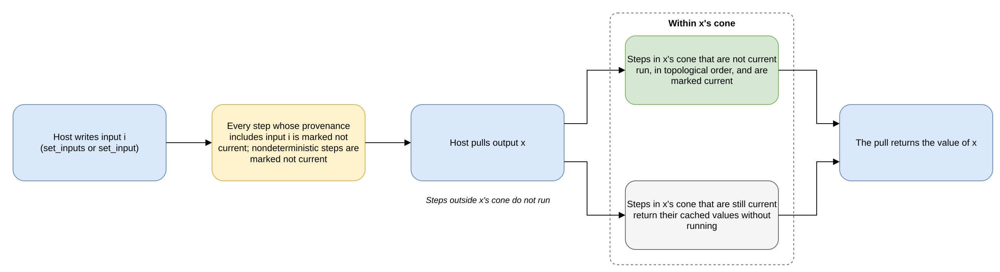

# Evaluation Model

This document specifies how a polydat program is evaluated,
independently of which engine runs it: the split between the
immutable program and per-thread kernel state, provenance-based
invalidation, the two evaluation lifecycles (effectively-const
and dynamic), the const binding contract (Plan A at build, Plan
B at scope activation), the exclusion of nondeterministic nodes
from folding, input spaces, and externally written inputs. It
provides the mechanism for axioms R1–R4 of
[runtime_model.md](runtime_model.md), L2, S4, and T1 of
[composition_substrate.md](composition_substrate.md), and G2 and
G5 of [polydat_grammar.md §18](polydat_grammar.md#sec-gaxioms).

**Related specifications:** [runtime_model.md](runtime_model.md)
(the normative runtime rules and the terms used here),
[composition_substrate.md](composition_substrate.md),
[engines.md](engines.md) (the engines that run this model), and
[jit_boundary.md](jit_boundary.md).

This document uses the terms of
[runtime_model.md](runtime_model.md) §Terms (program, kernel,
node, wire, input, write, change, pull, cone, provenance, step,
current, volatile) and these:

- **Engine.** One of the four ways a program runs: the
  interpreter (P1), the closure tier (P2), the native tier (P3,
  native segments and closure steps in one hybrid kernel), and
  pure native. The last three are the *compiled engines*.
- **Cycle.** One coordinate write (`set_inputs`) and the pulls
  that follow it. The conventional coordinate input is named
  `cycle`.
- **Scope activation.** One instance of a scope's kernel, bound
  to its outer scope's values: a child materialised by
  parent-gated construction, or a `for` traversal activation.
  Scope-init is the start of an activation.

The program is immutable and shared; each thread's kernel state
is mutable and private. Threads therefore evaluate without
locking a shared cache, and only explicit `SharedCell` inputs
are shared, under their own synchronisation contract. The split
holds on all four engines.

---

## Program / State Split

The split is the `KernelProgram` / `Kernel` pair of the kernel
API. A program is an `Arc<dyn KernelProgram>`, immutable and
shared across threads, and each thread creates its own `Kernel`
from it with `create_kernel`. `Kernel::into_program` turns a
kernel back into its program. On all four engines, a kernel
created from a program starts from the program's initial state:
every input at its declared default, every `shared` binding
with a cell of its own, and no step current.

```
KernelProgram (Arc, immutable, shared across threads)
  interpreter realisation — PolydatProgram:
    ├── nodes[]          — node instances
    ├── wiring[]         — input source tables
    ├── input_defs[]     — typed names, defaults, and lifecycle kinds
    ├── output_map       — name → (node_idx, port_idx)
    └── provenance/dependents — exact multi-word masks and reverse lists
  compiled realisation — the closure plan or the hybrid segments
    over one slot layout, with the same provenance and dependents

Kernel (per thread, mutable, private)
  interpreter realisation — PolydatState:
    ├── core: EngineCore
    │   ├── buffers[][]        — per-node output value slots
    │   ├── node_clean[]       — per-node cache validity (bool)
    │   ├── inputs[]           — non-cell input registers
    │   ├── input_defaults[]   — reset values
    │   ├── shared_cells[]     — optional cell register per input
    │   └── cell-cone state
    ├── input_dependents[] — per-input transitive dependents
    └── nondeterministic_nodes[] — never cached
  compiled realisation — one u64 slot buffer, its None mask,
    the per-step current-ness of the provenance mode, and the
    scratch entries its steps publish pairs into
```

On the interpreter, the `PolydatProgram` is created once at
compilation and shared through an `Arc`, and a `PolydatState`
is created per thread with `program.create_state()`.

---

## Provenance-Based Invalidation

Each node has an exact multi-word **provenance mask**, computed
at compile time: bit i is set if the node transitively depends
on graph input i. When inputs change, only the nodes whose
provenance includes a changed input are marked not current.
Nodes that depend only on unchanged inputs keep their cached
values.

```
1. kernel.set_inputs(&[cycle])
   → write each coordinate input in the leading coordinate prefix
   → dirty every transitive dependent of each written coordinate
   → dirty every non-deterministic node

2. kernel.pull("user_id")
   → if the node is current → return the cached value
   → recursively evaluate dirty upstream nodes
   → gather inputs, evaluate, mark the node current
   → return the value
```

In this sequence, "dirty" means not current. The interpreter
treats the write itself as the invalidation signal and does not
compare rich `Value` instances for equality.

The following diagram shows the same sequence for a write to
one input and a pull of one output.



The evaluation rule is the same on all four engines
(interpreter, closure tier, native, and pure native):

- A step is current until an input in its provenance changes.
- A nondeterministic node is never current.
- Compile-constant nodes are folded once at build.
- `set_inputs` writes the coordinate prefix.
- `pull` evaluates the named output's cone and nothing else.

A compiled engine is built with a provenance mode (`Raw`,
`Push`, `Pull`, `PushPull`, or the selector's `Auto`); the
closure tier offers all four named modes, native offers `Raw`,
`Pull`, and `PushPull`, and pure native offers `Raw` and
`PushPull`. The mode changes which steps are recomputed, never
a value: it is an optimization.

**Diamond optimization.** In a diamond-shaped DAG where only one
input branch is written, the unchanged branch keeps its cached
value.

**Memoization granularity.** Every node's output buffer is
cached. Because the rule is uniform, a later pull of any
downstream cone reuses every intermediate that is still
current, including shared branches in a diamond. The normative
rule and its invariants are R1 and R2 of
[The Runtime Model §3–§4](runtime_model.md).

---

## Two Evaluation Lifecycles

A node's *lifecycle* is how often it is re-evaluated. There are
two:

| Lifecycle | When evaluated | Re-evaluated when… |
|-----------|----------------|---------------------|
| **effectively-const** | Once, for the duration of a scope activation. Two implementation paths: (a) **compile-fold** — evaluated during the build and replaced with a leaf const node; (b) **scope-init pull** — evaluated once after parent materialization populates iteration-variable externs, then frozen for the activation. The choice between (a) and (b) is decided by the compiler based on the wire chain; the author writes `const NAME := <expr>` in both cases. | Never within an activation. The enclosing comprehension advancing to its next iteration ([comprehension_forms.md](comprehension_forms.md) §9.5) triggers a fresh activation, which re-runs scope-init pull (compile-folded leaves are immutable across activations). |
| **dynamic** | Once per pull, on demand at execution time | Whenever a transitively dependent input changes (provenance-based invalidation). Includes per-cycle pulls *and* intra-stanza recomputation when external-write inputs or `do_while`/`do_until` counters tick. |

The `const` modifier is the only author-facing way to declare an
effectively-const binding. Compile-fold and scope-init pull are
two implementations of the same contract: evaluate once and keep
the value for the scope activation. The compiler chooses between
them; the author does not.

### Effectively-Const Nodes

A node is **effectively-const** at a given scope-init if it
produces exactly one value for the entire activation of its
scope. The set is closed under upstream traversal: a node whose
every upstream wire comes from an effectively-const producer is
itself effectively-const.

| Producer | Effectively-const? | Why |
|----------|-------------------|-----|
| Literal in source | Yes | Resolved at parse / compile. |
| Compile-const fold result | Yes | Already a leaf const node. |
| Workload param (`const` binding) | Yes | Bound once at workload-kernel init, never reassigned. |
| `for` traversal element / `extern` with no default (iteration extern) | Yes — *for one activation* | Bound when the activation is created (`activation_on`) or the child is materialised; fixed for every coordinate of that activation. |
| `do_while` / `do_until` counter | **No** | Dynamic — ticks within the scope's own evaluation; not stable for the activation. |
| Graph input (e.g. `cycle`) | **No** | Dynamic — changes every cycle. |
| External-write input | **No** | Dynamic — written by the host between pulls. |
| Non-deterministic source (`counter`, `current_epoch_millis`, `elapsed_millis`, `thread_id`) | **No** | Excluded by construction even when wires would suggest otherwise. |

The iteration-extern row is the case that needs explanation.
The body of `for profile in ..., table in ... { ... }` sees
`profile` and `table` as input slots, and a purely data-flow
view would classify every binding downstream of those slots as
dynamic and refuse to fold it. But `profile` is bound exactly
once per activation and held fixed for every coordinate, which
is the same stability guarantee a folded literal has. Because
iteration externs are effectively-const,
`const prebuffered := dataset_prebuffer("{dataset}:{profile}")`
is a legal const binding inside such a body.

### Compile-Time Constant Folding

Compile-time folding is the compile-fold path of the
effectively-const lifecycle. It runs once per build, on all four
engines, before the program is shared:

```
Phase 1: Classify each node — PolydatProgram::classify_lifecycle
  - Graph input / external-write input / non-deterministic source
                                  → dynamic
  - NodeOutput whose source is dynamic
                                  → dynamic (propagates)
  - Wire to an iteration extern (`for` element / `extern` with no default)
                                  → scope-init: not foldable at
                                    build. Extern values are unknown
                                    until scope activation; folding is
                                    deferred to the scope-init pull.
  - Everything else               → compile-constant

Phase 2: Evaluate the compile-constant nodes once

Phase 3: Replace evaluated nodes with leaf const nodes
         (ConstU64, ConstF64, ConstStr, ConstHandle, …)
```

On the interpreter the three phases are
`PolydatProgram::fold_init_constants_impl`. The three compiled
engines use the same classification: the compile-constant nodes
run once when the kernel is built, and their slots hold the
folded values from then on. The `ConstantFolded` compile event
is recorded for the same nodes with the same values on all four
engines.

Type adapter nodes (`__u64_to_f64`, etc.) are folded like any
other node. A chain such as `ConstU64(42) → __u64_to_f64 → sin`
folds to `ConstF64(sin(42.0))`: the whole chain is evaluated
once and replaced with a single constant.

Folded constants can be read by name (`get_constant` on the
interpreter kernel, or `Kernel::pull` on all four engines), for
example to resolve activity configuration such as cycles or
concurrency from dataset metadata.

### Scope-Init Pull

The scope-init pull is the scope-init path of the
effectively-const lifecycle. It runs once per scope activation,
after parent materialization has filled the kernel's
iteration-extern input slots and before the scope is used.

```
For each const-modifier output b in this scope's program:
  Pull b's name on the activation kernel. The standard pull walks
  back through b's subgraph, evaluating each upstream node against
  the populated externs and caching the result in the kernel's
  per-node buffer (marked current).
```

Every later read of the binding, from any cycle and from every
kernel created from the activation, returns that one value, and
the binding's eval does not run again. This is the runtime side
of the const-binding contract: one eval per scope activation,
however many cycles or threads read it.

---

## Const Binding Contract

`const <name> := <expr>` declares an effectively-const binding:
it asserts that `<expr>` evaluates to a single value for the
entire activation of the enclosing scope. The compiler and the
runtime enforce this with two checks.

### Compile-Time Check (Plan A)

During the build, after wire resolution and topological sort:

> For every binding declared `const`, every node in its upstream
> wire chain must be effectively-const (either compile-foldable
> or an iteration extern that materialise-wiring populates at
> scope activation).

If any upstream node is not effectively-const (a graph input,
an external-write input, a `do_while`/`do_until` counter, or a
chain through a nondeterministic source), compilation **fails**
with a diagnostic naming the const binding and the offending
wire. The binding is never silently evaluated as dynamic
instead.

This check runs in the fold pass. The effectively-const
classification (above) and the const-binding check use the same
upstream walk (`classify_lifecycle`); the check requires that
the binding's node not be classified dynamic.

### Scope-Activation Pull (Plan B)

After the outer chain has filled the scope's input slots, the
materializer pulls every `const` output once, so that its value
is captured for the lifetime of the scope and every later read
of the binding returns that one value.

A pull that panics is caught and reported, not ignored:

- The materializer prints one warning naming the binding and
  the panic text, and leaves the binding's buffer at
  `Value::None`.
- The scope still activates.
- The failure surfaces when the binding is read. A read of the
  `None` buffer falls through to the wired-in input where the
  conditional shadow allows it; otherwise it re-raises the
  node's failure with the reader's full context.

The scope does not refuse to start on a failed const pull,
because a `const` may depend on resolution that is not ready
until the workload runs (`dataset_prebuffer` and similar nodes).
A warning at activation followed by the failure in context at
first use gives an operator the information needed to act.

Plan A is a compile-time check, made when iteration-extern
values are unknown but the wire structure is fully visible.
Plan B is the single pull at scope activation, made when those
values are known and the fold pass has already run. Together
they guarantee that a const binding either evaluates exactly
once per scope activation, or every use of it reports the same
failure.

### Why Both Checks

Plan A catches structural errors when the workload is compiled,
so the failure is reported against the source without running
anything. It cannot catch runtime conditions, such as a remote
facet that returns 403, an eval panic, or a `Value::None` from
an otherwise valid scope-init pull, because those depend on
real extern values.

Plan B handles runtime conditions, but on its own it would
defer clear structural errors (for example, a const binding
wired through a `cycle`-dependent node) to runtime, where the
diagnostic is less precisely tied to the source line.

Both checks are cheap, and each runs at most once per scope
activation. The contract is the pair.

### Diagnostic Format

Plan A fails the build with

```
init binding '<name>' violates the init contract: <offending>
(init bindings must be effectively-const at scope-init time per the init contract, evaluation_model.md))
```

where `init` in the message refers to the `const` modifier, and
`<offending>` names the first offending wire the fold found:

- **`wire on node '<n>' reaches coordinate input '<name>'
  (dynamic; changes every cycle)`**: a const binding wired to a
  graph input declared by `input ...: u64`.
- **`wire on node '<n>' reaches external-write port '<name>'
  (dynamic; mutated by op execution)`**: a const binding wired
  to an `extern X: T = default` input (the polydat
  external-write surface, which hosts use for runtime
  injection).
- **`wire on node '<n>' reaches non-deterministic source '<name>'
  (dynamic by construction)`**: `counter`,
  `current_epoch_millis`, `elapsed_millis`,
  `session_start_millis`, or `thread_id`.
- **`wire on node '<n>' reaches dynamic node '<upstream>'
  upstream`**: the fallback when the chain is dynamic but the
  immediate source is none of the above (for example, a chain
  through a `do_while` counter).

Plan B warns at scope activation with `warning: scope-init const
pull failed for '<name>': <panic text>`, from step 3 of
`materialize_wiring_from_outer`. A later read of the binding
raises the node's own failure message, with the reader's
context added.

---

## Non-Deterministic Nodes

A node declared `Purity::Nondeterministic` (`counter`,
`current_epoch_millis`, `elapsed_millis`, `thread_id`, and
similar nodes), and any node feeding a `volatile` output, is
excluded from compile-fold *and* from effectively-const
classification regardless of its input wires, and the exclusion
propagates downstream. Such nodes are always dynamic, even when
a static analysis of their wires would suggest otherwise, and no
engine ever treats them as current. A `const` binding that
depends on one of them fails the Plan A check.

*When* such a node reads its source, within one write, depends
on the engine's steps. Two such wires that no wire connects are
two separate steps on all four engines, and each is read when
its own output is first pulled. Two that a wire connects are one
fused unit on the native tiers and are read together at the
first pull of either. Every engine reads them again after the
next write; that is the guarantee, and simultaneity within a
write is not guaranteed. Two readings that must come from the
same instant belong in one node that returns both; see
[runtime_model.md](runtime_model.md) R1.v, "Read granularity".

---

## Input Spaces

Most workloads use a single `cycle` input. Multi-dimensional
inputs enable nested iteration:

```
input cycle: u64

// Mixed-radix decomposition: flat cycle → nested indices
row := mixed_radix(cycle, 1000, 0)     // cycle / 1000
col := mixed_radix(cycle, 1000, 1)     // cycle % 1000
```

The input space is defined inside polydat, not in the activity
layer. It can therefore be composed with other nodes, and the
executor only passes `[cycle]`.

---

## External-Write Inputs

An `extern name: type = default` declaration produces an
`InputDef` with `InputKind::ExternalWrite`. External producers
write these inputs through the deprecated `Dataflow::set_wire`
API (on the interpreter kernel) or through `Kernel::set_input`
(on all four engines). The boundary accepts `Value::None`,
accepts a value that satisfies the declared slot type, applies
a registered boundary adapter when one exists, and otherwise
returns an error.

```
Producer writes to slot "user_name"
  → kernel.set_wire("user_name", value)?
  → input slot in the kernel holds the value

Consumer pulls a binding that reads {user_name}
  → standard input read → returns the value
```

External-write inputs keep their values across `set_inputs()`
calls, which write only the leading coordinate-input prefix. A
host resets the non-coordinate inputs to their declared
defaults at a scope boundary with
`PolydatState::reset_inputs_from`, normally passing
`program.coord_count()`. Cell-bound inputs are skipped, because
their lifecycle is controlled by the scope that owns the shared
cell. Rebuilding or invalidating the whole state also restores
ordinary inputs to their defaults.

Hosts give external writes their own application-level names;
for example, a host that passes one operation's result into the
next operation's inputs does so through external-write inputs.
The polydat mechanism is generic population of external inputs.

---

## Compilation Levels

The host chooses an `Engine` (`compile_polydat_with`,
`PolydatAssembler::compile_with`): the interpreter; the closure
tier (P2); native code (P3), which runs a node natively where it
has a lowering and as a closure elsewhere; or pure native (with
the `jit` feature), which compiles the whole program to native
code. `Engine::default()`, which every engine-less entry point
and the binary use, is P3 with the `jit` feature and P2 without
it. All four engines evaluate under the rule of this document
and compute the same values for the same inputs; each refuses
at construction, with a reason, a program it cannot run; and
`Kernel::plan` reports what the engine chose for the program.
Per-node costs, eligibility, the provenance-mode selector, and
the JIT call-boundary contract are specified in
[engines.md](engines.md) and [jit_boundary.md](jit_boundary.md).
