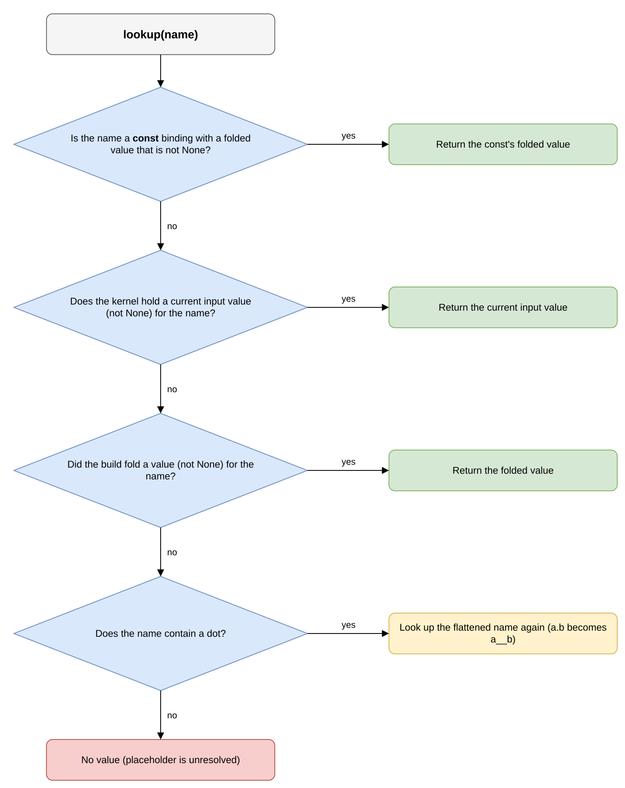

# The Expression Engine

This document specifies how a host crate uses polydat to evaluate
text: the entry points it calls (§3), the guarantees it receives,
stated as the E-axioms (§4), the obligations of host and polydat at
the boundary (§5), the errors the entry points return (§6), and the
canonical way to combine them (§7). A **host** is a crate that embeds
polydat and calls these entry points; an **expression** is polydat
source text the host submits for evaluation. An expression is compiled
by the same pipeline as a full program and runs under the same rules,
so the host gets typed, deterministic evaluation over the whole node
library without writing a parser, an evaluator, or a type checker.

Terms used throughout: a **slot** is the typed storage location in a
kernel that holds one input or output value. The **substrate** is the
set of rules in [Composition Substrate](composition_substrate.md) that
every slot obeys: how a slot gets its value (the S-axioms), how its
type is checked (the T-axioms), and which state owns it (the
L-axioms); together these are the **slot contract**. A value is
**effectively-const** when it is fixed at build or when a scope is
opened, and **dynamic** when it can change between pulls
([graph_compiler.md §3.1](graph_compiler.md)); an expression's
**lifecycle** is effectively-const only if every input in its cone is.

**Related specifications:**

- [Composition Substrate](composition_substrate.md) — the
  S/T/L axioms and the slot contract. The typed-result guarantee
  (E2) follows from T1 and T2.
- [The Graph Compiler](graph_compiler.md) — the construction
  pipeline. An embedded expression is compiled by the same
  compiler as a program; there is no separate evaluator.
- [The Runtime Model](runtime_model.md) — the R-axioms
  (data flow, caching, invalidation) and D-axioms
  (determinism guarantees). E3 is D1, D2, and D3 applied to
  expressions.
- [The Polydat Grammar](polydat_grammar.md) — the G-axioms. G3
  (scope-chain transparency) and G6 (one grammar for
  expressions and full programs) give E1 (self-contained
  submission), E4 (library inheritance), and the
  expression-as-kernel correspondence of §2.
- [The Evaluation Model](evaluation_model.md) — the
  two-lifecycle classification and the const-binding
  contract; `eval_const_expr` is that contract applied to a
  single expression.

---

## 1. Scope

Any text the polydat grammar accepts can be evaluated by a host.
The host passes the text and, when the text refers to names, a
context that supplies their values; polydat compiles the text,
evaluates it, and returns a typed `Value` (or a list of typed
`Value`s). The machinery that compiles a 200-line workload program
also compiles a four-character expression such as `"k+1"`, and the
slot contract and every compiler pass apply to it unchanged.

> **For any text the polydat grammar accepts, the host crate
> can ask polydat to evaluate it against an optional context
> and receive a typed `Value` (or a typed list of `Value`).
> The host inherits the full node library, the lifecycle
> classification, the typed slot contract, and the
> deterministic-evaluation guarantee — without writing a
> parser, an evaluator, or a type checker. The host's
> obligation is the text and (when needed) the context; the
> output is a typed `Value`.**

This document calls that agreement the **Embedding Contract**. It
requires no infrastructure beyond what compiles and runs programs:
the expression engine is the program engine applied to shorter
input.

---

## 2. The expression-as-kernel correspondence

Every text a host submits is compiled by the same pipeline, into
the same kind of program, under the same slot contract, as a full
workload program. The program's size is proportional to the
text's complexity; an expression like `"k * 2 + 1"` compiles to a
three-node program (two operations and a constant-folded output
binding).

```text
host text input            polydat compile pipeline
──────────────────         ──────────────────────────────────────
"k * 2 + 1"                Parse → Bind → wire resolution with
                           adapters → Node Fusion → DCE →
                           topological sort → ResolvedDag →
                           kernel on the chosen Engine, its
                           constants folded at build (3 ops, 1 output)

                                            │
                                            ▼

host context (binding         materialize_subscope / set_input
for "k" as scope-input)       ─────────────────────────────────
                                            │
                                            ▼

                              Kernel::pull → Value::U64(<result>)

                                            │
                                            ▼

                              host receives Value
```

The correspondence is total: every expression compiles to a
kernel, and a kernel whose body is a single binding is a
single-expression case. "Expression" and "workload" differ only in
quantity (lines of input, number of bindings), not in the machinery
that compiles and runs them. Consequently there is no separate
expression engine to maintain, and every change to the substrate or
the graph compiler applies to embedded expressions as well.

---

## 3. The host-facing surfaces

Polydat offers three public entry points for evaluating text, one for
each evaluation depth, and exposes the compiler beneath them (§3.4).

### 3.1 `eval_const_expr` — const-fold at compile time

Location: [`crate::dsl::compile::eval_const_expr`].

Signature:

```rust
pub fn eval_const_expr(source: &str) -> Result<Value, EmbeddingError>
```

Purpose: evaluate a piece of text whose value does not depend on
anything that changes at run time, such as `1000 * 1000` or
`hash(42)`, and return that value.

Argument: `source` is the text to evaluate, written in the polydat
expression grammar. It may use node calls, literals, arithmetic, and
string operations.

What happens: polydat wraps the text as a single output binding
(`out := <source>`), compiles it, and reads the output's value, which
the compiler computed at build. The call succeeds only if that value
can be computed at build: nothing in the expression's cone may be a
dynamic input, so the expression's lifecycle must be effectively-const
(per H1, H2, H3). Results are cached by source text, so a given text
is compiled once per process.

Return: `Ok(Value)` holding the computed value, or an
`Err(EmbeddingError)` naming the failure (below). A host that wants
its own Rust type back rather than a `Value` calls
`eval_const_expr_typed::<T>` (§5.3), which returns
`Result<T, EmbeddingError>`.

Use case: a host's `{...}` configuration expressions, where the text
is short and must resolve when the host builds its activity (no
`cycle` reference, no externally written inputs). The host converts
the result into its own configuration value, typically with
`.as_u64()` for numeric fields or `to_display_string()` for string
fields; that conversion is host policy, not part of the embedding
contract.

**What works as a const expression:**

- Literals: `{42}`, `{3.14}`, `{"hello"}`
- Arithmetic: `{1000 * 1000}`, `{4 ** 0.5}`
- Function calls with constant args: `{hash(42)}`, `{mod(hash(42), 100)}`
- Catalog-registered metadata accessors (e.g.
  `{vector_count(h)}`, where `h` is a dataset handle wire)
- Nested: `{vector_count(h) / 10}` (after the host's
  param substitution pass has bound `h`, which is itself outside
  the embedding contract)

**What does NOT work:**

- References to cycle inputs: `{hash(cycle)}` → error
- References to undefined names: `{undefined_var}` → error
- Non-deterministic functions: `{counter()}` → error

Cost: one full compile and fold, on the order of milliseconds. The
compile dominates; the folded value is stored in the program, and
reading it costs nothing further.

Failure modes (returned as typed `Err(EmbeddingError)` per
§6 Error Ontology):
- `Parse` — the text does not parse.
- `LifecycleMismatch` — the expression's cone contains a
  dynamic input, so it cannot be computed at build.
- `NodeEvalPanic` — a node's `eval` panicked while the value was
  being computed. The panic is caught with `catch_unwind` and
  returned as this error.

### 3.2 `interpolate_via_kernel` + evaluation — kernel-bound dynamic evaluation

#### 3.2.1 Why interpolation is text-level

A kernel holds the current values of its names in typed slots. A
host's expression text is not part of that kernel's program; it is
text the host is about to submit for compilation. To use the kernel's
values in that text, polydat offers **text-level interpolation**: each
`{name}` placeholder in the text is replaced by the display string of
the value the kernel holds for `name`. The result is text, which the
host then passes to `eval_const_expr` like any other text.

Polydat deliberately does not offer value-level injection, in which
the host would build an expression tree with values already
substituted. The text-level design is chosen for three reasons:

- **The grammar is the only contract.** Interpolation produces
  ordinary expression text, and evaluation compiles ordinary text,
  so no separate "expression-with-bound-values" representation
  exists to maintain.
- **Interpolation and evaluation are independent.** A host that only
  wants placeholder substitution (for example, to render a label
  string from kernel values) calls interpolation alone. A host with
  text that has no placeholders calls evaluation alone. The two are
  combined only when both are needed.
- **Type and lifecycle checks happen in one place.** Interpolation
  does not check types (every value becomes a display string); the
  typed, lifecycle-checked evaluation happens when the resulting text
  is evaluated. If the text after interpolation still refers to a
  dynamic input that was not substituted, `eval_const_expr` rejects it
  with a typed error.

The `{name}` placeholder is the contract for inserting slot values
into text. Hosts may write expression text with `{...}` placeholders
freely; the kernel's slots supply the substituted values, and the
evaluation step produces the typed result.

Braces are not a Polydat expression form. In Polydat source, `{name}`
has meaning only inside a string literal, as interpolation
([polydat_grammar.md §9](polydat_grammar.md)). A host whose
configuration fields contain brace-delimited expressions — a
`dim: {vector_dim("glove-25-angular")}` in a workload file — is using
its own syntax, and the host decides when to pass the inner text to
`eval_const_expr`. Keeping the two separate means a Polydat program
can be read without knowing which host embedded it.

#### 3.2.2 The surfaces

Location: [`crate::kernel::interp::interpolate_via_kernel`].

Signature:

```rust
pub fn interpolate_via_kernel(
    text: &str, kernel: &dyn Lookup,
) -> Result<String, EmbeddingError>
```

Purpose: fill the `{name}` placeholders in a piece of text with the
values a kernel currently holds.

Arguments: `text` is any text containing zero or more `{name}`
placeholders. `kernel` is the source of values: any `Lookup`
(described below), typically a compiled kernel.

What happens: each `{name}` in `text` is replaced by the display
string of `kernel.lookup(name)`. A placeholder whose lookup finds no
value, including a slot that holds `Value::None`, is an error.
Substitution runs in rounds until a round changes nothing, which lets
placeholders nest:

- Each round replaces the *leaf* placeholders, those whose body
  contains no further `{`. A nested form such as `{a_{b}_c}` is
  resolved by replacing `{b}` first; the next round then finds the
  leaf `{a_<value of b>_c}` and replaces it.
- `\{` and `\}` are literal braces. They are never treated as
  placeholders and appear in the result as `{` and `}`.
- The number of rounds is bounded. After 100 rounds polydat warns that
  the placeholders are probably cyclic, and if the text has not
  stabilised after 1000 rounds the call fails with
  `EmbeddingError::Parse`.
- Any `{name}` still present once the rounds stop is unresolved.

Return: `Ok(String)` with every placeholder replaced and escapes
removed, `Err(EmbeddingError::UnresolvedPlaceholder)` naming the first
placeholder that had no value, or `Err(EmbeddingError::Parse)` for
text that did not stabilise.

`Lookup` (`kernel::interp::Lookup`) is the trait interpolation reads
values through. It has two methods: `lookup`, which returns the value
bound to a name, and `ledger`, which returns the compile ledger that
any compilation triggered by the lookup (a comprehension source or
predicate) is charged to. Three types implement it: the interpreter
kernel itself; `KernelLookup`, which wraps a kernel of any of the four
engines (the interpreter, the closure tier, native, and pure native);
and `Layered`, which places a tuple's bindings in front of another
lookup and forwards both methods to it. The typed kernel-bound
surfaces, `eval_kernel_bound_typed::<T>(text, &dyn Lookup)` and its
`_strict` variant (§5.3), perform interpolation followed by the typed
const fold over any of these, so a host holding a `Box<dyn Kernel>`
interpolates against that kernel directly:
`eval_kernel_bound_typed(text, &KernelLookup::new(kernel.as_ref()))`.

Through `KernelLookup`, a name resolves to the value the kernel holds
for it now — an input the host wrote, or the coordinate the kernel is
positioned at — and only if there is none, to the value the build
folded for it. The current value takes precedence because on some
engines a coordinate also has a folded value, which is the value the
program was built with rather than the one the kernel is positioned
at. A `const` binding is the exception: its folded value is the
scope's value for the name, so it is read first, and an input slot of
the same name (which holds only the enclosing scope's value) is read
only while the const's value is `None`. A value of `None` at any step
counts as no value. A dotted name such as `q.cursor.idx` that finds
no value is retried as the flattened wire name `q__cursor__idx`,
which is how the compiler lowers `a.b`.

The following diagram shows the order in which `KernelLookup` tries
each source for a name.



`KernelLookup` is a wrapper rather than an
`impl Lookup for dyn Kernel` because one trait object cannot
become another: `&dyn Kernel` has no `dyn Lookup` vtable to
coerce into.

The canonical two-step composition:

```rust
let interpolated = interpolate_via_kernel(text, &kernel)?;
let value = eval_const_expr(&interpolated)?;
let truth = value.as_bool();
```

Step 1 (interpolate) inserts the kernel's current values into the
text. Step 2 (eval) compiles the resulting text and folds it. The
lifecycle check applies at step 2: if the text after interpolation
still refers to a dynamic input, the evaluation is rejected; if every
name was replaced by a static value, the fold succeeds.

Use case: evaluating a host predicate. The host has a text such as
`"{k} > 5"` (where `{k}` is an iteration variable bound in the
calling kernel) and needs a boolean. The two steps replace the
placeholder and fold the resulting `5 > 5` (or `7 > 5`, etc.) to a
boolean.

Cost: interpolation is O(name lookups + text length). The
following `eval_const_expr` is a compile and fold (on the order of
milliseconds) the first time a given text is seen, and a cache hit
after that.

**One name-resolution contract.** Placeholder resolution against a
kernel is provided by polydat through this surface and nothing else.
A comprehension source or predicate that refers to a scope binding
resolves it through the same `Lookup`, and an unresolved name is the
typed error above, never an empty substitution. A host does not add a
second interpolation dialect: text it wants resolved goes through this
surface, and nested placeholders follow the bounded round rules
stated above for `interpolate_via_kernel`.

#### 3.2.3 Interpolation alone — text rendering without evaluation

Interpolation can be used on its own when the host needs the
*rendered text* rather than an evaluated value. The output is
host-domain text (a filesystem path, an SQL fragment, a log line, a
keyspace name) whose consumer is not polydat. The host calls
`interpolate_via_kernel` and uses the returned string directly; no
`eval_const_expr` follows.

**Worked example: rendering a per-iteration data path.**

Suppose the host has a path template that depends on the
current scope's iteration variables:

```text
"data/{dataset}/k{k}_limit{limit}.bin"
```

and the current kernel's bindings are
`dataset = "sift1m"`, `k = 10`, `limit = 100` (typical
post-Context-Fusion state in a `for k in …, limit in … { … }`
traversal body running over a configured dataset). The
host's code:

```rust
use polydat::kernel::interp::interpolate_via_kernel;

let template = "data/{dataset}/k{k}_limit{limit}.bin";
let path = interpolate_via_kernel(template, &kernel)?;
// path = "data/sift1m/k10_limit100.bin"

let bytes = std::fs::read(&path)?;
// host proceeds with the resolved path; no polydat
// evaluation needed.
```

Three properties of standalone interpolation:

- **The result is text, not a `Value`.** The host receives a
  `String` and uses it for its own purpose (a filesystem read).
  Polydat renders the text; it does not consume it.
- **The template need not be a polydat expression.** It is a
  string with `{placeholder}` syntax. Polydat does not parse
  `"data/.../"` as a Polydat expression; the `{...}` form is the
  only syntax interpolation recognizes.
- **No lifecycle check applies.** Because no evaluation follows,
  `LifecycleMismatch` cannot occur. If a placeholder is unresolved,
  `interpolate_via_kernel` returns `UnresolvedPlaceholder` (per §6),
  and the host reports it as a missing binding.

E6 states that interpolation and evaluation are combined only when
both are needed; standalone interpolation is the case that needs only
the substitution.

### 3.3 `evaluate_spec` — list-yielding evaluation against a scope

Location:
[`crate::iteration::comprehension::eval::evaluate_spec`].

Signature:

```rust
pub fn evaluate_spec(
    spec_text: &str, kernel: &dyn Lookup,
) -> Result<Vec<Value>, EmbeddingError>
```

Purpose: turn the text that follows `in` in a comprehension clause
(for example the `1..10` in `k in 1..10`, or `[1, 2, 3]`) into the
list of values the clause iterates over.

Arguments: `spec_text` is the clause's source text. `kernel` is the
`Lookup` that supplies the values of any names the text refers to.

What happens: the text is matched against the recognized clause-source
forms in order, and the first form that matches produces the list.
The forms are `all(cursor)`; a bare wire, parameter, or constant name
(resolved through the same `lookup` the `{name}` path uses); a
bracket list, which may contain spreads; and a partition call.
Otherwise the text is interpolated and passed to `eval_const_expr`,
and if that fails, it is parsed as a literal list whose elements are
typed by their spelling (`1` → `U64`, `1.5` → `F64`, `true` → `Bool`,
anything else → `Str`).

Return: `Ok(Vec<Value>)` holding the expanded values, or an
`Err(EmbeddingError)`.

Use case: expanding the source of every `k in <text>` clause of a
`for` comprehension. The text can declare a *list* of values rather
than a single value, and `evaluate_spec` expands it against the
scope's `Lookup`. Because the sources are evaluated against a
`Layered` view of the opening kernel's values rather than against an
engine-specific kernel, a traversal opens on all four engines.

Cost: dominated by matching the recognized forms (microseconds for
the cheap forms), plus an `eval_const_expr` fallback for the
literal-list case (milliseconds, once per text).

### 3.4 The underlying surface: compiling a kernel

Location: [`crate::dsl::compile::compile_polydat`].

Signatures:

```rust
pub fn compile_polydat_with(source: &str, engine: Engine)
    -> Result<Box<dyn Kernel>, KernelError>;
pub fn compile_polydat_kernel(source: &str)
    -> Result<Box<dyn Kernel>, KernelError>;   // on Engine::default()
pub fn compile_polydat(source: &str)
    -> Result<PolydatKernel, String>;          // the interpreter's kernel
```

Purpose: compile text into a kernel that the host keeps and evaluates
repeatedly, rather than into a single value.

Arguments: `source` is polydat program or expression text; `engine`
names the engine to compile for.

Return: `compile_polydat_with` returns a kernel on the named engine,
used through the `Kernel` trait; `compile_polydat_kernel` does the same
on `Engine::default()`, which is native code where the build has it
and the closure tier otherwise; `compile_polydat` returns the
interpreter's concrete `PolydatKernel`, which is what the kernel-bound
typed surfaces take. The three surfaces of §3.1–§3.3 are built on
these entry points.

Use case: host crates that compile an expression once and evaluate it
many times. `Kernel::into_program` turns a kernel into a shareable
program (`Arc<dyn KernelProgram>`), and each thread creates its own
kernel from the program with `create_kernel`; the interpreter's
`PolydatKernel::into_program` returns the concrete
`Arc<PolydatProgram>`.

Cost: one full compile (milliseconds for small expressions).
Creating further kernels from the program is cheap: the program is
shared and only the state is per thread.

---

## 4. The Embedding Contract — E-axioms

The host receives seven guarantees in exchange for submitting
self-contained text. Each is a property of the substrate or the
compiler, applied to expressions.

### Axiom E1 — Self-contained submission

**A host submits self-contained text (and optionally a
`Lookup` context — a kernel or a layered view over one).
Polydat does not read ambient state, global
registries-not-named-in-the-call, or thread-local context.
The submission is the input; the return is the output; there
is no third channel.**

Enforcement: the public function signatures. Each entry point is a
pure function of its declared arguments and the process-level node
library (linked at build and fixed thereafter).

### Axiom E2 — Typed result

**The returned `Value` (or each element of a returned
`Vec<Value>`) has a declared type per T1. The host
reads the type via `Value`'s typed accessors (`as_u64`,
`as_f64`, `as_str`, `as_bool`, etc.) or via pattern matching.
There is no untyped result.**

Enforcement: T1 (every slot is typed) holds through the entire
compiler pipeline, so the output binding's slot is typed and the
returned value's type is that slot's declared type. Failures are
typed as well: each is an `Err(EmbeddingError)` variant.

### Axiom E3 — Bounded determinism via the Runtime Model

**For a fixed expression text, a fixed context, and a
fixed node registry, embedded evaluation produces a
deterministic typed return value (D1), with deterministic
side channels conditional on per-node metadata (D2), and
structurally bounded cost (D3). The full mechanism — data
flow, dependency tracking, node caching, invalidation, and
the state-layering contracts that compose them — is specified
by the [Runtime Model](runtime_model.md); §5 records how
those properties apply to embedded evaluation.**

Enforcement: the Runtime Model's R1–R3 (memoization, lazy
pull-through, forward-only flow), together with the substrate's
S/T/L axioms and the Graph Compiler's H-axioms.

### Axiom E4 — Library inheritance

**Every node in the linked node registry — polydat's
built-in library plus every host-crate registration made
with `register_nodes!` or `#[polydat_node]` — is available
to embedded expressions. The host inherits the full node
catalog — hash, arithmetic, string, math, distributions,
datetime, noise, vector ops — without declaring
per-expression node availability.**

Enforcement: the compiler reads the link-time
`NodeRegistration` inventory at compile time (§5.5). A node
registration linked by any host crate is available to every
embedded evaluation in the process. `PolydatRuntime`'s
object-local factories are a separate mechanism that the standard
surfaces do not consult.

### Axiom E5 — Lifecycle transparency

**The host chooses the evaluation depth that matches its
need: const-fold via `eval_const_expr` (the expression must
be effectively-const), kernel-bound dynamic via
`interpolate_via_kernel` + eval (the expression sees the
kernel's bound state), or full compile via `compile_polydat`
and its engine-taking forms (the host keeps the resulting
kernel for repeated evaluation). Each surface preserves the
substrate's lifecycle classification; they differ in
*which* lifecycle window they evaluate against.**

Enforcement: the surfaces are distinct entry points with
distinct contracts. `eval_const_expr` rejects expressions
whose cone contains a dynamic input (typed error). The two-step
interpolate-then-eval composition handles values that are dynamic
in the kernel. The compile entry points expose the full kernel for
any remaining use.

### Axiom E6 — Composability via interpolation

**The interpolation surface (`interpolate_via_kernel`) and the
evaluation surface compose. The host can use them as a
pipeline: text → interpolation → resolved text → evaluation
→ value. The composition's invariants are: interpolation
preserves text grammar (substitutions are syntactically
sound); evaluation operates on the post-interpolation text
under the same E1–E5 guarantees.**

Enforcement: interpolation is text-to-text, with no semantic
transformation, only placeholder replacement via `lookup` and
`Value::to_display_string`. Evaluation is text-to-`Value`. The
output of the first is a valid input to the second, and this
pipeline is the canonical host pattern.

### Axiom E7 — Typed error ontology

**Every failure mode the embedding surface produces is
classified into a typed `EmbeddingError` variant per the
error ontology in §6. The host pattern-matches on the
error to drive UX, recovery, or logging. `From<EmbeddingError> for String`
is a display compatibility conversion, not a second
error ontology.**

Enforcement: §6 enumerates the variants, and all standard
embedding surfaces return `EmbeddingError`.

---

## 5. The Embedding System Contract

This section is the canonical reference for the contract between
polydat and the host crates that embed expression evaluation. It
specifies:

- what host and polydat each provide (§5.1)
- how types cross the boundary (§5.2)
- l-value type inference at the embedding surface (§5.3)
- type-matching adapters at the boundary (§5.4)
- virtual nodes — linked registry contributions (§5.5)
- virtual wires — context-fusion-conditioned host bindings
  (§5.6)
- how the [Runtime Model] applies to embedded expressions
  specifically (§5.7)

The contract's terms are explicit and mechanically enforced: host and
polydat share a typed interface, not an incidental usability of
polydat as an expression engine.

### 5.1 The contract — what host and polydat each provide

The Embedding System Contract binds both sides and has **two
engagement levels**: a baseline contract every host must satisfy to
use the surfaces at all, and an opt-in strict contract a host can
engage for stronger compile-time type alignment.

#### 5.1.1 Polydat's obligations

Polydat's obligations to every host, regardless of
engagement level:

| Obligation | Discharged by |
|---|---|
| Typed result | T1+T2 (substrate) → E2 |
| Deterministic typed return | D1 (runtime model) → E3 |
| Library inheritance | E4 — every registered node is available |
| Lifecycle transparency | E5 — three surfaces for three depths |
| Typed error ontology | E7 + §6's `EmbeddingError` enum |
| Forward-only data flow | R3 (runtime model) — no surprise side channels |

These obligations are unconditional; a host using only the baseline
contract receives all of them. The strict opt-in adds guarantees and
removes none.

#### 5.1.2 Host's baseline obligations

The minimum a host must do to use the surfaces:

| Obligation | Required surface |
|---|---|
| Self-contained text | A `&str` submitted to one of §3's surfaces |
| Context (when needed) | A `Lookup` (the interpreter kernel, or a layered view) for kernel-bound evaluation |
| Registry contributions (when needed) | Node registrations linked before evaluation |

A host at the baseline calls a surface, receives a `Value` (or
`Result<Value, EmbeddingError>`), and handles the value as it chooses:
a typed accessor, a pattern match, or rendering it as a display
string. The host is responsible for any type expectation it imposes
on the result, including accessor panics and mismatch handling.

A host whose predicate evaluation calls `.as_bool()` on the result,
or whose parameter evaluation calls `.as_u64()`, operates at this
level; this works because the host knows the expected type from
outside the contract.

#### 5.1.3 Host's opt-in strict contract

A host that wants polydat to enforce type alignment at
*kernel compile time* accepts additional obligations in
exchange for additional guarantees. The opt-in surface
is the typed embedding API (§5.3):

| Opt-in obligation | What polydat guarantees in return |
|---|---|
| Declare the expected return type via `eval_const_expr_typed::<T>` | Compile-time check: expression's output type matches `T` or is healable via the catalog (§5.4) |
| Use the typed accessor on the unwrapped Rust value | No accessor panic risk — the result is a Rust `T`, not a `Value` |
| Treat `TypeMismatch` errors as compile-time signals | Error variant fires at embed-call rather than at downstream use |

The opt-in extends the baseline contract rather than replacing it.
A host can use baseline and opt-in surfaces in the same crate, with
different call sites at different levels.

**Why opt-in, not mandatory.** Some hosts have legitimate
reasons to operate at the baseline:

- Hosts that evaluate expressions whose return type
  varies across calls (e.g., a generic configuration
  evaluator that may return `U64`, `Str`, or `Bool`
  depending on the configuration key).
- Hosts that already have their own type-coercion layer
  and want polydat's value as its input.
- Hosts wrapping polydat for an interpreted-language
  binding (e.g., a Python embedding), where Rust's static
  typing is not the boundary.

The baseline serves these hosts, while Rust-native hosts that want
stricter compile-time guarantees opt into them.

#### 5.1.4 Shared vocabulary

Both engagement levels use the same vocabulary:

| Shared element | Role |
|---|---|
| `Value` enum | The carrier type for all typed return values |
| `PortType` enum | The type vocabulary for slot declarations and value classifications |
| `{name}` placeholder syntax | The textual surface for interpolation |
| The grammar | The expression-text language both produce/consume |

A host that works with the substrate's type system, at baseline or
strict level, uses exactly these types and this syntax. Polydat
exports them, and host crates depend on the polydat crate and import
them directly. There is no opaque value, no host-side type that
polydat treats as a black box, and no syntax other than what the
grammar declares.

Hosts that use Polydat's `Value` type system in depth (e.g.,
constructing `Value`s programmatically, pattern-matching
exhaustively, or contributing virtual nodes per §5.5 that produce
typed values) are explicitly *allowed and supported*. The substrate's
type vocabulary is public, and deep host integration is a supported
pattern, not a workaround.

### 5.2 Types at the embedding boundary

Every value crossing the boundary is typed. The contract has no
untyped slot, no untyped return, and no untyped error. The type
vocabulary is `PortType` (declarations) and `Value` (the runtime
representation). The two correspond: every `Value` has a
`port_type()` method returning its `PortType`, and every `PortType`
has a non-empty set of `Value` variants that satisfy it.

**Boundary type checks:**

- **Inputs (host → polydat):** the host's submitted text
  must parse as expression text whose result wire
  has a `PortType`. The compiler infers this from the
  expression's structure (T1+T2). If the host supplies a
  kernel context with bindings whose types are wrong for
  the slots the expression declares (e.g., slot expects
  `U64`, binding is `Str`), the boundary adapter catalog
  converts the value if an adapter exists; otherwise the typed write
  is rejected, and compiling a mismatched graph returns
  `EmbeddingError::TypeMismatch`.

- **Outputs (polydat → host):** the `Value` returned to the host
  identifies its `PortType` by its enum variant. The host reads it
  through typed accessors (`Value::as_u64`, `Value::as_f64`, etc.)
  or pattern matching. The accessors (`as_u64`, `as_bool`, …)
  panic on a type mismatch; a host that must not panic
  pattern-matches on the `Value` variant or uses the typed
  surfaces (§5.3).

- **Errors (polydat → host):** the `EmbeddingError` enum
  (§6) is itself typed: every error class is a distinct
  variant, not a message string.

The boundary is type-strict in both directions. Because both sides
use the same `Value` / `PortType` vocabulary, the checks need no
per-call negotiation.

### 5.3 L-value type inference

The embedding surface supports both result-typed and
l-value-typed evaluation. The result-typed surface returns a
`Value`, and the host applies a typed accessor afterwards:

```rust
let result_value = eval_const_expr("k > 5")?;
let truth = result_value.as_bool();  // post-hoc accessor
```

On this surface polydat does not know the host's expected type
(`bool` in the example) at compile time.

The l-value-typed surface makes that type part of the call:

```rust
let truth: bool = eval_const_expr_typed::<bool>("k > 5")?;
```

Here the type parameter `bool` tells polydat the host expects a
`Value::Bool`. Polydat checks that the expression's output
`PortType` is `Bool` or can be converted to it, and returns a Rust
`bool` (not a `Value`). A mismatch is returned as
`EmbeddingError::TypeMismatch` from the call, not raised as a
runtime panic from `.as_bool()`.

The mechanism:

- The host's type parameter selects a target `PortType` via
  the `HostType` trait (one impl per Rust type that has a
  natural polydat counterpart).
- The expression is evaluated as usual, and the resulting
  value's `PortType` is compared with the target.
- If they match: the unwrapped Rust value is returned.
- If they differ but a return-path adapter exists (per
  §5.4): the adapter is applied and its result returned.
- Otherwise: a typed error.

The corresponding kernel-bound entry point is
`eval_kernel_bound_typed::<T>`. The `_strict` variants reject
catalog conversions that `is_lossless_adapter` classifies as
lossy. The raw-`Value` surfaces remain supported for generic
hosts and exhaustive value handling.

### 5.4 Type-matching adapters at the boundary

The substrate's T2 axiom states that a type mismatch between
adjacent wires is resolved by an automatically inserted edge adapter.
The Graph Compiler's wire resolution
([graph_compiler.md](graph_compiler.md) §5.1) implements
this with the catalog of known conversions in
[`library::convert`] and its polyfill companions:
`__u64_to_string`, `__f64_to_string`, `__u64_to_f64`,
`json_to_str`, and so on. Each catalog entry is itself a
`PolydatNode` with declared input and output `PortType`s;
the assembler inserts the appropriate adapter node when a
wire's source type differs from its consumer's expected type
and the catalog has a conversion between them.

#### 5.4.1 Catalog application sites

The catalog is applied at three typed boundaries. The first is
**intra-graph wire validation during assembly**. The
assembler (`compile::assembly::resolve_with_log`) walks each
wire, compares the source's output `PortType` with the
consumer's input `PortType`, and:

- If they match exactly → no adapter needed.
- If they mismatch but a catalog adapter exists → insert
  the adapter as an intermediate node, rewriting the wire
  to pass through it.
- If they mismatch and no catalog adapter exists → fail
  with `AssemblyError::TypeMismatch`.

The second is **input binding**: the scope-init
materializer (`materialize_subscope`, driving
`materialize_wiring_from_outer`) and the typed host writes
(`Dataflow::set_wire`) pass every value written into a
slot through `adapt_boundary_value`, which consults
`boundary_adapter` — `auto_adapter` plus the boundary-only
parsers ([type_system.md](type_system.md) §6.2). When the
host's context kernel has a binding `k: F64` and the
expression's extern slot declares `k: U64`, the catalog's
`F64 → U64` adapter runs where the slot is filled; a mismatch
with no adapter is rejected by the typed write surface.

The third is **typed return conversion**. When the host calls
`eval_const_expr_typed::<bool>` and the expression
produces `U64`, the surface applies the catalog's
`U64 → Bool` rule (`auto_adapter`), and the host receives a
`bool` with no risk of an accessor panic.

#### 5.4.2 The contract's rules for boundary adapters

The rules are the same at all three sites:

- **Only catalog adapters apply.** There is no silent generic
  coercion. `U64` → `Str` uses the catalog's
  `__u64_to_string`; a pair with no entry is reported as
  `TypeMismatch`. The host can tell what is convertible by
  reading the catalog.
- **Lossy conversions are refusable.** The `_strict` typed
  surfaces refuse a conversion `is_lossless_adapter`
  classifies as lossy and apply only the lossless ones. That
  classification is computed from the two types' numeric
  domains (`PortType::numeric_domain`), not declared per
  catalog entry: a conversion is lossless when every number
  the source type can represent is a number the target type
  can represent. Integers fit by their magnitude bits: an
  unsigned domain needs a signed one strictly wider, and a
  signed domain never fits an unsigned one. An integer fits
  a float when its magnitude bits fit the significand, so
  `U32 → F64` is lossless while `U64 → F64` and `I64 → F64`
  are not, since 64 magnitude bits do not fit in 53 and values
  above `2^53` round. Rendering to `Str` is lossless for
  every type with a numeric domain. No other type — `Bytes`,
  `Json`, the vectors, `Ext` — is classified lossless,
  whatever conversions the catalog offers for it. Because the
  classification depends only on the types, it is the same for
  every input value; a host that wants a number widened writes
  it at the wider type.
- **Adapter insertion is observable.** The compile event
  log records every adapter the assembler inserts, a lossless
  widening as `TypeWidening` and any other adapter as
  `TypeAdapterInserted`, on all four engines, since assembly
  precedes engine selection; the typed boundary APIs report
  boundary errors as typed values.
- **The catalog is the single source of truth.** A new
  conversion is added to the catalog *once*, and is then
  available at every boundary where that catalog applies.
  `auto_adapter` governs graph and return-path conversions;
  `boundary_adapter` is its superset for the scope and host
  boundaries.

### 5.5 Virtual nodes — linked registry contributions

A **virtual node** is a node a host crate contributes to the
registry. Such nodes use the same link-time `NodeRegistration`
inventory as Polydat's built-in library. Host crates contribute
registrations with `register_nodes!` or the `#[polydat_node]`
attribute macro. Each registration supplies static `FuncSig`
metadata, a builder, and an optional constant validator. The
standard compiler's `registry()` and `build_node()` paths read that
inventory directly.

Once linked, contributed nodes are indistinguishable from built-ins:
they declare typed ports, compile levels, purity, commutativity, and
optional compiled or SIMD hooks through the ordinary node contract,
and the slot, lifecycle, and runtime axioms apply to them unchanged.

`PolydatRuntime::register_factory` is a separate, object-local
factory catalog. Its `registry()` and `build_from_factory()` methods
support explicit host orchestration, but the standard
`eval_const_expr` and `compile_polydat` entry points do not accept a
`PolydatRuntime` and therefore do not consult object-local factories.
A node that must be visible to those standard embedding surfaces
must be registered through the linked inventory.

Virtual nodes are how a host extends the set of callable nodes.
Virtual wires (§5.6) extend instead the set of names a scope can
bind.

### 5.6 Virtual wires — context-fusion-conditioned bindings

A **virtual wire** is a binding whose value a host-registered
resolver supplies. When a scope is opened, **Context Fusion** fills
the scope's extern slots — the names its program reads but does not
define, which the compiler discovers by **auto-extern** (S1) — from
the enclosing scope's bindings ([graph_compiler.md §4](graph_compiler.md)).
When the enclosing scope has no binding for such a slot, the host's
resolver is called and may supply the value.

The host registers a resolver via
[`crate::dsl::factories::register_extern_resolver`]:

```rust
register_extern_resolver(Box::new(|slot_name, slot_type| {
    // Host-mediated resolution; returns Option<Value>.
    // If Some, Context Fusion fills the slot with the
    // returned value; if None, falls through to ordinary
    // resolution (typed error if no binding exists).
}));
```

The resolver receives the slot's name and declared type and returns
`Some(Value)` to fill the slot or `None` to decline. For example, a
resolver can bind a name such as `cluster_metadata.region` from host
configuration when the enclosing kernel chain has no matching value.
When a scope is opened, polydat calls the registered resolvers for
each unfilled extern slot in registration order and uses the first
value returned. If every resolver returns `None`, the ordinary
unresolved-slot handling applies.

#### 5.6.1 Why this is a distinct integration tier

Virtual wires differ from virtual nodes in three ways:

- **Timing.** A virtual node runs at *evaluation* time
  (its `eval` runs per cycle, like any node). A virtual
  wire's resolver runs when the scope is opened, and the
  value it returns is fixed for the scope's lifetime (S3).
- **Surface.** A virtual node appears in the expression
  *text*: the workload author writes the registered function
  call. A virtual wire appears as a *binding* the expression
  text refers to via `{...}`; how it is resolved is not
  visible to the expression author.
- **Substrate role.** A virtual node reads slots (its inputs)
  and writes slots (its outputs). A virtual wire *fills* slots
  that auto-extern declared.

A virtual wire therefore integrates the host more deeply: the host
takes part in filling slots when a scope is opened (S2), not only in
consuming them. The value for a slot discovered by auto-extern (S1)
comes from the enclosing kernel chain or from a registered host
resolver.

#### 5.6.2 Virtual-wire resolver contract

A resolver must preserve every substrate axiom for the slot it
fills:

- **T1, T2 (typed slots).** The resolver MUST return a
  typed `Value` matching the slot's declared `PortType`,
  or `None` to fall through. A returned value passes
  through the boundary adapter catalog; a value of a type
  the catalog cannot convert is a typed error.
- **S3 (coordinate advance).** The resolver runs only when the
  scope is opened. It cannot set the slot anew for each coordinate.
  A host that needs per-coordinate resolution uses a virtual node
  (§5.5).
- **L1 (each layer owns its state).** The resolver
  sees no other layer's state beyond the kernel context
  passed as its argument, which is the context in effect
  when this scope is opened.
- **D1 (typed-return determinism).** The resolver MUST
  be deterministic in its inputs (slot name, type, and
  context). Polydat's D1 holds only if it is; a
  non-deterministic resolver breaks D1 for every expression
  that reads its slot.

#### 5.6.3 Composition with virtual nodes

Virtual wires fill slots; virtual nodes read them. A virtual node's
`eval` sees its input slots filled under the ordinary contract, and
it reads a typed `Value` from each slot whether that slot was filled
by the enclosing chain, by a virtual-wire resolver, or by an ordinary
binding. The slot contract is the boundary between the two. The
resolver is the mechanism for binding host configuration and
external-system values; workload parameters remain the explicit
alternative.

### 5.7 The runtime model applied to embedded expressions

How embedded expressions execute — data flow along wires,
dependency tracking, per-generation node caching, lazy pull-through
invalidation, and the determinism guarantees that result — is
specified in the [Runtime Model](runtime_model.md). That document
defines the R-axioms (R1 memoization, R2 lazy pull-through,
R3 forward-only flow) and the D-axioms (D1 typed-return
determinism, D2 side-channel determinism, D3 cost
determinism). E3 is D1, D2, and D3 applied to expressions.

#### 5.7.1 The embedded expression's kernel is its own scope tier

Under the Runtime Model's realisation of L1 (kernel state is
per thread), an embedded expression's kernel is its own scope tier,
held by the host call. The kernel's state is not shared with the
host's other state; the kernel's program is an `Arc` and can be
shared across threads if the host caches it.

The host context (the `Lookup` it passes) is the **outer
scope** of the embedded expression. Context Fusion (per the Graph
Compiler) fills the expression kernel's extern slots from the context
kernel's bindings when the scope is opened, including values from
virtual-wire resolvers per §5.6.

#### 5.7.2 Cone size is small — cost stays small

D3 (cost determinism) gives the host a structural cost
prediction: cone size × node-eval cost per generation. An embedded
expression's cone is typically small: single-digit node counts for a
one-line expression, low double digits for a complex predicate. A
host that compiles once and evaluates many times therefore pays a
one-time compile cost plus a per-evaluation cost bounded by a small
cone.

#### 5.7.3 External-write-aware embedding patterns

Under the Composition Substrate's S4 (external-write synthesis as
the open-granularity fill path), an embedded expression that reads
an externally written wire must be evaluated *after* the host has
written the value into the slot. The host pattern:

```rust
// host writes the value through the typed dataflow boundary
kernel.set_wire("recall_at_k", recall_value)?;

// NOW the expression sees the written value
let ok: bool = eval_kernel_bound_typed::<bool>("{recall_at_k} >= 0.8", &kernel)?;
```

If the host evaluates **before** the slot is written, the slot holds
`Value::None` (or the slot's default). Under the None-propagation
contract, `{recall_at_k}` is then an `UnresolvedPlaceholder` at
interpolation, and a `None` that reaches a typed surface's result is
`NonePropagated` (per §6).

Hosts that use this pattern give their write events host-specific
names — writing one operation's result values into externally
written slots between operation executions is one such pattern — but
the embedding contract sees only the generic external-write
mechanism.

#### 5.7.4 Cross-host determinism — what hosts share

Two host crates evaluating the same expression text against
the same kernel context get the same typed return value
(D1). This allows expression evaluation to be a shared utility
across a workspace: two hosts calling `eval_const_expr` on
`"{k} * 2 + 1"` with the same kernel get identical
`Value::U64`s, every time, on every thread.

D2 (side-channel determinism) is more qualified: if the
expression includes a diagnostic node (`log_info`,
`log_debug`), its log output is deterministic according to that
impure node's declared semantics. Hosts that share a sink for
diagnostic output observe deterministic emission *per node*; the
order of the combined output follows the order in which the
diagnostic nodes are evaluated, which is itself deterministic by R3
(forward-only flow along the wire chain).

For the normative statement of these properties,
see [Runtime Model §7 (D-axioms)](runtime_model.md).

---

## 6. The Error Ontology

The standard embedding entry points return seven classes of
`EmbeddingError`, arising from parsing, compilation, lifecycle
validation, evaluation, and typed result conversion. Each variant
has the fields shown below; the shape is normative, and every
variant is one that some entry point constructs and a host can
receive.

Each variant's fields are taken from the compiler's own data. A
wiring type mismatch includes the two node names and the two port
types the assembler resolved; an unknown function includes the
registry's nearest name; a lifecycle mismatch includes the kernel's
dynamic inputs the expression depends on. None of them is
reconstructed by parsing an error message.

```rust
pub enum EmbeddingError {
    /// Text could not be parsed as polydat expression source.
    /// The lexer or parser rejected the input before any
    /// semantic analysis. Also the class of an interpolation
    /// that does not stabilise (cyclic placeholders).
    Parse {
        source: String,
        message: String,
        position: Option<usize>,
    },

    /// A `{name}` placeholder in the text had no matching
    /// binding in the lookup. Produced by
    /// `interpolate_via_kernel` and `evaluate_spec`.
    UnresolvedPlaceholder {
        name: String,
        source: String,
    },

    /// The expression's upstream cone reaches a dynamic
    /// input, but the requested evaluation surface requires
    /// effectively-const lifecycle. Produced by
    /// `eval_const_expr` (directly or via the two-step
    /// composition).
    LifecycleMismatch {
        source: String,
        dynamic_inputs: Vec<String>,
    },

    /// A node mentioned in the expression is not registered.
    /// `suggestion` is the nearest registered name within
    /// three edits, when there is one.
    UnknownNode {
        name: String,
        source: String,
        suggestion: Option<String>,
    },

    /// The expression's wire chain has a type mismatch that
    /// auto-adapters cannot heal (from the assembly pass), or
    /// a typed surface's target type has no adapter from the
    /// expression's result type.
    TypeMismatch {
        from_node: String,
        from_type: PortType,
        to_node: String,
        to_type: PortType,
        source: String,
    },

    /// A node's `eval` panicked during the fold. The
    /// `catch_unwind` boundary captured the panic; the message
    /// is the panic payload's human-readable form.
    NodeEvalPanic {
        node_name: String,
        message: String,
        source: String,
    },

    /// A `Value::None` reached a typed surface's result: the
    /// `HostType` conversion refuses to read an absent value
    /// as a Rust value. See none_semantics.md.
    NonePropagated {
        accessor: &'static str,
        source: String,
    },
}
```

### 6.1 Variant guide

| Variant | When it fires | Host remediation |
|---|---|---|
| `Parse` | Lexer/parser rejects the input; or interpolation does not stabilise. | Surface the parse position to the user; the input is malformed expression text. |
| `UnresolvedPlaceholder` | `{name}` has no binding in the lookup (an unset extern reads as none). | Check the kernel's inputs and outputs; suggest declaring the name as a workload param or fixing the spelling. |
| `LifecycleMismatch` | `eval_const_expr` was called on text reaching a dynamic input. | Either: (a) use the two-step interpolate-then-eval pattern to resolve dynamic names, or (b) accept the expression must be evaluated per-cycle via a compiled kernel + cycle dispatch. |
| `UnknownNode` | A node call uses a name not in the registry. | Surface `suggestion` when it is set, and point the user at the node catalog otherwise. Host crates that register custom nodes must link the registration. |
| `TypeMismatch` | Wire types incompatible and no auto-adapter exists; or the typed surface's target has no adapter. | Surface the from/to node and types; suggest an explicit conversion (`x as str`, `format_u64(x)`, `to_f64(x)`) or a different node. |
| `NodeEvalPanic` | A node panicked during the fold. | Surface the panic message; this is typically a node-internal contract violation (invalid argument range, etc.). Forwarded to the user with provenance. |
| `NonePropagated` | A typed surface's result was `Value::None`. | Use the raw-`Value` surface and handle the None, or surface it to the user with context about which input was missing. See [none_semantics.md](none_semantics.md). |

### 6.2 Provenance

Every variant includes the source text that produced the error.
Host crates that wrap embedded evaluation should *also* record
(a) the file or YAML key the source text came from, and (b) the
calling host context (e.g., "workload `query` op, field `where`").
Together these form the diagnostic chain: polydat supplies the
polydat-layer error variant, and the host supplies the host-layer
location and naming.


## 7. The composition pattern

The canonical host pattern for kernel-bound evaluation:

```rust
use polydat::kernel::interp::{interpolate_via_kernel, Lookup};
use polydat::dsl::compile::{eval_const_expr, EmbeddingError};

fn evaluate_predicate(
    text: &str, kernel: &dyn Lookup,
) -> Result<bool, EmbeddingError> {
    let resolved = interpolate_via_kernel(text, kernel)?;
    let value = eval_const_expr(&resolved)?;
    Ok(value.as_bool())
}
```

The two-step composition has these properties:

- **Interpolation preserves the text.** `{name}` becomes the
  display string of `kernel.lookup(name)`, and the text after
  interpolation remains a grammatically valid polydat expression.
- **Evaluation is independent of interpolation.** `eval_const_expr`
  does not know the text was interpolated; it compiles what it
  receives.
- **The lifecycle check happens at the eval step.** If the text
  after interpolation still refers to a dynamic input (because
  interpolation did not substitute every name, or because the
  remaining names are bound to dynamic values), evaluation returns a
  typed error.
- **Each step can be used alone.** A host that wants only
  interpolation (text → text) calls the first; a host with
  already-resolved text calls only the second.

This pattern gives the host the full expressive range of the grammar
without weakening the deterministic-evaluation guarantee.
`eval_kernel_bound_typed::<bool>` is this pattern with the typed
return conversion of §5.3, on the interpreter's kernel.

---

## 8. Surface boundaries

- Evaluation APIs compile eagerly. Callers that need reuse
  compile a kernel and cache the resulting program.
- Each embedding call accepts one expression. Hosts batch by
  compiling a graph with multiple named outputs or by managing
  a collection of cached programs.
- Source provenance is recorded in the existing source and
  `EmbeddingError` fields. There is no separate `HostText`
  wrapper in the embedding contract.

---

[`crate::ast`]: ../../../polydat-core/src/ast.rs
[`crate::kernel`]: ../../../polydat-core/src/kernel/mod.rs
[`crate::dsl::compile::eval_const_expr`]: ../../../polydat-core/src/dsl/compile.rs
[`crate::dsl::compile::compile_polydat`]: ../../../polydat-core/src/dsl/compile.rs
[`crate::dsl::factories::register_extern_resolver`]: ../../../polydat-core/src/dsl/factories.rs
[`crate::kernel::interp::interpolate_via_kernel`]: ../../../polydat-core/src/kernel/interp.rs
[`crate::iteration::comprehension::eval::evaluate_spec`]: ../../../polydat-core/src/iteration/comprehension/eval.rs
[`library::convert`]: ../../../polydat-core/src/library/convert.rs
[Runtime Model]: runtime_model.md
