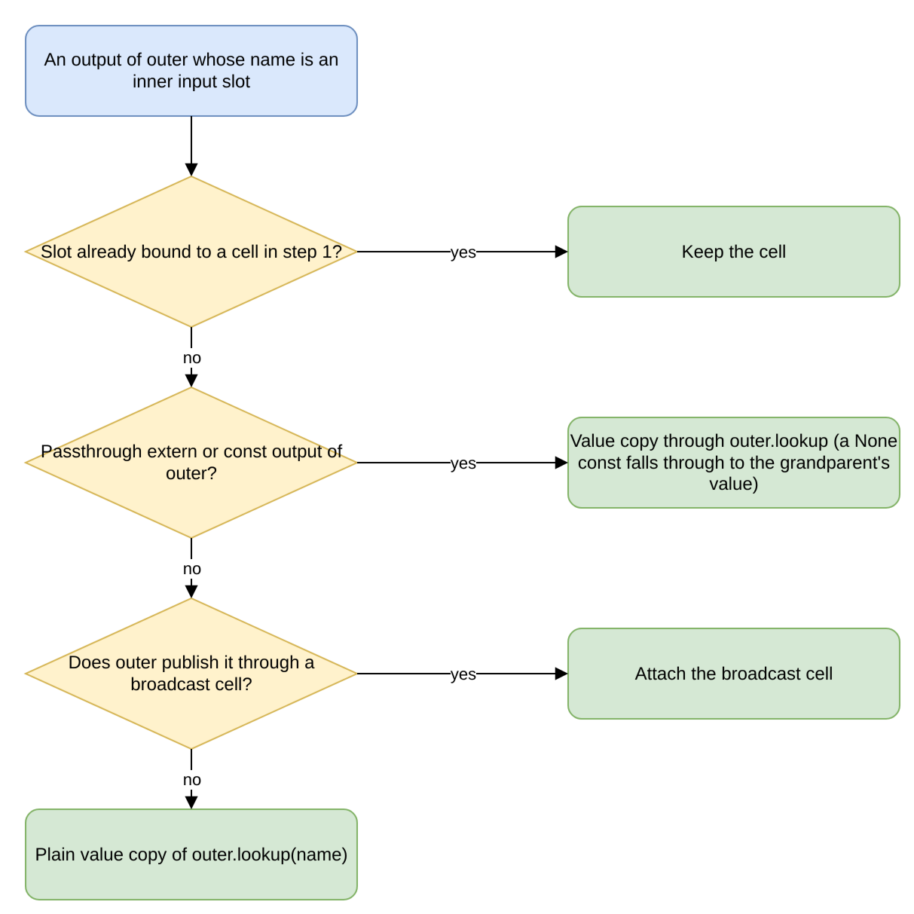

# The Graph Compiler

This document specifies the scope-aware compiler that turns an
authored polydat graph into a ready kernel: the order of its
passes, what each pass produces, and the axioms each pass
preserves over the [composition substrate](composition_substrate.md)'s
slot contract. It covers hoisting (the H-axioms), Context Fusion
(the CF-axioms), and Node Fusion (the NF-axioms). A workload
declares clauses, bindings, and operations, but never which
values are computed where, which subgraphs are merged, or which
inputs are constant for a scope's lifetime; the compiler derives
all of these.

**Related specifications:** the
[Composition Substrate](composition_substrate.md) (the slot
contract and the S, T, and L axioms); the
[Runtime Model](runtime_model.md), which specifies what the
compiled program does at runtime and defines the terms used
here; the [Evaluation Model](evaluation_model.md), which
specifies the two-lifecycle classification that hoisting
applies and the const-binding contract it enforces; and
[engines.md](engines.md).

---

## 1. Scope

This document uses the terms of
[runtime_model.md](runtime_model.md) §Terms, the terms *slot*,
*chain*, *scope-init*, *cycle time*, and *engine* as defined in
[composition_substrate.md](composition_substrate.md) §1, and
the following:

- **Hoisting.** The compile-time lifecycle analysis that
  classifies every node as compile-constant, scope-init, or
  dynamic, and so decides whether it is evaluated once at
  build, once at scope-init, or per cycle (§3).
- **Graph Fusion.** The two passes that adapt a graph to its
  context and its engine: Node Fusion and Context Fusion.
- **Node Fusion** (Graph Fusion Phase 2). Compile-time graph
  rewriting: type-conversion adapters inserted at wire
  resolution, and recognised subgraphs replaced by fused nodes
  (§5).
- **Context Fusion** (Graph Fusion Phase 1). Slot filling at
  scope-init: the kernel's extern slots are bound from the
  outer scope, which fills the synthesis surface that
  auto-extern declared (§4).
- **Synthesis surface.** The set of extern slots, by name and
  type, that the chain must fill from outer-scope state at
  scope-init (composition_substrate.md S1).

The compiler is scope-aware: it treats a kernel not as a closed
compilation unit but as one scope in a chain of nested scopes,
each with its own lifecycle classification and synthesis
surface. It builds a kernel with three coordinated mechanisms:

```text
                  AUTHORED GRAPH
                        │
                        ▼
                ┌──────────────────┐
                │   Node Fusion    │   compile-time graph
                │   (Phase 2 GF)   │   rewriting
                └────────┬─────────┘
                         │
                         ▼
                ┌──────────────────┐
                │     Hoisting     │   compile-time lifecycle
                │     (analysis)   │   classification
                └────────┬─────────┘
                         │
                         ▼
                ┌──────────────────┐
                │   kernel on the  │   the program is built
                │   chosen Engine  │   and ready to instantiate
                └────────┬─────────┘
                         │
                         │   (per scope-init)
                         ▼
                ┌──────────────────┐
                │  Context Fusion  │   scope-init-time
                │  (Phase 1 GF)    │   slot filling
                └────────┬─────────┘
                         │
                         ▼
                  READY KERNEL
                  (slot contract held)
```

Together these form the construction pipeline, and every pass
in it preserves the substrate's typed slot contract.

---

## 2. Pipeline overview

The table lists the passes in the order the code runs them.
Every pass up to and including the `ResolvedDag` is
engine-neutral: it runs once, in the same way, whichever engine
the host names. The engine then decides how the resolved graph
is run.

| Pass | Where | What it does |
|---|---|---|
| Parse | `polydat_grammar::lexer` / `parser` (re-exported as `dsl::lexer`, `dsl::parser`) | Source to AST. |
| Prologue | `dsl::compile` (`Prepared`) | One prologue for every entry point: the compile options, the required outputs, the pragmas, the data-file base directory. |
| Bind | `dsl::compile::assemble_parent` | One lowering for every entry point: bindings become assembler nodes; every referenced name not defined locally becomes an input slot (the conditional-shadow rule of [none_semantics.md](none_semantics.md)); tiles are typed. `for` statements are lifted out first and their bodies compiled as traversals. |
| Wire resolution + adapter insertion | `compile::assembly::resolve_with_log` | Arity is checked. Each wire's producer type is compared with the consumer's declared input type; a mismatch is either healed through `auto_adapter` (the adapter node is inserted and `TypeAdapterInserted` logged) or fails as `AssemblyError::TypeMismatch`. Strict mode refuses the implicit conversion instead. |
| Strict-wire assertions | same pass | Under `strict_values`, an `AssertValue` node is inserted in front of every constrained sink port whose source is not already proven (`AssertionInserted` / `AssertionSkipped`). |
| Node Fusion | same pass, `compile::fusion::apply_fusions` | `fusion::default_rules` (every rule the linked node crates register, in priority order) applied to a fixpoint; `FusionApplied` logged. |
| Dead-code elimination | same pass | Nodes not reachable from a declared output are dropped; the side-channel `log_*` nodes are always kept. |
| Topological sort | same pass | Kahn's algorithm over the live nodes; a cycle is `CycleDetected`. |
| Round-trip lint | same pass, `compile::roundtrip_lint` | A value converted `T → Y → … → T` through pure conversion nodes is a warning, and an error under `strict_values`. |
| → `ResolvedDag` | | The engine-neutral product: nodes in topological order, wiring, input definitions, output map. |
| Hoisting | `PolydatProgram::classify_lifecycle` | Classifies every node as compile-constant, scope-init, or dynamic (§3); run by the engine build. |
| Engine build | `PolydatAssembler::compile_with(Engine)` | Interpreter: native cone extraction, then the fold (`fold_init_constants_impl`). Closure tier: the closure plan (`build_p2_layout`). Native: the hybrid kernel's segments. Pure native (with the `jit` feature): one native kernel over the whole program (`JitKernelRaw` or `JitKernelPushPull`). The strict refusals (`refuse_strict`) and the compile-constant fold run on all four engines, and `ConstantFolded` is logged on all four. |
| Context Fusion | `materialize_subscope` | Slot synthesis at scope-init (§4). |

### 2.1 What the pipeline produces

The product is a `PolydatProgram`, which is immutable once built
and shared across kernels through an `Arc`. It holds the DAG as
parallel vectors, together with typed input metadata and
ordered output metadata:

```rust
pub struct PolydatProgram {
    nodes: Vec<Box<dyn PolydatNode>>,   // node instances, topological order
    wiring: Vec<Vec<WireSource>>,       // per node, the source of each input port
    input_defs: Vec<InputDef>,          // typed inputs and their lifecycle classes
    coord_count: usize,                 // the leading coordinate-input prefix
    output_map: HashMap<String, (usize, usize)>,  // name → (node, port)
    output_list: Vec<(String, usize, usize)>,     // declaration order
    …                                   // provenance, dependents, and cone metadata
}

pub enum WireSource {
    Input(usize),               // a named input, by index
    NodeOutput(usize, usize),   // the output of (node_index, port_index)
}
```

Two properties of this layout are required by the rest of the
system:

- **A wire source is either an input or another node's
  output.** Data therefore flows forward only along the wire
  chain, and nothing reads backwards
  ([runtime_model.md R3](runtime_model.md)). Acyclicity itself
  is established by the topological sort, not by the
  representation.
- **Lifecycle is recorded on the input, not on the wire.**
  There is no third `WireSource` variant for a lifecycle class.
  Each input's lifecycle is `InputDef::kind` (`Coordinate`,
  `IterationExtern`, or `ExternalWrite`). A consumer's wiring
  records where a value comes from, and the input definition
  records how often it changes, so hoisting (§3) classifies
  lifecycle without rewriting any wiring.

Inputs are ordered with the coordinates first, so `coord_count`
splits the array and a host can write the coordinates by
position without naming them.

Outputs are stored twice on purpose. `output_map` finds the
value of a named output in one lookup, and `output_list`
preserves declaration order so that positional access is stable
across compiles of the same source.

### 2.2 The compile log

Every pass writes to one event log instead of to stderr. The log
is part of the compiled artifact, not a debugging side channel:
the binary's `explain` command reads it back, and so can any
embedding host. Each event has a level:

| Level | Tag | What it marks |
|---|---|---|
| Info | `polydat[info]` | A normal step: parsed, bound, folded, sorted. |
| Advisory | `polydat[advisory]` | An implicit choice the compiler made for the author — an inserted adapter, a widened operand. Worth reviewing for module quality; not a defect. |
| Warning | `polydat[warning]` | A likely performance or correctness problem, such as a value round-tripped through conversions back to its own type. |

The advisory level records implicit conversions. Every implicit
conversion in polydat is silent at runtime by design, because
the adapter is an ordinary node; without the log entry, the
author could not see that a `u64` operand became an `f64`, or
that a value was converted to `Str` on its way into an
interpolation. Recording each one as an event keeps implicit
conversions inspectable, and lets strict mode refuse whole
classes of them without a second mechanism.

---

## 3. Hoisting

### 3.0 What "hoisting" means in polydat

In general compiler usage, *hoisting* often means cross-scope
code motion, such as moving a loop-invariant computation out of
a loop. In polydat the term is narrower:

> **Hoisting is the per-node lifecycle classification within
> a single kernel's program, used to partition the program's
> execution into code paths built into the same program: a
> compile-constant fold that runs once at build, a scope-init
> evaluation that runs once when the kernel materialises, and
> a per-cycle dispatch that runs each `set_inputs` advance.**

Hoisting partitions work within one kernel; it does not move
code between kernels. Kernels are optimization boundaries: no
computation is moved between a parent kernel and a child
kernel, and values that pass between them use the scope
materialization protocol.

Hoisting classifies each node from the *final* wire chain,
meaning which inputs the node depends on and through which
computed nodes. Node Fusion changes the wire structure, so Node
Fusion runs before hoisting, and the classification is computed
on the post-fusion graph.

### 3.1 The hoisting algebra

Under the [Evaluation Model](evaluation_model.md), every node
in a kernel has one of two lifecycles:

- **Effectively-const.** Resolved once, at build
  (compile-constant) or at scope-init, and fixed for the
  scope's lifetime.
- **Dynamic.** Resolved on pull at cycle time.

Hoisting walks the kernel's wire chain and classifies every
node by lifecycle. The classification is structural:

```text
classify(node) =
    seed from the inputs the node reads directly:
      a Coordinate input slot:        Dynamic
      an ExternalWrite input slot:    Dynamic
      an IterationExtern input slot:  ScopeInit
      a Const input slot:             ScopeInit
      no input at all:                CompileConst
    a node declared Purity::Nondeterministic, or feeding a
    `volatile` output:                Dynamic (and nondeterministic)
    then the join with every upstream node:
      the maximum of its own seed and its producers'
      (Dynamic > ScopeInit > CompileConst); nondeterminism
      is contagious downstream.
```

A `Const` input slot (`__const_<name>`) holds the value a `const`
binding took at initialization ([Evaluation Model](evaluation_model.md),
"Const Binding Contract"). A node that reads a const reads that
slot, so it is scope-init even when the const's own expression
(the output `__init_<name>`) is dynamic or nondeterministic:
nondeterminism does not pass through a const.

A computed node's class is the *join* (the maximum) of its own
seed and its upstream nodes' classes. The join is monotonic and
computed bottom-up, as a fixpoint over the wiring.

The classifier is `PolydatProgram::classify_lifecycle`. It is
the single classification used by the interpreter's fold, the
strict refusal, the closure plan, the hybrid builder, and the
pure-native builder, so all four engines (interpreter, closure
tier, native, and pure native) fold, defer, and recompute the
same nodes. The interpreter's native-cone extraction derives
the same three classes again to keep its cones within per-cycle
work.

### 3.2 The hoisting boundary

A kernel's hoisting boundary is the set of wires with
effectively-const nodes on the upstream side and dynamic nodes
on the downstream side. The build produces one evaluation path
per class:

- **Compile-constant path.** Every compile-constant node is
  evaluated once at build and replaced with a constant.
- **Scope-init path.** The kernel's initialization evaluates
  every `const` binding once and writes each value to its const
  slot; every scope-init node is then evaluated once, from the
  bound iteration externs and the const slots, and its value is
  stored in a slot or buffer.
- **Per-cycle path.** Every dynamic node is evaluated per
  `set_inputs` advance, reading effectively-const upstream
  values from their folded constants or pre-evaluated buffers.

The boundary is structural, not declared. A node author does not
mark a node as hoistable; the analysis derives it from the
upstream wire chain.

### 3.3 Hoisting eligibility — what moves to scope-init

A computed node is hoisting-eligible if and only if every input
in its upstream cone is effectively-const. Any dynamic upstream
keeps the node on the per-cycle path.

Eligibility therefore depends on the wire chain, not on the node
itself. For example:

- A `hash(k)` node where `k` is a `for` traversal element is
  hoistable, because `k` is `IterationExtern` (effectively-const
  for the scope's lifetime).
- A `hash(cycle)` node is not hoistable, because `cycle` is a
  `Coordinate` (dynamic).
- A node that reads a `const X := <expr>` binding reads X's
  const slot, so it is hoistable whatever `<expr>` reads.
- A `const X := hash(cycle)` binding is a build error on all four
  engines, because a const is evaluated once at initialization
  and a coordinate advances every cycle.

### 3.4 The Axiom suite — H-axioms

The substrate's axioms (S1–S5, T1–T3, L1–L2) are general
guarantees about slots and layers. The H-axioms are specific
guarantees about the hoisting analysis.

#### Axiom H1 — Classification is total

**Every node in a well-formed graph has exactly one
lifecycle classification (compile-constant, scope-init, or
dynamic). The classification function is total: there is no
"unknown" or "deferred" state.**

Enforcement: the structural walk in §3.1 is exhaustive; an
unresolved wire fails at construction (`UnknownWire`); strict
mode refuses what lax compilation only warns about.

#### Axiom H2 — Classification is monotonic and stable under composition

**Node `n`'s classification is a monotonic function of its
upstream cone's classifications: if any upstream is dynamic,
`n` is dynamic; otherwise `n` is effectively-const. The
classification is preserved under fan-in composition (joining
upstream cones) and under fan-out (multiple consumers of
`n`).**

Enforcement: the join rule in §3.1. Adding an upstream wire can
change `n` from effectively-const to dynamic but never the
reverse, so the analysis stays stable under graph rewrites
(Node Fusion, §5).

#### Axiom H3 — Hoisting boundary is preservation-of-determinism

**A node `n` moved from the per-cycle path to the scope-init or
compile-constant path produces the same value as it would have
produced per cycle, for every cycle. Hoisting does not change
the value of any wire; it changes only when the value is
computed.**

Enforcement: H1's totality, S3 (the typed writes change
coordinates only), and L2 (lifecycle bridging). An
effectively-const value does not change after scope-init, by
definition of the lifecycle; hoisting relies on exactly that
guarantee.

A `const` binding is not a hoisting and H3 does not apply to it.
Its value is defined as its expression's value at the kernel's
initialization, not per cycle, so a const that reads an extern
written after initialization, or a volatile source, differs from
the same expression evaluated per cycle, as its definition
states. H3 applies to the nodes that read the const: they read
its slot, whose value is fixed, so moving them to the scope-init
path does not change their values.

---

## 4. Graph Fusion Phase 1 — Context Fusion

Context Fusion implements the substrate's Synthesis pillar (S1,
S2) at scope-init. When a scope is materialised, its declared
extern slots are filled from the outer scope's bindings, its
effectively-const buffer is evaluated, and its dispatch state is
initialised.

### 4.1 The synthesis surface

Under S1, the compiler discovers extern slots through
auto-extern, and the discovered externs form the **synthesis
surface**: the slot names and types that the chain must fill
from outer state at scope-init.

The synthesis surface is recorded in the kernel's `input_defs`.
The `IterationExtern` entries and the relevant `ExternalWrite`
entries are the non-coordinate slots, each filled by
construction or at the external-write boundary, whichever
applies.

### 4.2 The synthesis act

Under S2, parent-gated construction is `materialize_subscope`.
It creates the child kernel from the shared program, writes the
iteration bindings into their slots, and runs the private
`materialize_wiring_from_outer` pass against `outer`. That pass
performs these steps in order:

1. **Cell cascade.** Every cell visible at `outer` (the cells
   on its own input slots and its transit cells) is attached to
   the inner input slot of the same name. A cell whose name the
   inner scope declares `const` is dropped (transit
   suppression, [wire_materialization.md](wire_materialization.md)).
   A cell with no matching inner slot is recorded on the inner
   kernel's transit list, so that a deeper descendant can
   attach it.
2. **Outer outputs into inner slots.** For each output of
   `outer` that names an inner input slot not already bound
   to a cell, the first applicable form is used:
   - *value copy through `outer.lookup`* when the name is an
     input slot on `outer` (a passthrough extern) or a `const`
     output of `outer`. This is the two-tier read, so a `None`
     const falls through to the grandparent's value;
   - *cell attach* when `outer` publishes the output through a
     broadcast cell (a computed, per-cycle output);
   - *plain value copy* of `outer.lookup(name)` otherwise;
   - *the registered extern resolver*
     (`dsl::factories::register_extern_resolver`) when the
     outer chain has no binding at all.
   Every copied value passes through `adapt_boundary_value`,
   the boundary adapter catalog of
   [type_system.md](type_system.md) §6.2.
3. **Initialization.** The child kernel is initialized
   (`Kernel::init`): every `const` is evaluated once, in
   dependency order, against the filled slots, and a const whose
   expression fails makes construction fail with
   `KernelError::ConstInit` naming it (the Evaluation Model's
   const-binding contract).
4. **Scope coordinates.** The inner scope's path becomes its
   own coordinates followed by `outer`'s.

The following diagram shows how step 2 chooses the form for
one outer output; the registered extern resolver, used when the
outer chain has no binding at all, is not shown.



After these steps, every declared extern slot in the child holds
a value or a `SharedCell` handle, and transit cells are queued
for later materialisations further down the chain.

The output **manifest**, the typed contract a program exposes
to descendant synthesisers, is a separate read-only summary
produced by `kernel::extract_manifest`. Synthesisers read it
before compiling an inner program, to decide which auto-externs
the inner program may declare. It is not used during synthesis;
it determines the shape of the synthesis surface in advance.

The same forms are available through the `Kernel` trait on all
four engines (interpreter, closure tier, native, and pure
native): a value copy is `set_input`, a shared-binding input
cell is attached with `attach_shared_cell`, and compile
constants are folded at build. Broadcast output cells exist on
three engines (interpreter, closure tier, and native); a
pure-native kernel publishes none (`output_cell_for` returns
no cell). A traversal's activation copies the parent's values
into the body's kernel on whichever of the four engines runs it
([for_traversal.md](for_traversal.md)).

### 4.3 The Axiom suite — CF-axioms

#### Axiom CF1 — Surface completeness

**Every extern slot in the kernel's `input_defs` is in the
synthesis surface, and Context Fusion fills every slot before
scope-init evaluation begins. No slot is filled lazily or on
first read; every declared slot is filled at scope-init.**

Enforcement: `materialize_wiring_from_outer` matches every cell
and every outer output against `input_defs`. Parent-gated
construction ([subcontext_construction.md](subcontext_construction.md))
is the only path that materialises a child, so no other
synthesis path exists.

#### Axiom CF2 — Deterministic synthesis

**For a fixed outer scope state and a fixed program, Context
Fusion produces the same slot values every time. It has no
nondeterministic ordering, no random choice, and no implicit
context that cannot be derived from the outer chain.**

Enforcement: the synthesis walk follows the outer program's
outputs and `input_defs` in a defined order, and the outer
chain lookup respects shadowing (transit suppression).
Identical inputs produce identical slot vectors.

#### Axiom CF3 — Gradient honouring

**The classification of each slot during synthesis (value
copy, cell, or transit) is exactly the materialization
gradient of [wire_materialization.md](wire_materialization.md),
derived from the outer binding's modifier and ownership.
Context Fusion never promotes or demotes a classification; it
applies it as given.**

Enforcement: the classification is read from the outer
program's binding modifiers (`const`, `shared`) and input
kinds, fixed when the outer program is built, and applied by
the materializer at scope-init. Nothing is reclassified during
synthesis.

#### Axiom CF4 — Synthesis happens once per scope-init

**Context Fusion runs once, at scope-init, when the kernel is
instantiated as a new scope. It does not run per coordinate.
Changes between coordinates are made by the typed writes (S3),
each of which is narrow and named.**

Enforcement: the private materializer runs once per child
construction, and `set_inputs`, the per-cycle write, changes
only coordinate slots. No operation re-runs Context Fusion in
the middle of a scope's lifetime.

### 4.4 Interaction with the substrate

Context Fusion is the runtime mechanism that implements the
Synthesis pillar (S1, S2): where the substrate states that the
chain synthesises scope state into slots, Context Fusion
performs that synthesis.

T1 and T2 (type-checked slots) are enforced during synthesis:
each slot's declared `PortType` is checked against the outer
binding's value type, and a mismatch goes through the boundary
adapter catalog (T2). L2 (lifecycle bridging) is the
classification that selects the synthesis path: only slots
with the effectively-const lifecycle (per H1) are filled by
Context Fusion, and dynamic slots are written per cycle under
S3.

---

## 5. Graph Fusion Phase 2 — Node Fusion

Node Fusion is compile-time rewriting of the graph. It runs
during wire resolution, before hoisting, so the lifecycle
classification is computed on the rewritten structure. It has
two mechanisms.

### 5.1 Adapter insertion at wire resolution

When a wire's producer `PortType` differs from its consumer's
declared input type, wire resolution heals it with a node from
the adapter catalog (`compile::assembly::auto_adapter`, the
class-A conversions of [type_system.md](type_system.md) §3).
The adapter is inserted between producer and consumer, and
`TypeAdapterInserted` is logged. A pair of types with no catalog
entry is `AssemblyError::TypeMismatch`. Under strict mode the
implicit conversion is refused, with a message naming the
explicit conversion to write instead. A few variadic,
type-polymorphic nodes (`printf`, `pick`, the `log_*` family,
`exactly_one_value`) declare placeholder port types and skip
the check; they validate their inputs at eval.

### 5.2 Subgraph fusion

After every wire is resolved, `compile::fusion::apply_fusions`
rewrites recognised subgraphs into single fused nodes.

- **The rule catalog** is whatever the linked node crates
  register through `FusionRuleRegistration` (inventory),
  collected by `fusion::default_rules` in ascending priority,
  ties broken by name. polydat-nodes contributes
  `hash_mod_to_hash_range` (10),
  `hash_unit_lerp_to_hash_interval` (20), and
  `unit_lerp_to_scale_range` (30).
- **A `FusionRule`** is a pattern, a replacement factory, and
  the names of the captured wires that become the fused node's
  inputs.
- **Equivalence.** Every fused node implements
  `FusedNode::decomposed`, which rebuilds the unfused subgraph
  it replaces. That is the equivalence contract NF2 relies on,
  and the equivalence tests exercise it.
- **Named outputs.** A node directly referenced by a declared
  output is never consumed as an interior node of a fusion.
- **Termination.** The pass runs to a fixpoint (§8.3).

Both mechanisms are graph rewrites that add, remove, or
reconnect nodes. The graph after Node Fusion is structurally
different from the one the parser produced, and the
classification that follows is computed on the rewritten graph,
not the original.

### 5.3 The Axiom suite — NF-axioms

#### Axiom NF1 — Slot contract preservation

**A Node Fusion rewrite must preserve the slot contract:
the input slots, output slots, and their declared
`PortType`s of the rewritten subgraph match the input
slots, output slots, and types of the original subgraph
modulo type-compatible edge adapters.**

Enforcement: the assembler ([`compile::assembly`]) resolves
every wire of the rewritten graph against T1 and T2. A fusion
that violates the slot contract fails assembly.

#### Axiom NF2 — Determinism preservation

**A Node Fusion rewrite must preserve evaluation determinism:
for every input vector `v`, the rewritten subgraph produces
the same output vector as the original subgraph.**

Enforcement: `FusedNode::decomposed`. Every fused node can
rebuild the subgraph it replaced, and the equivalence tests
evaluate both over a representative input space.

#### Axiom NF3 — Lifecycle preservation or weakening

**A Node Fusion rewrite may preserve or weaken the lifecycle
classification of any wire, but may not strengthen it.
Effectively-const → effectively-const (preserve) and
effectively-const → dynamic (weaken) are allowed; dynamic →
effectively-const requires explicit proof and lifecycle
pinning.**

Enforcement: hoisting (§3) classifies the fused graph from
scratch. A fused node's lifecycle is the join of the inputs the
fused subgraph reads, which are the inputs its members read, so
the rewrite cannot produce a stronger class than its members
had.

#### Axiom NF4 — Compositional closure

**The result of a Node Fusion rewrite is itself a subgraph
eligible for further Node Fusion. The fusion pass repeats
until no pattern applies.**

Enforcement: `apply_fusions` is a fixpoint iteration over the
graph with the registered rules, and each rewritten graph is
matched again.

### 5.4 Interaction with hoisting and Context Fusion

**Node Fusion precedes hoisting.** The lifecycle classification
is computed on the fused graph, not the original, and NF3
ensures that any lifecycle change caused by fusion is visible
and monotonic.

**Node Fusion is invisible to Context Fusion.** Context Fusion
operates on the synthesis surface (the `input_defs` of the
built program), which is determined after fusion. The synthesis
act does not know which nodes were fused; it fills the declared
slots.

**Adapter insertion preserves the slot contract at
construction.** A wire from a `U64` source to a `Str` consumer
gets a `U64 → Str` adapter. In the resolved wire chain both the
source and the consumer are correctly typed, so the
substrate's T1 and T2 hold across the inserted adapter.

---

## 6. The pipeline as ordered composition

```text
                  ┌──────────────────────────────┐
                  │   Parse + Bind               │   one prologue (Prepared),
                  │   (assemble_parent)          │   one lowering; auto-externs;
                  │                              │   tiles typed; for bodies lifted
                  └─────────────┬────────────────┘
                                │ assembler
                                ▼
                  ┌──────────────────────────────┐
                  │   resolve_with_log           │
                  │   - wire resolution +        │   auto_adapter; strict refuses
                  │     adapter insertion        │   the implicit coercion
                  │   - strict-wire assertions   │   AssertValue under strict_values
                  │   - Node Fusion (§5)         │   default_rules to a fixpoint
                  │   - dead-code elimination    │   reachable from outputs
                  │   - topological sort         │   Kahn; CycleDetected
                  │   - round-trip lint          │   warning; error under strict_values
                  └─────────────┬────────────────┘
                                │ ResolvedDag (engine-neutral)
                                ▼
                  ┌──────────────────────────────┐
                  │   compile_with(Engine)       │   classify_lifecycle (§3) on
                  │   interpreter: cones + fold  │   every engine; strict refusals;
                  │   closures: closure plan     │   compile-constant fold;
                  │   native: hybrid segments    │   ConstantFolded logged
                  └─────────────┬────────────────┘
                                │ kernel on the chosen engine
                                ▼
                       --- compile end ---

                       --- scope-init begin ---

                                │
                                ▼
                  ┌──────────────────────────────┐
                  │   Context Fusion (§4)        │   materialize_subscope:
                  │   - cell cascade             │   cells, value copies,
                  │   - value copy / cell attach │   resolver, const pull,
                  │   - const pull               │   scope coordinates
                  └─────────────┬────────────────┘
                                │ ready kernel
                                ▼
                       --- READY KERNEL ---
                       (slot contract held)
```

In this diagram, "every engine" means all four engines
(interpreter, closure tier, native, and pure native); pure
native, which the diagram does not list, is built by the same
`compile_with(Engine)` step (§2).

The pipeline is correct when every pass preserves the slot
contract. The substrate guarantees that the slot contract holds
at every boundary between passes, and this document's axioms
(H, CF, NF) guarantee that each pass preserves it. The pipeline
is engine-neutral up to `ResolvedDag`. The `Engine` the host
names ([engines.md](engines.md)) selects how the resolved graph
is run and does not change what it computes.

---

## 7. Rationale

The graph compiler enforces the substrate's slot contract
automatically, so workload authors never maintain it by hand.
Three design constraints follow:

- **No synthesis declarations (S1, S2).** The compiler
  discovers which slots need filling, and Context Fusion fills
  them. An author writes `query[id={k}]`; the compiler finds
  that `{k}` refers to the outer iteration variable; Context
  Fusion fills the slot. Polydat has no syntax for declaring
  that a kernel reads `k` from the outer scope, and needs none.
- **Performance from compile-time analysis (H1, H2, H3).**
  Hoisting moves work from the per-cycle path to build time or
  scope-init. The analysis runs once per program, and the
  runtime executes the partitioned code paths without a
  per-cycle check of whether a value has changed; the lifecycle
  classification guarantees that it has not.
- **Fusion rules are proved locally (NF1–NF4).** Because Node
  Fusion rewrites preserve the slot contract, a fusion rule
  does not need its own proof of soundness across every
  upstream and downstream combination. Its soundness follows
  from NF1–NF4 together with its own equivalence contract
  (`FusedNode::decomposed`).

---

## 8. Compiler boundaries and deterministic ordering

### 8.1 Adapter catalog

The conversions the compiler inserts are exactly the entries of
`auto_adapter`. There is no other implicit or host-discovered
conversion namespace; a type pair with no entry is a type
error, which the author resolves with an explicit conversion
node.

### 8.2 Kernel boundary

Hoisting does not move work across scope kernels. Each child is
compiled and classified independently, and parent values enter
through explicit scope inputs. This keeps each kernel's state,
invalidation, and per-fiber boundary separate.

### 8.3 Node Fusion order

Fusion is deterministic for a fixed graph and rule catalog.
Each fixpoint round examines rules in ascending `priority`
(ties broken by name) and nodes in ascending graph index,
applies the first valid match, then recomputes consumer counts
and starts the round again. An interior node with an external
consumer or a named-output reference is not consumed. A rule's
`priority` is therefore part of the compiler contract, and a
new rule must be equivalence-correct under every lower-priority
rule.

---

[`compile::assembly`]: ../../../polydat-core/src/compile/assembly.rs
