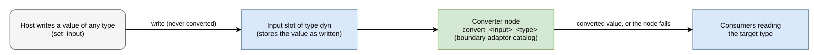

# Input Variance

This document specifies how Polydat handles an input whose written
type varies over a kernel's lifetime. A write is never converted.
Where the host asks for it, the compiler places a converter node
between such an input and its readers, reports each placement in the
compile log, and the converter converts each value the host writes.
The document also specifies how an input's type origin is recorded,
the compile option that controls conversion, the host-side conversion
function, and the treatment of values copied between scopes.

**Replaces.** This specification replaces the runtime conversion of
typed writes (write-time "healing") in
[composition_substrate.md](composition_substrate.md) (the typed-write
paragraph and the second site of Axiom T2) and in
[type_system.md](type_system.md) §6.2. The only runtime conversions of
an input value are a converter node (§5) and a host's own call of
`convert::to_port` (§6). The exceptions that remain in the code are
listed in §8 and §11.

**Related specifications.** [Engines](engines.md) §3.4 (node failure
attribution) and §3.5 (write refusal); [Type System](type_system.md)
§3 and §6 (the boundary adapter catalog);
[None Semantics](none_semantics.md) (None propagation and
auto-externs); [Subcontext Construction](subcontext_construction.md)
(scope trees).

## Terms

The terms of the [Runtime Model](runtime_model.md) (program, kernel,
node, wire, input, write, change, pull, step, current) apply. This
document also uses the following.

- **Extern.** An input the host writes by name with `set_input`.
- **Coordinate.** An input positioned with `set_inputs`; coordinates
  are always `u64`.
- **Auto-extern.** The implicit input slot the compiler gives a
  `const` whose right-hand side references at least one name (the
  conditional-shadow rule of [None Semantics](none_semantics.md)). Its
  type is the type the right-hand side compiled to.
- **Synthesized extern.** An `extern` statement written by a program
  synthesizer, such as the subcontext builder, rather than by the
  author.
- **Declared and inferred type.** An input's type is *declared* when
  the author wrote it, and *inferred* when the compiler or a
  synthesizer chose it (§3).
- **Open input.** An extern whose type is inferred: an auto-extern,
  or a synthesized extern the synthesizer names as inferred (§3).
  Coordinates are never open.
- **Boundary adapter catalog.** The set of conversion nodes that
  convert a value of one type to another at the host boundary,
  `boundary_adapter` in [type_system.md](type_system.md) §3.
- **`Dyn` slot.** An input slot of type `PortType::Dyn` (keyword
  `dyn`), which accepts a value of any type and stores it as written.
- **Converter.** A node the compiler places between a `Dyn` slot and
  its readers, converting the stored value to the type the readers
  read (§5).

## 1. Inputs whose written type varies

An input slot has one declared type, and all four engines (the
interpreter, the closure tier, native, and pure native) refuse a write
that does not satisfy it (engines.md §3.5,
`WriteError::TypeMismatch`). For almost every program that is the
correct rule: a host that writes the wrong type has a bug, and the
refusal identifies it at the write.

Some embedders legitimately write values whose type varies over a
kernel's lifetime. A workload parameter arrives as text from a command
line in one run and as a number from a config file in the next, and a
scope binder copies a parent's value into a child whose own program
typed the slot differently. This specification serves those cases with
a node in the program instead of a conversion at the write, so that
every conversion is visible in the program and reported.

## 2. The rule

Conversion of a varying input is a node in the program, placed at
assembly, reported in the compile log, and never implicit.

- **A declared input is invariant.** `input x: T`, `extern x: T`, and
  `shared x: T := …` declare `x`'s type for the kernel's lifetime. A
  write must satisfy it on all four engines, and a mismatched write is
  refused. No path converts it.
- **An open input has an inferred type.** An auto-extern and a
  synthesized extern have types the compiler or a synthesizer chose,
  not the author, so a host may reasonably write a value of another
  type. An untyped `input` is a coordinate: its type is recorded as
  inferred, but it is never open (§3).
- **An open input is converted only when the host asks.** The
  `input_variance` compile option (§4) decides what the compiler does
  with open inputs. By default (`Fixed`) the inferred type is the
  slot's type, and a mismatched write is refused.
- **A converter is a node.** When conversion is requested, the
  compiler types the slot `Dyn` and places a converter node between
  the slot and its readers. The node converts to the type the readers
  read, through the boundary adapter catalog. A value the catalog
  cannot convert is that node's failure, attributed to it like any
  node's failure (engines.md §3.4). Nothing converts at the write.

A host therefore sees each conversion in three places: the
configuration that requested it, the compile log that lists every
converter placed, and the program, where each converter is a node
that a pull runs.

The following diagram shows the path of a written value through an
open input that has a converter.



## 3. Declared and inferred types

The assembler records how each input's type was established:

```rust
pub enum TypeOrigin {
    /// The author wrote the type.
    Declared,
    /// The compiler inferred it: an untyped `input`, an auto-extern's
    /// right-hand side, a synthesized extern, an inferred coordinate.
    Inferred,
}
```

Each `InputDef` has a `type_origin: TypeOrigin` field. The grammar
keeps the distinction for `input` (`InputDecl::ty` is optional) and
for auto-externs (the slot type comes from the compiled right-hand
side), and the assembler records it.

Source text carries no mark of who wrote a declaration, so the
compiler does not detect synthesized externs. A synthesizer names the
externs it typed through `CompileOptions::inferred_externs`, and the
compiler records those as `Inferred`. The subcontext builder passes its
result and write-through externs this way. A host that synthesizes
source with exact types does not name its
externs, so they remain declared.

Coordinates are never open. They are positioned with `set_inputs` and
are always `u64`; an untyped `input` is recorded as `Inferred` for
reporting, and no setting converts it.

`Kernel::input_type_origin(name) -> Option<TypeOrigin>` returns the
origin of the named input, or `None` if there is no such input, so a
host can see which of its inputs are open before it writes.

## 4. The configuration

`CompileOptions` has one field for this:

```rust
pub enum InputVariance {
    /// Open inputs take their inferred type; a mismatched write is
    /// refused. Today's behavior, and the default.
    Fixed,
    /// Every open input is a construction error naming it: the program
    /// must declare every input's type.
    Error,
    /// Every open input gets a converter node; each placement is a
    /// `Warning` event in the compile log.
    Warn,
    /// Every open input gets a converter node; each placement is an
    /// `Info` event.
    Info,
}

pub input_variance: InputVariance, // default Fixed
```

The subcontext builder's `CompileOptions` has the same field and
passes it through, so all scopes of a scope tree share one setting.

The three non-default settings map the one situation, an input whose
type the author did not declare, to the three responses a host can act
on:

- `Error` stops construction. The assembler returns
  `AssemblyError::OpenInputs`, which a kernel builder returns as
  `KernelError::Assembly`. The error names every open input with its
  inferred type, so a host that wants every type declared finds out at
  build, not at the first write.
- `Warn` places converters and reports each one as a warning. This
  setting is for an embedder that knows its writes vary and wants every
  place that relies on conversion to stay visible.
- `Info` places converters and reports each one at `Info`, for an
  embedder that has audited them.

The `strict` option is independent: it refuses implicit coercions
between nodes and has no effect on inputs.

Each placement is one event:

```rust
CompileEvent::InputConverterInserted {
    input: String,
    /// The keyword of the type the consumers read.
    to: String,
    /// The converter's node name.
    node: String,
    /// Why the input is open: "inferred" or "declared dyn".
    origin: String,
    /// The level the event is reported at.
    level: EventLevel,
}
```

`origin` is `inferred` for an input opened by `input_variance` and
`declared dyn` for an input the program declares `dyn`. For an input
opened by `input_variance`, the level is the configured one
(`Warning` under `Warn`, `Info` under `Info`); a converter for a
declared `dyn` input is reported at `Info` under any setting.
`CompileEvent::level()` returns that field for this variant, while
every other variant has a fixed level, and the log's `warnings()` and
`advisories()` read it the same way.

An opened input that nothing reads is still reported, once, with the
node name `(none: nothing reads it)`, so no opened input goes
unreported.

## 5. The converter

The slot of a converted input is typed `PortType::Dyn`. It holds a
`Value` exactly as written, `None` included, and only a node whose
port accepts any type can read it. The converter,
`__convert_<input>_<type>`, is such a node: it has one `Dyn` input and
one output of the readers' type, and its body applies
`convert::to_port`, and through it the boundary adapter catalog, to
the value ([type_system.md](type_system.md) §3 for the catalog, class
B included).

- If the readers read more than one type, there is one converter per
  target type, each named for its input and target.
- A `None` passes through as `None`, so None propagation
  ([None Semantics](none_semantics.md)) is unchanged.
- A value already of the target type passes through unchanged. A value
  the catalog cannot convert fails the converter, and the failure
  message names the input, the value's type, and the target type.

On the compiled engines the converter runs as a closure kit: a closure
step on the closure tier, and a slot call (`JitOp::SlotCall`) inside
native code ([Compiled By-Reference Slots](compiled_handles.md) §6). A
`Dyn` slot is a reference pair to the stored `Value` on every compiled
engine and at a native cone's boundary. Under R1 the converter runs
when its input changes, not on every pull, because it stays current
until the next write. Every node downstream of it is typed and is
compiled as it would be without the converter.

**Rationale.** The converter is the cost of variance, which is why
conversion is requested rather than assumed: a declared input costs
nothing, and an open input under `Fixed` costs nothing.

## 6. The host side

A host has three supported ways to write a value that may not match
its input's type:

1. **Declare the type and convert before writing.** When the host knows
   the target type, it converts the value itself and writes the result.
   `polydat::convert::to_port(value, PortType) -> Result<Value, ConvertError>`
   takes the value and the target port type and returns the converted
   value, or a `ConvertError` holding the value's type, the target
   type, and the reason. A value that already satisfies the target, and
   `None`, are returned unchanged. It is the function the converter
   node applies, so a host that converts through it gets exactly the
   conversions a converter node would make, plus an error it can handle
   at the write instead of a node failure at the pull.
2. **Insert a converter as a transform.** A host that wants one input
   converted, without opening every undeclared input, rewrites the
   program before compiling. `transform::convert_input(&mut file, "x")`
   changes the top-level `extern x` of the parsed program to type `dyn`;
   the compiler then places its converters as §5 describes and reports
   each as `InputConverterInserted` at `Info`, under any
   `input_variance` setting. A name that is not a top-level `extern` is
   an error, because a coordinate never varies in type.
3. **Open the inputs whose types were inferred.** Set `input_variance`
   to `Warn` or `Info` and write what arrives; the compile log lists
   every input that was opened.

A host must not rely on a write that converts. The only writes that
still convert are the deprecated `Dataflow::set_wire` and
`set_wire_idx` (§8).

## 7. Scope trees

A scope binder copies a parent's values into a child's inputs (the
subcontext wiring; subcontext_construction.md).

- A child input that is open and converted (the child was compiled with
  `Warn` or `Info`) takes the parent's value as written, and the
  child's converter converts it.
- A binder copy into a child input the child's program declared is
  converted through the boundary adapter catalog
  (`adapt_boundary_value`). A copy the catalog cannot convert is
  discarded without an error.
- The subcontext builder synthesizes externs for parent values with
  the type `port_type_keyword` derives from the parent's type, and
  names them as inferred (§3).

The following rules take effect in the release that removes
`Dataflow::set_wire`:

- A child input the child's program declared refuses a parent value of
  another type, and the binder reports the refusal as a construction
  error naming the parent output, the child input, and both types.
- A child built from source under a parent (`ParentView`) gives an
  input it synthesizes for a parent value the parent's exact type, so
  that input needs no converter; `port_type_keyword` does not derive
  its type.

## 8. Relation to existing paths and specifications

- `Dataflow::set_wire` and `set_wire_idx` are deprecated (since 0.5.0)
  and will be removed. They still convert through the boundary adapter
  catalog. Their callers write through `set_input_at` (or
  `set_input`), converting first with `convert::to_port` where needed.
  `ScopedExpr::set` converts through `convert::to_port`.
- `adapt_boundary_value` remains the write-time conversion for the
  binder's copies (§7) and the deprecated writes. The converter node
  and `convert::to_port` apply the boundary adapter catalog through
  `convert::to_port`, not through `adapt_boundary_value`.
- The write-through commit converts a fixed list of widenings. The
  rule that replaces the list is: a shared cell's type is its
  declaration's, and a write-through of a narrower numeric type is
  converted by the catalog's lossless widenings only, reported once
  per binding at build. That rule is not implemented; the fixed list
  applies.
- composition_substrate.md's typed-write paragraph and Axiom T2 name
  converter nodes as the only runtime conversion, and type_system.md
  §6.2 names the converter node and `convert::to_port`.
- engines.md §3.5's rule that a write is never converted holds, with
  the exceptions of this section.

## 9. Embedders

For a host that writes workload parameters of varying type through a
scope tree:

- compile every scope with `input_variance: Warn`, so every open input a
  scenario relies on is listed in the compile log;
- convert values whose target is known, such as a CLI argument bound to
  a declared parameter, through `convert::to_port` before writing;
- let scope-tree children built from source take their parents' exact
  types (§7, once in effect), so most copies need no converter.

The embedding guide's §3 describes the pattern for hosts.

## 10. Tests

`crates/polydat/tests/input_variance.rs` checks each of the following
on the interpreter, the closure tier, and native (P3), under both
provenance modes of the compiled engines:

- A declared input refuses a mismatched write under every
  `input_variance` setting.
- Under `Error`, a program with an open extern fails construction
  naming it and its inferred type.
- Under `Warn` and `Info`, the same program builds, logs one
  `InputConverterInserted` per converter at the configured level, and
  converts a text write for a numeric consumer; a value the catalog
  cannot convert fails the converter with a message naming the input.
- `convert::to_port` agrees with a converter node.
- `transform::convert_input` opens one extern, reports its converter at
  `Info`, and leaves other externs declared.
- A scope's synthesized result extern is `Inferred` and converts under
  `Warn`.

Two further tests are specified. A property test over the catalog
checks that `convert::to_port` agrees with a converter node on every
catalog entry; the suite above checks agreement on sample values only.
A test that a binder copy into a declared child input of another type
is a construction error naming both sides belongs to the refusal rule
of §7 and takes effect with it.

## 11. Implementation notes

- `PortType::Dyn` (keyword `dyn`) is a reference-pair slot naming the
  stored `Value`, whatever its variant, on every compiled engine and at
  a native cone's boundary; a `Dyn` slot accepts any value.
- `InputDef` has `type_origin` and `converts_to`. For a converted
  input, `converts_to` holds the readers' type, and `input_port_type`
  reports that type, not `Dyn`, so a host that re-declares a parent's
  inputs as source text declares the readers' type.
- The binder's copies into declared inputs are converted through the
  catalog, and a failed copy is discarded (§7). Making them refuse
  would change what existing scope trees build, so the refusal takes effect in the release that
  removes `Dataflow::set_wire`. For the same reason
  `port_type_keyword` derives the types of synthesized write-through
  externs until then, and the write-through widening list (§8) is
  unchanged.
- `set_inputs` writes only the coordinates. Values beyond the
  program's coordinate count are not written into its externs. On the
  interpreter such values would land in the first extern's value, and
  on the compiled engines in its slots, where a by-reference extern
  holds a pointer. `set_inputs_never_reaches_past_the_coordinates`
  checks this on the interpreter, the closure tier, and native.
