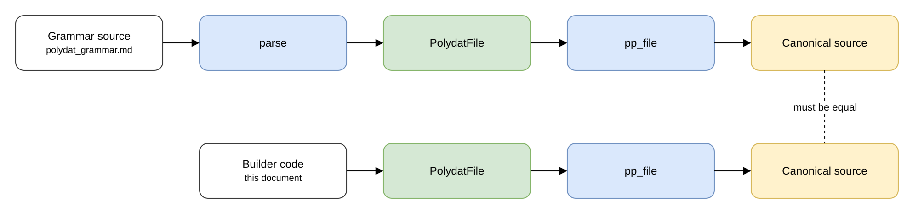

# Programmatic Construction of the Grammar

This document shows how to build a program in Rust from the public AST
types, without writing a source string, for a selection of the examples in
the grammar specification. Each example links to its section of the
grammar specification. Every paired example (§2 to §9) is
**machine-verified**: the test suite checks that the hand-built AST and the
grammar specification's source **project to identical canonical syntax**,
where projecting means printing an AST back as `.polydat` source with
`pp_file` ([polydat_grammar.md §0.1](polydat_grammar.md#sec-roundtrip)):

```text
pp_file(builder_ast) == pp_file(parse(grammar_src))
```

The equality shows that the two construction paths, parsing source and
assembling the AST by hand, produce the same program. The same test also
checks that each builder snippet below appears verbatim in this file, so
the document cannot drift from the code the test runs.

**Related specifications:** [`polydat_grammar.md`](polydat_grammar.md)
(the grammar whose examples this document rebuilds).

The following diagram shows the two paths the test compares.



The examples build a `PolydatFile` and project it with `pp_file`, rather
than touring the wider Rust API, because the claim under test is that
both paths yield the same kernel definition, and the canonical syntax is
where that definition is compared. Compiling
and running a kernel (`set_inputs`/`pull`, and the typed `Dataflow` path)
is shown in §[10](#sec-driving).

<a id="sec-setup"></a>
## 1. Imports and helpers

All AST types are public with public fields. A `Span` records a source
position for diagnostics; nodes built by hand have no source, so they use
`Span { line: 0, col: 0 }`, as the crates do. The helpers below build one
statement or expression each (an input declaration, an identifier, an
integer or float literal, a positional call, a binary operator, a single-
or multi-target binding, and a file), and every example uses them:

```rust
use polydat::dsl::ast::{
    Arg, Binding, BindingModifier, BinOpKind, CallExpr, CursorDecl, Expr,
    ExternPort, InputDecl, ModuleDef, PolydatFile, Statement, TypedParam,
};
use polydat::dsl::lexer::Span;
use polydat::ast::PortType;

fn sp() -> Span { Span { line: 0, col: 0 } }
fn input(name: &str, ty: &str) -> Statement {
    Statement::InputDecl(InputDecl { name: name.into(), ty: Some(ty.into()), span: sp() })
}
fn id(n: &str) -> Expr { Expr::Ident(n.into(), sp()) }
fn int(n: u64) -> Expr { Expr::IntLit(n, sp()) }
fn flt(n: f64) -> Expr { Expr::FloatLit(n, sp()) }
fn call(func: &str, args: Vec<Expr>) -> Expr {
    Expr::Call(CallExpr {
        func: func.into(),
        args: args.into_iter().map(Arg::Positional).collect(),
        span: sp(),
    })
}
fn binop(l: Expr, op: BinOpKind, r: Expr) -> Expr {
    Expr::BinOp(Box::new(l), op, Box::new(r))
}
fn bind(target: &str, value: Expr) -> Statement {
    Statement::Binding(Binding {
        targets: vec![target.into()], value,
        modifier: BindingModifier::NONE, type_annotation: None, span: sp(),
    })
}
fn bind_multi(targets: &[&str], value: Expr) -> Statement {
    Statement::Binding(Binding {
        targets: targets.iter().map(|s| s.to_string()).collect(), value,
        modifier: BindingModifier::NONE, type_annotation: None, span: sp(),
    })
}
fn file(statements: Vec<Statement>) -> PolydatFile { PolydatFile { statements } }
```

To print a built file as canonical source, call
`polydat::dsl::pprint::pp_file(&file)`, which returns the source as a
`String`. To compile it directly, call
`polydat::dsl::compile_ast_with_engine(&file, source, &options, log, engine)`,
which builds the program on `engine`, or
`polydat::dsl::compile_ast_interpreter_with_options(&file, source, &options, log)`
for the interpreter's concrete kernel. `source` is the text the file
was parsed from, used for error locations; a file built entirely in
code passes `pp_file(&file)`.

<a id="p-minimal"></a>
## 2. Minimal kernel — input, hash, mod

Mirrors [spec §3 “Bindings”](polydat_grammar.md#sec-bindings):

```text
input cycle: u64
hashed := hash(cycle)
user_id := mod(hashed, 1000000)
```

```rust
fn build_minimal() -> PolydatFile {
    file(vec![
        input("cycle", "u64"),
        bind("hashed", call("hash", vec![id("cycle")])),
        bind("user_id", call("mod", vec![id("hashed"), int(1_000_000)])),
    ])
}
```

`pp_file(build_minimal())` is byte-for-byte the spec's source, because
the program has no binary operator, interpolation, or float for the
projection to canonicalize.

<a id="p-destructure"></a>
## 3. Tuple-destructuring binding

Mirrors [spec §3.1](polydat_grammar.md#sec-destructuring). A multi-target
binding uses `bind_multi`; the target order is the projection order.

```rust
fn build_destructure() -> PolydatFile {
    file(vec![
        input("cycle", "u64"),
        bind_multi(&["region", "store", "tx"], call("mixed_radix", vec![id("cycle"), int(50), int(200), int(0)])),
        bind("region_id", call("mod", vec![call("hash", vec![id("region")]), int(10_000)])),
        bind("store_id", call("mod", vec![call("hash", vec![call("interleave", vec![id("region"), id("store")])]), int(100_000)])),
    ])
}
```

<a id="p-tuple-input"></a>
## 4. Tuple input — building the desugared form

Mirrors [spec §4.1](polydat_grammar.md#sec-input-tuple). The grammar's
`input (cycle: u64, thread: u64)` desugars at parse time to **two**
`InputDecl`s, so the builder constructs the two declarations directly,
matching the canonical projection rather than the surface tuple.

```rust
fn build_tuple_input() -> PolydatFile {
    file(vec![
        input("cycle", "u64"),
        input("thread", "u64"),
        bind("combined", call("interleave", vec![id("cycle"), id("thread")])),
        bind("row_key", call("mod", vec![call("hash", vec![id("combined")]), int(1_000_000)])),
    ])
}
```

<a id="p-extern"></a>
## 5. Extern in an arithmetic expression

Mirrors [spec §12 “Externs”](polydat_grammar.md#sec-externs). The
extern is an `ExternPort` with `default: None`, and the `*` is a
`BinOpKind::Mul` that projects fully parenthesized as `(cycle * scale)`.

```rust
fn build_extern() -> PolydatFile {
    file(vec![
        input("cycle", "u64"),
        Statement::ExternPort(ExternPort { name: "scale".into(), typ: "u64".into(), default: None, span: sp() }),
        bind("result", binop(id("cycle"), BinOpKind::Mul, id("scale"))),
    ])
}
```

<a id="p-cursor-over"></a>
## 6. Cursor with an `over` clause and field access

Mirrors [spec §11.2 “Cursors”](polydat_grammar.md#sec-cursors). The
`over` clause is `Some(id("p"))`; chained field access `q.cursor.idx` is
already flattened in the AST to a single `FieldAccess` whose source is
`q__cursor`. The cast binds tighter than `/`.

```rust
fn build_cursor_over() -> PolydatFile {
    file(vec![
        Statement::Cursor(CursorDecl {
            name: "q".into(),
            constructor: call("range", vec![int(0), int(100)]),
            over: Some(id("p")),
            span: sp(),
        }),
        bind("i", Expr::FieldAccess { source: "q__cursor".into(), field: "idx".into(), span: sp() }),
        bind("ratio", binop(Expr::Cast(Box::new(id("i")), PortType::F64, sp()), BinOpKind::Div, flt(100.0))),
    ])
}
```

<a id="p-module"></a>
## 7. Module definition

Mirrors [spec §13 “Module definitions”](polydat_grammar.md#sec-modules).
A `ModuleDef` holds typed `params` and `outputs` and a `body` of
statements; the projector indents the body four spaces inside `{ … }`.

```rust
fn build_module() -> PolydatFile {
    let body = vec![
        bind("pos", call("to_f64", vec![binop(id("input"), BinOpKind::Mod, id("period"))])),
        bind("per", call("to_f64", vec![id("period")])),
        bind("value", call("sin", vec![binop(binop(id("pos"), BinOpKind::Div, id("per")), BinOpKind::Mul, flt(std::f64::consts::TAU))])),
    ];
    file(vec![Statement::ModuleDef(ModuleDef {
        name: "sine_wave".into(),
        params: vec![
            TypedParam { name: "input".into(), typ: "u64".into() },
            TypedParam { name: "period".into(), typ: "u64".into() },
        ],
        outputs: vec![TypedParam { name: "value".into(), typ: "f64".into() }],
        body,
        span: sp(),
    })])
}
```

<a id="p-for"></a>
## 8. A `for` traversal, a producer, and nesting

Mirrors [spec §16 "The `for` construct"](polydat_grammar.md#sec-for).
The comprehension text after `for` is one token, so a `ForSource` holds
both the text and its parsed form, a tree of the comprehension algebra.

- `ForSource::comprehension(tree, span)` builds an inline source from a
  parsed tree. It writes the text from the tree's canonical text
  ([Comprehension Forms](comprehension_forms.md#sec-canonical-text)), so
  the text and the tree cannot disagree, and it returns `None` when the
  tree has no text that parses back to the same tree. The `for` lowering
  rejects any source whose text and tree disagree.
- `ForSource::producer(name, span)` builds a source that names a
  producer bound earlier in the program.

A producer binding is an `Expr::For` bound to a name. A traversal is a
`Statement::For` holding the source and a body of ordinary statements,
which may contain traversals of their own.

```text
sweep := for k in 1..4, limit in 10, 20, 30 order halton/5
for sweep {
    f := myfunc(k)
    g := otherfunc(limit, k)
}
for phase in load, verify, p in partitions("*/4", 1000000) {
    row := mod_in(cycle, p)
    for q in 1..2 {
        z := hash(q)
    }
}
```

```rust
use polydat::dsl::ast::{ForSource, ForStmt};
use polydat::iteration::comprehension::spec::parse_comprehension_algebra;

fn comprehension(text: &str) -> ForSource {
    let algebra = parse_comprehension_algebra(text).expect("comprehension text");
    // The source takes its text from the tree, so the two halves cannot
    // disagree; the `for` lowering refuses one where they do.
    ForSource::comprehension(algebra, sp()).expect("the text writes this tree")
}

fn build_for() -> PolydatFile {
    file(vec![
        bind(
            "sweep",
            Expr::For(Box::new(comprehension(
                "k in 1..4, limit in 10, 20, 30 order halton/5",
            ))),
        ),
        Statement::For(ForStmt {
            source: ForSource::producer("sweep", sp()),
            body: vec![
                bind("f", call("myfunc", vec![id("k")])),
                bind("g", call("otherfunc", vec![id("limit"), id("k")])),
            ],
            span: sp(),
        }),
        Statement::For(ForStmt {
            source: comprehension("phase in load, verify, p in partitions(\"*/4\", 1000000)"),
            body: vec![
                bind("row", call("mod_in", vec![id("cycle"), id("p")])),
                Statement::For(ForStmt {
                    source: comprehension("q in 1..2"),
                    body: vec![bind("z", call("hash", vec![id("q")]))],
                    span: sp(),
                }),
            ],
            span: sp(),
        }),
    ])
```

<a id="p-tile"></a>
## 9. Tiles: every body form

Mirrors [spec §17 "Tiles"](polydat_grammar.md#sec-tiles). A `TileDef`
holds the header (name, optional encoding, options), how the body was
written (`TileBodyKind`: a brace block, a heredoc, or a string literal),
and the body itself as a list of template pieces (static text, holes,
projections, and branches). The pieces are the only stored form of the
body; no copy of the text is kept, so the body a tile prints is always
the body it renders.

There are two constructors, and both produce the same `TileDef`:

- `TileDef::from_body(name, encoding, options, body_kind, body, span)`
  parses the body text into pieces under the tile's own options
  (delimiters and sigil), and returns an error if the text is not a
  valid template.
- `TileDef::from_pieces(name, encoding, options, body_kind, pieces, span)`
  takes pieces already built and cannot fail.

`parse_template(text, options, span)` parses a *fragment* of template
text into pieces, which can be concatenated with hand-built ones, so a
template can be assembled from text, from pieces, or from any mixture in
any order ([Polytile](polytile.md) §5.7). `body_text()` returns the body
as canonical text: each hole is printed as its expression, type, format,
and raw marker, with the expression printed as `pp_file` prints any
expression.

The example below uses `from_body` because it mirrors a spec example
written as text. The paired test checks that the two paths agree, so
either constructor can be used.

```text
tile doc : json := {
    "tenant": ${tenant_id},
    "samples": [ @for s in 0..4 { { "n": ${s} } } ]
}
tile load : text := <<<
INSERT ${keyspace} '${doc!}'
>>>
tile row : csv := "${a},${b}"
tile odd : text (delims "<%" "%>", sigil "#", strict) := "<%x%> #if c { y }"
```

```rust
use polydat::dsl::ast::{TileBodyKind, TileDef, TileOptions};

fn tile(
    name: &str,
    encoding: &str,
    options: TileOptions,
    body_kind: TileBodyKind,
    body: &str,
) -> Statement {
    Statement::Tile(
        TileDef::from_body(name, Some(encoding.into()), options, body_kind, body, sp())
            .expect("template"),
    )
}

fn build_tile() -> PolydatFile {
    let odd_options = TileOptions {
        open: "<%".into(),
        close: "%>".into(),
        sigil: "#".into(),
        strict: true,
        in_string: false,
    };
    file(vec![
        tile(
            "doc",
            "json",
            TileOptions::default(),
            TileBodyKind::Block,
            "{\n    \"tenant\": ${tenant_id},\n    \"samples\": [ @for s in 0..4 { { \"n\": ${s} } } ]\n}",
        ),
        tile(
            "load",
            "text",
            TileOptions::default(),
            TileBodyKind::Heredoc,
            "INSERT ${keyspace} '${doc!}'",
        ),
        tile(
            "row",
            "csv",
            TileOptions::default(),
            TileBodyKind::Literal,
            "${a},${b}",
        ),
        tile(
            "odd",
            "text",
            odd_options,
            TileBodyKind::Literal,
            "<%x%> #if c { y }",
        ),
    ])
}
```

The `body` argument is, for a block body, the balanced braces as
written; for a heredoc, the text between `<<<` and `>>>`; and for a
literal, the text inside the quotes. The options hold the hole
delimiters, the directive sigil, and the strict flag, and the pieces are
parsed from the body under them.

<a id="sec-driving"></a>
## 10. Driving a kernel (reference)

The builders above are verified at the *syntax* layer. To check
behaviour, compile a kernel and drive it. `compile_polydat(source)`
compiles a source string and returns a kernel, or a compile error.
`set_inputs(&[u64])` writes the coordinate inputs, and `pull(name)`
evaluates the named output and returns its `Value`; as the first
example's comment notes, this path panics on an unknown name or type.
The `Dataflow` trait is the typed path that does not panic:
`set_wire(name, value)` writes an input and returns an error on a type
mismatch, and `get_wire(name)` returns `None` for an unknown wire.
`compile_polydat` and `compile_polydat_kernel` are the same entry point:
both build the program on the default engine, P3 in a build with `jit`.

```rust
use polydat::dsl::compile_polydat;
let mut kernel = compile_polydat(
    "input cycle: u64\nhashed := hash(cycle)\nuser_id := mod(hashed, 1000000)\n",
).unwrap();
kernel.set_inputs(&[42]);                 // writes the `cycle` coordinate
let user_id = kernel.pull("user_id").as_u64();   // panics on unknown name/type
assert!(user_id < 1_000_000);
```

```rust
use polydat::dsl::compile_polydat;
use polydat::kernel::Dataflow;
use polydat::ast::Value;
let mut k = compile_polydat("input cycle: u64\nextern n: u64\nout := n\n").unwrap();
k.set_wire("n", Value::U64(5)).expect("typed write");   // deprecated since 0.5.0; see input_variance.md
assert_eq!(k.get_wire("n"), Some(Value::U64(5)));        // None on unknown wire, never panics
```

A grammar snippet's source and its hand-built AST compile to kernels that
produce identical `pull` results, which is the behavioural counterpart
of the projection equality. The suite checks only the syntax equality;
where a behavioural guarantee is needed, compile both paths and compare
their `pull` outputs.
