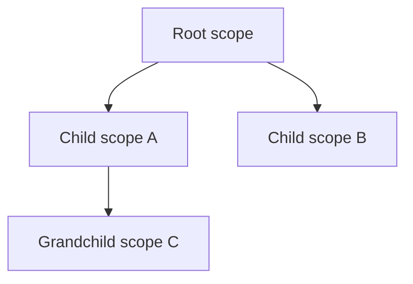

# Scope Model

This specification defines scope identity, parent-gated construction,
visibility, lifecycle ownership, shared mutation, and scope-coordinate paths.
It uses the terms of [runtime_model.md](runtime_model.md) and these:

- **Scope.** One kernel placed at a point in a parent/child hierarchy (§1).
- **Parent-gated construction.** A child scope is created only through a
  call on its parent, and that call binds the child to the parent's wires in
  the same step (§2).
- **Shared cell.** A `SharedCell`: one mutex-protected value register that
  several kernels read and write for a `shared` binding (§6).
- **Transit cell.** A shared cell a scope holds only to pass it to its
  descendants, because the scope has no input slot of that name (§4).
- **Output (broadcast) cell.** A cell through which a parent publishes a
  computed output each time it pulls that output, so a child bound to the
  cell reads the parent's current value (§4).
- **Binder.** The construction code that connects a child's inputs to its
  parent's wires (§4).
- **The four engines.** The interpreter (P1), the closure tier (P2), native
  (P3), and pure native ([engines.md](engines.md)).

**Related specifications:** the builder protocol is
[subcontext_construction.md](subcontext_construction.md); the binding
algorithm is [wire_materialization.md](wire_materialization.md).

## 1. Scope hierarchy

A scope is one kernel, on some engine, over one compiled program, placed at a
specific point in a parent/child hierarchy. Common scope boundaries are a
root graph, a traversal activation, and a nested child graph. Ordinary
bindings and function calls inside one compiled source are not scope
boundaries.

The hierarchy is not flattened at runtime:



Each scope owns its input registers, its step buffers and their currency,
its scope-coordinate stratum, and, when it is a typed `ScopeKernel`, its
child registry. Programs are shared by `Arc` (`KernelProgram`); kernels are
never shared. The engine a scope runs on determines how the scope is
evaluated; no rule in this specification depends on the engine.

## 2. Construction boundary

A scope is constructed in one of these forms:

- **Root.** `compile_polydat_with(source, Engine)` compiles a program and
  yields a kernel on the chosen engine (`Engine::default()` when the host
  names none). `KernelProgram::create_kernel` yields another root kernel
  over a program already compiled, for another thread.
- **Child by parent spawn.** A parent `ScopeKernel` spawns a child from a
  finalized module (`subcontext_builder` → `finalize` → `spawn`), or a
  parent `PolydatKernel` builds one from matter (`build_subscope`). The
  parent performs the cell cascade, output/input matching, iteration-binding
  injection, initialization, write-through construction, and
  scope-coordinate threading. This form binds an interpreter child.
- **Child by traversal activation.** `Kernel::traverse(index)` opens the
  program's `index`-th `for` traversal on a kernel of any of the four
  engines and returns a `TraversalStream`, and
  `TraversalStream::activation_on(index, engine)` creates one child per
  tuple on the engine the host asks for.

Every child is a separate kernel over the body's program: it owns
its inputs, its outputs, and the storage behind them, and follows the
provenance rules as if it were the only kernel
([runtime_model.md](runtime_model.md) R4). Both paths create the child
uninitialized (`KernelProgram::create_uninitialized` on the traversal path),
bind it, and then initialize it (`Kernel::init`), so its `const` bindings
are evaluated once, from the bound values
([runtime_model.md](runtime_model.md) §6). A const whose expression fails
makes the child's construction fail with `KernelError::ConstInit`.

`PolydatKernel::materialize_subscope` is crate-private and
`materialize_wiring_from_outer` is private to `PolydatKernel`'s impl; both
are implementation chokepoints. Callers cannot construct two
independent kernels and bind them as parent and child afterward, so a child
cannot bypass the parent's live shared-cell view or lifecycle
checks. The only public binding a host may make after construction is
`Kernel::attach_shared_cell(name, cell)`. It takes the name of one of the
kernel's `shared` bindings and a cell another kernel holds, and binds the
binding to that cell, so both kernels read and write one register (§6). It
returns an error, naming the kernel's `shared` bindings, for any name that
is not a `shared` binding.

## 3. Input lifecycle classes

Every graph input has one `InputKind`:

| Kind | Population and lifetime |
| --- | --- |
| `Coordinate` | Leading input prefix written by `set_inputs` for each scalar cycle |
| `IterationExtern` | Supplied while constructing or hydrating one structural scope activation |
| `ExternalWrite` | Written through the typed dataflow boundary and retained until reset or state replacement |
| `Const` | The value of one `const` binding (`__const_<name>`), written only by the kernel's initialization; a host write is refused with `WriteError::ConstSlot` |

The author-facing `const` modifier classifies an output as effectively constant
for the life of its kernel. A literal right-hand side is compile-folded; any
other is evaluated once at the kernel's initialization, after parent wiring,
and held in a `Const` slot. The implementation choice does not change its
visibility or lifetime.

The `volatile` modifier prevents const folding and makes every read that
reaches the wire evaluate it again. Intrinsically nondeterministic nodes
declare the equivalent runtime requirement through `Purity::Nondeterministic`.

## 4. Parent-to-child materialization

The two child-construction paths of §2 use different binders. The diagram
shows what each one transfers from the parent to the child.


Parent binding is name-based and typed: a child input is bound to the parent
wire of the same name, and a value is checked against, or adapted to, the
child slot's declared type. The spawn binder
(`materialize_wiring_from_outer`, reached through `materialize_subscope`)
performs these operations in order:

1. Collect every shared cell visible at the parent, including transit cells
   inherited from ancestors.
2. Attach a matching cell to the child's same-named input slot. A visible cell
   with no matching child slot is retained on the child as transit for deeper
   descendants.
3. Suppress an ancestor transit cell when the child has a local authoritative
   `const` output of the same name.
4. For a parent output that is backed by a parent input slot or is a `const`,
   copy the parent's current cell-aware lookup result through the child's
   typed input boundary, healing the type through the boundary adapter
   catalog where a lossless adapter exists.
5. For a computed parent output consumed by the child, attach the parent's
   output cell to the child's slot; every pull of that output on the parent
   publishes the fresh value through the cell. Output cells exist on the
   interpreter only; compiled kernels have none, and a computed value
   crosses into a compiled child by value.
6. Initialize the child (`Kernel::init`), after its extern inputs have been
   filled, so each `const` is evaluated once and fixed for the child's life.
7. Refresh the child's own coordinate stratum and append the parent's frozen
   coordinate path.

Coordinate advancement remains explicit. Parent materialization does not copy
a live cycle counter into a child as a substitute for the child's own
`set_inputs` or iteration binding.

**Traversal cascade.** An activation (the child created for one tuple of a
`for` traversal) is bound by a different, smaller binder: the tuple's elements and the parent's cascaded wires are written into
the body's declared inputs by name, through `Kernel::set_input`, and every
`over` cursor is narrowed through `Kernel::set_cursor`, and the activation is
then initialized, so its `const` bindings read the bound values. The cascade is a
snapshot of the parent's values taken when the traversal is opened: the body
lowers every cascaded wire as a plain extern, so a body that reads an outer
`shared` wire sees the value the wire held at open, not the cell. The two
binders differ in what they transfer to the child (cells, transit cells,
output cells, and coordinates on the spawn path; values on the traversal
path) and in which engines they support. The design direction is that both
paths call one binder over the `Kernel` trait.

## 5. Visibility and shadowing

The interpreter kernel's `lookup` is the canonical scope-aware read. Its
order is:

1. a defined local folded-output buffer;
2. the same-named input slot, read through an attached cell when present; and
3. for dotted names, the same lookup after replacing `.` with `__`.

`Value::None` means absent at this boundary. A local `const` whose own
expression yields `None` at initialization takes the value of the same-named
wired input instead, so the inherited value remains visible
([none_semantics.md](none_semantics.md)). `find_l2f_violations` reports such
consts, by reading each const's own expression (`__init_<name>`), for strict
callers that reject conditional fall-through.

A defined local constant shadows an inherited value for the whole subtree. A
local declaration also suppresses a stale same-named transit cell so deeper
descendants see the local authority.

The specialized reads have narrower contracts:

- `get_constant(name)` reads only a populated folded-output buffer;
- `get_input(name)` reads only the named input plane and is cell-aware;
- `pull(name)` evaluates a named output's not-current dependency cone; and
- `lookup(name)` performs non-evaluating scope lookup across the local constant
  and input planes.

Reads do not perform type coercion. Types are enforced when the child is
assembled or when a value is written.

## 6. Shared mutable bindings

A `shared` binding is represented by one `SharedCell` attached to every scope
input slot participating in that binding. The cell, not a mirrored local
`inputs[]` entry, is the slot's register. `set_input` writes through the cell;
all cell-aware reads take the current cell value. This holds on all four
engines. A compiled kernel (closure tier, native, or pure native) binds each
`shared` slot to a cell of the same type, its `set_input` publishes through
it, and every run and every pull refresh the slot from the cell when the
cell's revision has moved. `Kernel::shared_cells` returns the cells a
kernel's `shared` bindings are bound to, and `Kernel::attach_shared_cell`
binds a `shared` binding to a cell another kernel holds (§2). A register is
therefore shared between kernels, on the same or different engines, only by
an explicit act. A kernel created from a shared program starts
with a cell of its own per `shared` binding.

There is no scope-exit copy and no `propagate_shared_to` API. Ordinary inner
writes become visible to parent and sibling scopes through the shared cell.
Result-binding rewrites use `commit_write_throughs`: the child pulls each
synthetic source output, checks it against the cell's declared type, and then
writes it through the cell-bound export slot.

### 6.1 Type stability

A shared cell has one `PortType` for its lifetime. A write:

- passes when the runtime value satisfies that type;
- may use a registered lossless boundary adapter on the write-through path;
  and
- fails at the write site when no adapter can satisfy the type.

Narrowing and semantic kind changes require explicit graph nodes. A write never
changes the cell's declared type.

### 6.2 Concurrent semantics

Cell values are protected by a mutex. Concurrent writers serialize, and the
observable value is last-write-wins in mutex acquisition order. Distinct cells
have no combined atomic transaction or global write order. A binding that
requires multi-field atomicity must hold those fields in one typed value or
be coordinated outside the graph.

Each publish also increments a monotonic revision and sets the cell's bit in
the intent word of the scope that created the cell. A cell's intent word
belongs to that scope for the cell's lifetime, wherever the cell is later
attached; a compiled kernel is such a scope, with an intent word of its own
for the cells it seeds. Readers use the revision to invalidate dependent
caches across kernels. The complete memory-order rules and both consumer
realizations are in
[cross_fiber_invalidation.md](cross_fiber_invalidation.md).

## 7. Scope coordinates

A `ScopeCoord` is the ordered name/value map of iteration externs owned by one
scope, excluding names merely inherited from a parent. A scope-coordinate path
is leaf-first:

```text
[own coordinates] ++ parent.scope_coordinates()
```

Empty strata are omitted by `format_scope_coordinate_path`. Root configuration
inputs are not iteration coordinates. Construction refreshes the coordinate
path only after iteration and parent bindings are installed, so every
initialized kernel exposes a complete path without requiring a caller to walk
the scope tree.

## 8. Program reuse and kernel creation

A scope's program is compiled once and instantiated many times. A kernel
becomes a shareable program through `Kernel::into_program`, and
`KernelProgram::create_kernel` yields a fresh kernel for the calling thread
on the program's engine: every input at its declared default, every `shared`
binding with a cell of its own, nothing current. A child is such a kernel
too; the spawn binder and the traversal binder (§4) each start from one.
Shared-cell handles are shared only by an explicit attach; ordinary buffers
and currency are fresh.

## 9. Composition modes

Polydat has two distinct composition operations:

- **Inline module composition** prefixes and splices module bindings into one
  program before assembly. The module boundary disappears.
- **Layered scope composition** preserves separate programs and kernels and
  connects them through parent-gated materialization.

Inlining is appropriate for reusable pure graph structure. Layering is
required when a distinct activation lifetime, iteration coordinate stratum,
shared-cell boundary, child registry entry, or scope-local constant state must
remain observable.

## 10. Invariants and exclusions

1. Every live child is constructed under its parent; no public path binds two
   independently constructed kernels as parent and child. The only post-hoc
   binding is `attach_shared_cell`, for a single `shared` binding.
2. One scope owns each ordinary mutable state instance.
3. One shared binding has one cell and one stable type across all attached
   scopes.
4. Name resolution is local-constant first, then cell-aware input, with
   `Value::None` treated as absence.
5. Downstream invalidation never rewinds or invalidates an upstream scope.
6. Coordinate-prefix slots and shared cells are mutually exclusive.
7. Shared mutation is last-write-wins; reductions, compare-and-swap, and
   multi-cell transactions are not part of the cell contract.
8. Host-specific loop policies are outside this specification. They may choose
   when to create activations or reset external inputs, but cannot bypass the
   construction, typing, visibility, or cell rules above.
