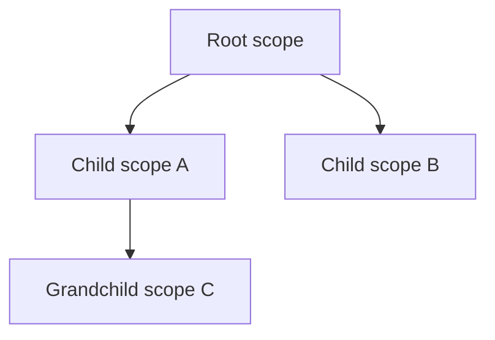

# Polydat Scope Model

This specification defines scope identity, parent-gated construction,
visibility, lifecycle ownership, shared mutation, and scope-coordinate paths.
The builder protocol is specified in
[subcontext_construction.md](subcontext_construction.md), and the binding
algorithm is specified in [wire_materialization.md](wire_materialization.md).

## 1. Scope hierarchy

A scope is one compiled `PolydatProgram` plus one mutable `PolydatState` placed
at a specific point in a parent/child hierarchy. Common scope boundaries are a
root graph, a structural comprehension instance, and a nested child graph.
Ordinary bindings and function calls inside one compiled source are not scope
boundaries.

The hierarchy is not flattened at runtime:



Each scope owns its program reference, evaluation state, input registers,
output buffers, clean flags, scope-coordinate stratum, and child registry.
Programs may be shared by `Arc`; states are never shared implicitly.

## 2. Construction boundary

There are exactly two caller-facing construction forms:

- `Construction::root(PolydatMatter)` creates a root context; and
- `Construction::subscope(&parent, PolydatMatter)` creates a child under an
  existing context.

The typed `ScopeKernel` protocol exposes the same rule as
`subcontext_builder` → `finalize` → parent `spawn`. The parent owns cell
cascade, output/input matching, iteration binding injection, scope-init pulls,
write-through construction, and scope-coordinate threading.

`PolydatKernel::materialize_wiring_from_outer` and
`materialize_subscope` are crate-private implementation chokepoints. Callers
cannot construct two independent kernels and bind them afterward. This keeps a
child from bypassing the parent's live shared-cell view or lifecycle checks.

## 3. Input lifecycle classes

Every graph input has one `InputKind`:

| Kind | Population and lifetime |
| --- | --- |
| `Coordinate` | Leading input prefix written by `set_inputs` for each scalar cycle |
| `IterationExtern` | Supplied while constructing or hydrating one structural scope activation |
| `ExternalWrite` | Written through the typed dataflow boundary and retained until reset or state replacement |

The author-facing `const` modifier classifies an output as effectively constant
for one scope activation. It is either compile-folded or pulled once after
parent wiring. The implementation choice does not change its visibility or
lifetime.

The `volatile` modifier prevents const folding and preserves dynamic
reevaluation semantics. Intrinsically nondeterministic nodes declare the
equivalent runtime requirement through `Purity::Nondeterministic`.

## 4. Parent-to-child materialization

Parent binding is name-based and typed. The materializer performs these
operations in order:

1. Collect every shared cell visible at the parent, including transit cells
   inherited from ancestors.
2. Attach a matching cell to the child's same-named input slot. A visible cell
   with no matching child slot is retained as transit for deeper descendants.
3. Suppress an ancestor transit cell when the child has a local authoritative
   `const` output of the same name.
4. For matching ordinary values, copy the parent's current cell-aware lookup
   result through the child's typed input boundary.
5. For computed parent outputs consumed by the child, attach a broadcast cell;
   `advance_broadcasts` refreshes those values from the parent graph.
6. Pull scope-init `const` outputs after their extern inputs have been filled.
7. Refresh the child's own coordinate stratum and append the parent's frozen
   coordinate path.

Coordinate advancement remains explicit. Parent materialization does not copy
a live cycle counter into a child as a substitute for the child's own
`set_inputs` or iteration binding.

`propagate_inputs_into` is the public name-based companion used for inherited
ordinary input values. It skips `Value::None` and names absent from the child.

## 5. Visibility and shadowing

`PolydatKernel::lookup` is the canonical scope-aware read. Its order is:

1. a defined local folded-output buffer;
2. the same-named input slot, read through an attached cell when present; and
3. for dotted names, the same lookup after replacing `.` with `__`.

`Value::None` means absent at this boundary. A local `const` whose scope-init
result is `None` does not manufacture a value and therefore permits the
same-named wired input to remain visible. `find_l2f_violations` reports such
const outputs for strict callers that reject conditional fall-through.

A defined local constant shadows an inherited value for the whole subtree. A
local declaration also suppresses a stale same-named transit cell so deeper
descendants see the local authority.

The specialized reads have narrower contracts:

- `get_constant(name)` reads only a populated folded-output buffer;
- `get_input(name)` reads only the named input plane and is cell-aware;
- `pull(name)` evaluates a named output's dirty dependency cone; and
- `lookup(name)` performs non-evaluating scope lookup across the local constant
  and input planes.

Reads do not perform type coercion. Types are enforced when the child is
assembled or when a value is written.

## 6. Shared mutable bindings

A `shared` binding is represented by one `SharedCell` attached to every scope
input slot participating in that binding. The cell, not a mirrored local
`inputs[]` entry, is the slot's register. `set_input` writes through the cell;
all cell-aware reads take the current cell value.

There is no scope-exit copy and no `propagate_shared_to` API. Ordinary inner
writes become visible to parent and sibling scopes through the shared cell.
Result-binding rewrites use `commit_write_throughs`: the child pulls each
synthetic source output, checks it against the cell's declared type, and then
writes it through the cell-bound export slot.

### 6.1 Type stability

A shared cell has one `PortType` for its lifetime. A write:

- passes when the runtime value satisfies that type;
- may use a registered lossless boundary adapter; and
- fails at the write site when no adapter can satisfy the type.

Narrowing and semantic kind changes require explicit graph nodes. A write never
changes the cell's declared type.

### 6.2 Concurrent semantics

Cell values are protected by a mutex. Concurrent writers serialize, and the
observable value is last-write-wins in mutex acquisition order. Distinct cells
have no combined atomic transaction or global write order. A binding that
requires multi-field atomicity must carry those fields in one typed value or
coordinate outside the graph.

Each publish also increments a monotonic revision and sets the cell's bit in
its defining scope's intent word. Readers use revision-aware cone checks to
invalidate dependent caches across fibers. The complete memory-order and
multi-word scope rules are in
[cross_fiber_invalidation.md](cross_fiber_invalidation.md).

## 7. Scope coordinates

A `ScopeCoord` is the ordered name/value map of iteration externs owned by one
scope, excluding names merely inherited from a parent. A scope-coordinate path
is leaf-first:

```text
[own coordinates] ++ parent.scope_coordinates()
```

Empty strata are omitted by `format_scope_coordinate_path`. Root configuration
inputs are not iteration coordinates. Construction refreshes the coordinate
path only after iteration and parent bindings are installed, so every
initialized kernel exposes a complete path without requiring a caller to walk
the scope tree.

## 8. Program reuse and state hydration

A canonical scope program can be compiled once and instantiated many times.
`for_iteration` and the typed builder clone the program `Arc`, allocate fresh
state, inject iteration values, and run the same parent materialization
chokepoint. Shared-cell handles are deliberately shared; ordinary buffers and
clean flags are fresh.

`cell_scope_snapshot` creates a fresh kernel state that preserves the live
shared-cell and transit-cell view. It is a scope view, not a snapshot of all
ordinary input and output values.

## 9. Composition modes

Polydat has two distinct composition operations:

- **Inline module composition** prefixes and splices module bindings into one
  program before assembly. The module boundary disappears.
- **Layered scope composition** preserves separate programs and states and
  connects them through parent-gated materialization.

Inlining is appropriate for reusable pure graph structure. Layering is
required when a distinct activation lifetime, iteration coordinate stratum,
shared-cell boundary, child registry entry, or scope-local constant state must
remain observable.

## 10. Invariants and exclusions

1. Every live child is constructed under its parent; post-hoc public binding is
   forbidden.
2. One scope owns each ordinary mutable state instance.
3. One shared binding has one cell and one stable type across all attached
   scopes.
4. Name resolution is local-constant first, then cell-aware input, with
   `Value::None` treated as absence.
5. Downstream invalidation never rewinds or invalidates an upstream scope.
6. Coordinate-prefix slots and shared cells are mutually exclusive.
7. Shared mutation is last-write-wins; reductions, compare-and-swap, and
   multi-cell transactions are not part of the cell contract.
8. Host-specific loop policies are outside this specification. They may choose
   when to create activations or reset external inputs, but cannot bypass the
   construction, typing, visibility, or cell rules above.
