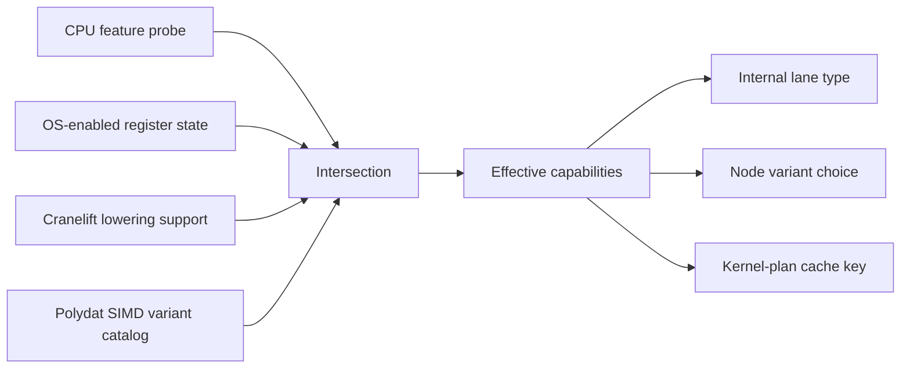
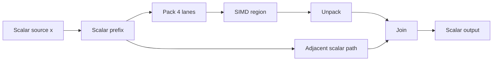
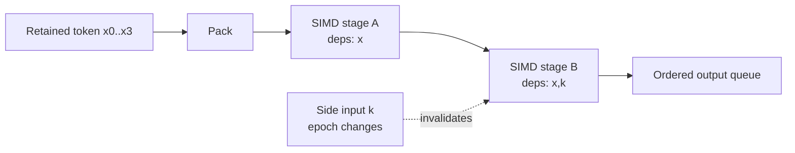
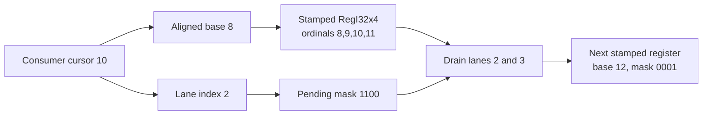
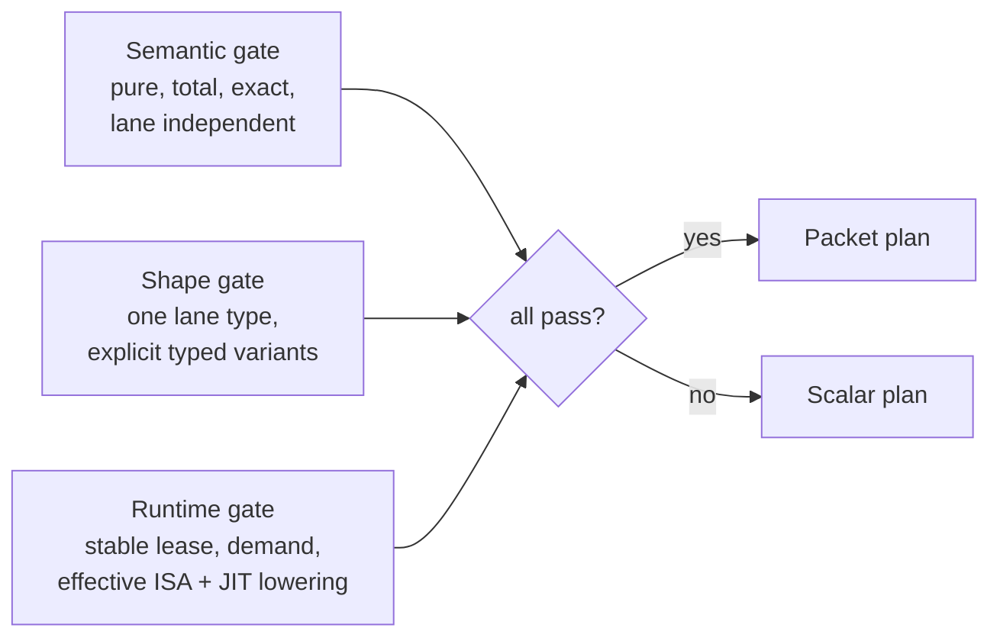

# SIMD ISA Selection and Scalar-Flow Auto-Promotion

**Status:** Proposed design with an explicit, opt-in Tier-1 production slice.
Promotion metadata, common-type shape validation, native-ISA discovery, selected
output-cone discovery, native register-kernel compilation, owned perfect-ordinal
leases, ordered scalar drain, and scalar recovery are implemented. The integrated
slice currently executes `u64` through `RegI64x2`; ordinary compile/pull behavior
remains scalar. A generic ordinal executor and local Criterion study remain in
`iteration/simd_ordinal.rs` and `benches/simd_autopromotion.rs`.

**Scope:** Capability discovery, selection of explicit 128-bit SIMD node
variants, and automatic promotion of qualifying scalar flows into ordered
SIMD batches while preserving Polydat's scalar graph semantics.

This SRD extends, but does not replace:

- [The Runtime Model](runtime_model.md), especially R1-R3 and the distinction
  between cached node state and forward-only data flow.
- [The Graph Compiler](graph_compiler.md), especially Node Fusion and engine
  selection.
- [SRD-11: Evaluation Model](evaluation_model.md), especially per-fiber state,
  lifecycle classification, and unconditional invalidation on input writes.
- [SRD-16: Engines](engines.md) and [SRD-16b: JIT Boundary](jit_boundary.md).
- [The Type System](type_system.md), especially the fixed 128-bit register
  plane.
- [Cross-Fiber Cell Invalidation](cross_fiber_invalidation.md).

The forcing question is:

> When may a scalar sequence be processed as 128-bit lane packets without
> losing, duplicating, reordering, or retroactively changing logical scalar
> evaluations when another path or external write invalidates part of the
> graph?

The answer is: only when advancement is represented as an owned sequence of
tokens, SIMD state is kept separately from the ordinary `node_clean` cache,
and scalar visibility advances through an ordered commit frontier. Cursor
rewind is neither required nor generally safe.

---

## 1. Decisions

1. **The native register plane remains 128 bits.** Polydat does not construct
   Cranelift vector values wider than the x64 backend can lower. AVX2 and
   AVX-512 are feature tiers, not promises of 256- or 512-bit Polydat values.
2. **Capability selection uses effective capabilities, not hardware names.**
   The usable set is the intersection of hardware, OS-enabled state, the
   Cranelift backend, and Polydat's registered node variants.
3. **SIMD variants remain explicitly typed.** A scalar `i32 -> i32` node may
   register a semantically equivalent `RegI32x4 -> RegI32x4` variant. Automatic
   promotion selects that variant; it does not invent a scalar-to-register
   adapter in the general type catalog.
4. **User-visible function signatures stay scalar.** `Pack` and `Unpack` are
   hidden execution-plan boundaries. Internal ports are register-typed; graph
   inputs and outputs retain their declared scalar types.
5. **Reservation is not semantic consumption.** Advancing a source or cursor
   reserves immutable logical tokens. Tokens are semantically consumed only
   when their scalar results cross the ordered commit frontier.
6. **Buffered lane packets are stream state, not node cache state.** They live
   in a per-fiber `BatchState`, never in `node_clean` or a single
   `Value::Reg128` node buffer standing for several future cycles.
7. **Every logical token has a sequence identity.** Equality of values is not
   identity. Repeated `i32` values and phase rewinds still receive distinct
   sequence identifiers.
8. **Downstream invalidation does not invalidate an upstream packet.** It
   invalidates only stages whose dependency set includes the changed source.
   An upstream packet remains queued and is joined to adjacent paths by
   sequence identity.
9. **No source rewind is used for recovery.** The runtime retains the earliest
   representation needed to replay uncommitted work. Recovery discards derived
   stages and recomputes from retained tokens, or scalarizes those tokens.
10. **The first useful implementation is deliberately narrow:** one driving
    input, one output, a convex unary chain of pure, total, lane-independent
    nodes, no shared cells or open-granularity external writes, and exact
    128-bit variants. Branch-aware and cross-fiber forms are later tiers.
11. **Stable ordinal-addressable streams get a stronger fast path.** For a
    source that declares `render(ordinal)` pure, total, and stable for a source
    generation, `(stream, activation, ordinal)` is the token identity and
    replay point. Its offset may also address lanes within an aligned packet.
    This compresses retained state; it does not weaken lease, epoch, or ordered
    commit rules.
12. **A perfect ordinal sequence is also its own packet clock.** The high
    cursor bits identify the packet and the low bits identify its lane. An
    ordered consumer derives fill/drain position and suffix masks from its
    scalar cursor rather than storing a second pacing counter or consumed mask.

---

## 2. Current constraints that shape the design

### 2.1 Cranelift width

Cranelift IR can name wider vector types, but the current x64 backend accepts
ordinary vector SSA values only through 128 bits. Polydat therefore targets the
existing register views only. A physical shape does not itself make a scalar
flow promotable; the scalar node still needs an explicit, exact register
variant and the complete register cone must compile:

| Scalar type | Internal register type | Lanes | Mechanical status | Initial use |
| --- | --- | ---: | --- | --- |
| `u8`, `i8` | `RegI8x16` | 16 | Pack/drain supported | Add/sub/bitwise later; `i8` multiply currently declines pure P3. |
| `u16`, `i16` | `RegI16x8` | 8 | Pack/drain supported | Modular arithmetic after scalar nodes have variants. |
| `u32`, `i32` | `RegI32x4` | 4 | Pack/drain supported; prototype JIT path tested | Highest-priority new scalar arithmetic family. |
| `u64`, `i64` | `RegI64x2` | 2 | Pack/drain supported | `u64` add/sub/mul variants declared now; use a strict cost gate. |
| `f32` | `RegF32x4` | 4 | Pack/drain supported | High-priority once scalar `f32` nodes are first-class. |
| `f64` | `RegF64x2` | 2 | Pack/drain supported | Add/sub/mul variants declared now; exact per-lane mode only. |
| `f16` | `RegF16x8` | 8 | Type view only | Defer until installed backend arithmetic is demonstrated. |
| `u128`, `i128` | none | 1 or less | No lane gain | Never auto-promote as a 128-bit packet. |

The raw `Reg128` view is not an automatic-promotion target because it has no
homogeneous scalar lane semantics.

The existing register plane uses signed names for integer lane views. Modular
add/sub/multiply and bitwise operations are sign-agnostic, but comparisons,
min/max, widening, and division are not. Initial promotion must therefore
either stay with signed scalar types or require variant metadata that states
the unsigned interpretation explicitly. It must not silently treat `u32` as
`i32` for signed operations.

### 2.2 Current invalidation

`PolydatState::set_input` and `set_inputs` treat every write as an invalidation
event, including same-value writes. This is intentional: a write can be a
logical request to re-evaluate downstream observers. A promotion epoch must
therefore advance on every relevant write; value equality is not sufficient.

`node_clean[node]` answers one question:

> Is this node's one cached output current for the state's present scalar
> inputs?

It cannot answer:

> Which four logical inputs does this register contain, which graph epoch did
> each lane observe, and which of those inputs have already produced a visible
> scalar result?

Overloading `node_clean` for lane packets would make a clean bit simultaneously
mean “current value,” “four future values,” and “source positions already
claimed.” That representation is unsound.

### 2.3 Current source reservation

`DataSource::reserve(stride)` already separates shared cursor acquisition from
fiber-local rendering. That is a useful substrate, but its returned range is
currently claimed irrevocably. The SIMD executor must either operate inside an
already-owned stanza range or retain every reserved item until it is committed.
It must not reserve beyond a demand boundary that may stop early.

Changing a source reservation from one item to four can also change work
striping between fibers. Auto-promotion must not silently change the host's
global allocation quantum. The preferred integration is to batch within the
fiber's existing owned stanza; direct `reserve(W)` is allowed only when the
source contract declares that `W` is within the current allocation unit.

---

## 3. Capability discovery and type selection

### 3.1 Effective capability set

The process builds one immutable `RuntimeCapabilities` value:

```text
RuntimeCapabilities
  architecture: x86_64 | aarch64 | ...
  native_vector_bits: { 0, 128 }
  hardware_features: feature bitset
  os_features:       feature bitset
  backend_features:  feature bitset
  polydat_variants:  variant catalog version/fingerprint
  effective_isa:     intersection of the four sets
  fingerprint:       stable cache key
```

For x86-64, `cranelift_native::builder()` (or the same native-feature probe
factored into Polydat) configures the JIT target. The exact same detected flags
must feed fusion planning. The optimizer and code generator must not make
separate guesses.



Examples:

- AVX-512VL plus AVX-512DQ may make a 128-bit `i64x2` multiply variant
  profitable. The selected type remains `RegI64x2`.
- AVX2 hardware does not make `F32X8` a usable Cranelift value; it may make a
  particular 128-bit lowering cheaper.
- A CPU flag with no supported Cranelift lowering or no registered Polydat
  variant is absent from the effective set.
- Detection failure selects the scalar plan. It is never a compilation error.

### 3.2 Variant catalog

Auto-promotion is driven by declarations, not opcode-name heuristics:

```text
SimdVariant
  scalar_function_id
  scalar_signature
  vector_function_id
  vector_signature
  lane_count
  required_features
  equivalence: Exact | DeclaredRelaxed
  lane_semantics: Independent | CrossLane
  fault_semantics: Total | ScalarReplay
  none_semantics: Reject | ValidityMask | ScalarReplay
  estimated_cost
```

The following laws are checked for an exact unary variant `f` / `F`:

```text
unpack(F(pack(x0, ..., xW-1)))
    == [f(x0), ..., f(xW-1)]
```

The equality is bit equality for exact integer and bitwise operations. Float
operations must state whether they are bit-exact per lane. Horizontal
reductions, reassociation, approximate transcendental functions, saturation,
and exception changes require their own explicit contracts; they are never
inferred from equal-looking names.

`Pack` and `Unpack` are not added to `auto_adapter`. Scalar-vector conversion
has no context-free meaning in the type system; here its width, order, tail,
and ownership are supplied by a specific batch plan.

The implemented metadata surface is intentionally smaller than the eventual
catalog. Core nodes declare, for example:

```rust,ignore
#[polydat_node(
    category = Arithmetic,
    simd = "reg_add_i64",
    simd_total
)]
fn u64_add(a: u64, b: u64) -> u64 { a.wrapping_add(b) }
```

`validate_simd_variant` proves purity, exactness, totality, lane independence,
uniform scalar shape, vector arity, and exact register-typed I/O. This static
check is deliberately not the last authority: the planner must compile the
whole proposed vector cone with the same effective ISA used by the JIT. A
failed lowering rejects only that promotion candidate and retains the scalar
plan.

### 3.3 Practical type and operation rollout

The common numeric types fall into four implementation waves:

| Wave | Types and operations | Why / restriction |
| --- | --- | --- |
| A | `u64` and `f64` add/sub/mul | Scalar nodes and 128-bit register nodes both exist now. Two lanes mean promotion needs a sufficiently deep cone. |
| B | `u32`, `i32`, `f32` add/sub/mul | Four lanes are the likely best general-purpose payoff. First add first-class scalar nodes and equivalence tests; do not route through checked adapters. |
| C | `u16`, `i16`, `u8`, `i8` add/sub and bitwise | Eight or sixteen lanes amortize the driver well. Multiplication is per-operation: `i8` multiply is currently excluded by backend compilation. |
| D | compares, shifts, div/rem, conversions, `f16` | Each needs additional semantics or backend proof; none is inferred from a compatible bit width. |

Unsigned values may share a signed physical register for modular add, sub,
multiply, and raw bitwise operations. The planner preserves signedness in
`SimdTypeShape`; it must choose distinct variants for comparisons, division,
right shifts, min/max, and widening.

Float promotion preserves one scalar operation per lane. It does not permit
reassociation, horizontal reduction, or contraction of multiply-plus-add into
FMA when the scalar graph specifies two rounding points. Relaxed float modes
would require separately named variants and a graph-level semantic opt-in.

Checked narrowing is excluded from the first tier. It can enter later only
with either a proof that every lane is in range or machinery that reports the
first failing lane and commits the successful scalar prefix in order. Widening
and narrowing also change lane count, so even total conversions need explicit
packet split/merge recipes; the first tier keeps one lane shape across a cone.

Boolean results are also deferred. Machine comparison masks commonly use
all-one lanes, while Polydat scalar truth has its own representation. A future
comparison variant must declare and normalize its mask representation rather
than exposing a machine mask as scalar data.

`Str`, `Bytes`, `Json`, `Ext`, `Handle`, and `Vec*` are not scalar-lane
auto-promotion targets. Some deserve bulk native kernels, but those are a
different plan kind with memory, length, and ownership contracts rather than
hidden scalar-to-register widening.

### 3.4 Plan cache identity

A compiled or cached promoted plan is keyed by at least:

```text
(canonical graph hash,
 capability fingerprint,
 variant-catalog fingerprint,
 semantic mode,
 Polydat/Cranelift codegen version)
```

A plan compiled for a richer ISA must never be loaded on a weaker host. A
scalar plan is always available as the semantic oracle and recovery path.

---

## 4. Why eager widening is unsound

Consider a scalar fan-out. One path is lane-liftable; the other is not:



The unsafe implementation lets `W` advance the source four times and stores
only one register. The adjacent path later asks for the same four logical
inputs, but the source cursor has moved. If `B` or `J` becomes dirty, there is
no representation from which to reconstruct the missing values. Backward
invalidation cannot repair this: it can mark nodes dirty, but it cannot unclaim
source items safely, especially when other fibers reserve from the same atomic
cursor.

There are three distinct states which the naive design collapses:

1. **Reserved:** the fiber owns input token `s`.
2. **Prepared:** one or more derived forms for `s` have been computed.
3. **Committed:** the scalar result for `s` is visible and `s` may be retired.

Correct batching keeps these states separate.

---

## 5. Sequence-stamped batch execution

### 5.1 Logical token

Each scalar evaluation admitted to a promoted plan becomes a token:

```text
Token
  sequence: u64                 // identity, not input value
  driving_inputs: small record  // retained replay point
  boundary_inputs: small record // values captured at the plan cut
  dependency_epoch: u64         // relevant writes observed at capture
  source_lease: optional handle
```

The boundary record is captured only after every scalar path feeding the
promoted cone has supplied the values for that sequence. A vector path cannot
advance a shared graph input independently of adjacent paths. Fan-out happens
from the retained token record, not by rereading the cursor.

### 5.2 Packet

Only tokens with consecutive sequence identifiers, the same internal lane
type, and a compatible dependency epoch may share a packet:

```text
LanePacket
  base_sequence: u64
  valid_mask: u16
  dependency_epoch: u64
  stage_valid: bitset
  ingress: retained scalar lanes
  registers: zero or more Reg128 values
  scalar_outputs: zero or more lane arrays
  state: Filling | Ready | Evaluated | Draining | Retired
```

The valid mask represents tails and recovery subsets. The first implementation
does not execute masked SIMD; a partial packet is scalarized. The mask still
belongs in the state model so tail handling and diagnostics are unambiguous.

### 5.3 Four frontiers

Per-fiber `BatchState` tracks ordered watermarks:


The invariant is:

```text
retired <= committed <= evaluated <= captured <= reserved
```

All frontiers advance monotonically within an activation. Phase rewind or
source reset is a barrier: outstanding packets must be committed, explicitly
cancelled under a source lease that supports cancellation, or reported as an
error before sequence numbering resets.

### 5.4 Ordered drain

SIMD execution may prepare several results together, but scalar visibility is
one token at a time. Only the result whose sequence equals `next_commit` may
cross `Unpack` into the scalar suffix. The suffix then runs until that logical
token is consumed before `next_commit` advances.

This preserves:

- graph order;
- within-cycle repeated-pull memoization;
- one scalar `SharedCell` publication per committed output, never a packet of
  future values;
- the ability to join a SIMD path with an adjacent scalar path by sequence ID.

### 5.5 Per-fiber ownership

`BatchPlan` is immutable and may be shared with `Arc<PolydatProgram>`.
`BatchState`, token records, packet registers, epochs, and output queues are
owned by one `PolydatState`/fiber. No packet or lane queue is shared between
fibers.

---

## 6. Invalidation and provenance

### 6.1 Two different meanings of “dirty”

The runtime must distinguish:

- **cache dirty:** the ordinary current scalar output in a node buffer no
  longer matches the state's present inputs;
- **packet stage invalid:** a derived representation for one or more specific
  sequence IDs no longer matches the dependency epoch captured for those
  tokens.

The first uses `node_clean`. The second uses packet metadata. Neither flag may
stand in for the other.

### 6.2 Forward-only packet invalidation

Each promoted stage has a compile-time dependency mask. On an invalidation
event:

1. Identify the first stage whose mask includes the changed input/cell.
2. Preserve every earlier stage and every packet record it does not depend on.
3. Clear `stage_valid` from that stage forward.
4. Recompute from the earliest retained valid stage, or scalar-replay from the
   retained ingress token.



Changing `k` does not invalidate `P` or `V1`. Changing an unrelated adjacent
path does not invalidate any SIMD stage. It may dirty the downstream join, but
the queue for `x0..x3` remains a valid set of pending records.

This is the packet analogue of R3: invalidation is forward-only. The fact that
the cursor has advanced is harmless because the runtime still owns retained
tokens for every sequence not yet retired.

### 6.3 Epoch assignment

Every local input slot has a monotonically increasing write generation. Every
write increments it, even if the new value compares equal to the old value.
For a plan, relevant generations may be folded into one `plan_epoch` that is
incremented whenever an input in the plan's non-driving dependency mask is
written.

Tokens admitted under different relevant epochs are not packed together.
When an epoch changes while a packet is only partially filled, the old partial
packet is scalarized and a new packet begins. This preserves the scalar
ordering of the write between the two groups of logical evaluations.

### 6.4 Same-token changes and scheduling barriers

A token is not eligible for packing until all values at the promotion cut are
captured. Once captured, later ordinary per-fiber writes belong to later
sequence IDs. An execution surface that permits a write to alter the same
logical token after capture has an open transaction; the promotion cut is
invalid and must move below that write or the region must remain scalar.

Examples of mandatory barriers:

- external-write callbacks between scalar cycles;
- a capture/result from one op used by a later op in the same token;
- short-circuit control that may decide not to request the next token;
- phase/stanza boundaries;
- source rewind;
- observable side effects;
- a shared-cell read without a stable snapshot protocol.

### 6.5 Cross-fiber cells

The first implementation excludes promoted cones whose captured boundary
depends on `SharedCell`. The current revision protocol detects that a scalar
cache is stale, but it does not by itself give a batch an atomic snapshot of
several cells or prevent mixed-revision lanes.

A later implementation may support shared dependencies with this protocol:

1. Read the relevant cell revisions.
2. Snapshot all relevant cell values in canonical order.
3. Read the revisions again.
4. Retry if any revision changed.
5. Evaluate the packet.
6. Re-read revisions before ordered commit.
7. If changed, discard derived stages and scalar-replay or retry from retained
   tokens.

The final revision check is the linearization point. Repeated instability must
trigger bounded retry followed by scalar cooldown; it must not starve the
fiber. Locking every cell for the whole batch is correct but is expected to
erase much of the benefit and is not the preferred design.

---

## 7. Qualification tiers

Promotion is a proof obligation. The compiler assigns the strongest tier it
can prove; failure at any gate leaves the graph scalar.

### Tier 0 — explicit register graph

The author supplied register-typed nodes. No scalar auto-promotion is involved.
Normal type checking and JIT fallback rules apply.

### Tier 1 — sealed unary chain (recommended first implementation)

All of the following must hold:

- one scalar driving input and one scalar output;
- one convex chain between `Pack` and `Unpack`;
- no fan-in or fan-out across the promoted interior;
- every node is pure, deterministic, total, lane-independent, and has an exact
  registered 128-bit variant;
- no `Purity::Nondeterministic`, `accepts_none_inputs`, shared cells,
  external-write inputs, cross-lane reduction, or diagnostic side effect;
- all non-driving values are compile-const or scope-init const;
- demand is known to continue for the reserved tokens;
- a scalar tail and scalar fallback exist.

Here dependency epochs cannot change within the activation. After SIMD
evaluation succeeds, ingress tokens may be retired as their scalar outputs
commit.

### Tier 2 — sealed convex cone

Allows internal fan-out and fan-in provided:

- the cone is convex;
- every boundary value for each sequence is captured before packing;
- all promoted branches use the same sequence IDs;
- all exits are drained together through sequence-aligned output queues;
- interior nodes have no consumer outside the cone unless that output is an
  explicit packet boundary.

This tier needs token refcounts or a per-exit consumed mask before ingress can
retire.

### Tier 3 — epoch-segmented dynamic side inputs

Allows per-fiber side-input writes between packets. Packets are segmented by
`plan_epoch`; partial packets at an epoch boundary scalarize. No cross-fiber
cells yet.

### Tier 4 — transactional shared dependencies

Allows cross-fiber revisions using the snapshot/revalidate protocol in §6.5.
This tier is high complexity and should be implemented only after measured
Tier-1/2 gains justify it.

### Ineligible without an explicit stronger contract

- impure or nondeterministic nodes;
- horizontal reductions or cross-lane shuffles that change scalar meaning;
- data-dependent control where vector evaluation would execute a scalar branch
  that should not have run;
- nodes whose panic/trap/overflow order is observable and lacks scalar replay;
- open-ended demand, filters, `take`/limit, or short circuit when reservation
  may outrun consumption;
- a multi-source zip without atomic reservation or a retained token from every
  source;
- graph regions containing `None` without a declared validity-mask or replay
  policy;
- any width or operation Cranelift cannot lower on the effective ISA.

---

## 8. Monotonic and ordinal-addressable inputs

### 8.1 Three meanings of monotonic

“Monotonic” has three different meanings and they must not be conflated:

1. **Monotonic cursor position:** reservations move forward and are never
   returned.
2. **Immutable token stream:** a reserved sequence ID always renders the same
   value.
3. **Numerically monotonic values:** later values compare greater than earlier
   values.

Only the first two simplify ownership and replay. Numeric monotonicity alone
does not make batching safe; a mutable side input, short-circuit consumer, or
shared-cell write can still make future work semantically premature.

A **completely monotonic promoted flow** is the useful fast path:

- the source is forward-only and immutable;
- reservation ownership is exclusive to the fiber;
- demand for the reserved range is guaranteed;
- every non-driving dependency is effectively const for the activation;
- every interior function is pure, total, and lane-independent;
- no observable event can interleave between the admitted scalar tokens.

For that case:

```text
reserve W -> capture W -> execute one SIMD packet -> ordered scalar drain
```

There is no invalidation/retry path inside the packet. The runtime still keeps
sequence IDs and ordered drain metadata because tail handling, cancellation,
metrics, and joins require them.

If only the driving source is monotonic while side inputs are mutable, the
source still need not rewind: retain its tokens and use epoch segmentation or
scalar replay. Monotonic source ownership removes one recovery problem; it does
not remove dependency-version problems.

### 8.2 Stable-by-ordinal source contract

The particularly useful property is stronger than monotonicity. Call a source
**stable by ordinal** for a generation when, for every owned ordinal `o`:

```text
render(stream_id, source_generation, o)
```

is pure, total, and returns the same item on every call. The call must not
advance shared state or produce an observable side effect. The current
`DataSource::render_item(ordinal)` API has the right addressable shape, but its
schema does not yet declare this law. A proposed source capability is:

```text
SourceReplayContract
  stability: Consumptive | StableByOrdinal
  stream_id: stable identity
  source_generation: changes when ordinal contents may change
  value_form: Opaque | AffineInteger { start, step, cast_semantics }
```

`RangeSource` can declare `StableByOrdinal` and an affine integer form. A
memory-mapped immutable dataset can declare `StableByOrdinal` with an opaque
value form. A live queue, PRNG with mutable internal state, clock, or external
iterator remains `Consumptive` even if its cursor only moves forward.

For a stable-by-ordinal stream, this tuple is a complete driving-token key:

```text
(stream_id, source_generation, activation_epoch, ordinal)
```

The ordinary independent sequence counter is unnecessary for that input. The
activation epoch remains necessary because a phase rewind may reuse the same
ordinal while representing a new logical evaluation. Source generation remains
necessary because an ordinal-addressable dataset can be replaced in place.

An uncommitted token can now retain this small key instead of cloning its input
payload. Recovery calls `render_item(ordinal)` again. This is the largest state
management gain supplied by the cursor stamp: replay storage becomes `O(1)`
metadata per live packet for a unary source, rather than `O(W)` retained scalar
values.

### 8.3 Cursor bits as lane selectors

Every current 128-bit homogeneous integer view has a power-of-two lane count:

| Lane type | Width `W` | Lane bits |
| --- | ---: | ---: |
| `i8` | 16 | low 4 bits |
| `i16` | 8 | low 3 bits |
| `i32` | 4 | low 2 bits |
| `i64` | 2 | low 1 bit |

For an ordinal `o` and lane width `W`:

```text
packet(o)   = o >> log2(W)
lane(o)     = o & (W - 1)
base(o)     = packet(o) << log2(W)
lane_bit(o) = 1 << lane(o)
suffix(o)   = FULL_MASK << lane(o)
```

Strictly, the low bits are a lane **index**, not already a selector mask. The
one-hot selector, consumed-prefix mask, and remaining-suffix mask are cheap
derivations from that index.

For `RegI32x4`, cursor `10` identifies aligned packet base `8`, lane `2`,
one-hot bit `0100`, and the still-pending contiguous suffix `1100` (lane 0 is
the least significant mask bit). If the consumer next requests three scalars,
it takes lanes 2-3 from packet 8 and lane 0 from packet 12.

Thus the high cursor bits identify the logical packet and the low bits are its
within-packet clock. A consumer's entire ordered drain position can usually be
stored as one scalar cursor rather than a packet index plus a mutable mask.
For a gapless perfect sequence this cursor also replaces a separate packet-fill
counter: reaching lane zero opens a packet, and crossing the next aligned base
closes it.



When consumption is ordered, contiguous, and single-consumer, the runtime does
not need to store a consumed bitset: `next_commit - base` derives it. An
explicit mask is still required for tails, lease intersections, recovery
subsets, holes, or consumers allowed to finish lanes out of order.

The cursor stamp belongs to the packet wrapper, not inside the 128-bit data
value:

```text
OrdinalPacket
  stream_id / source_generation / activation_epoch
  base_ordinal
  valid_mask          // owned by this lease and inside source extent
  ready_mask          // derived results available
  dependency_epoch
  value: optional Reg128
  stage_values: optional Reg128 records
```

This keeps the node signature honestly `RegI32x4 -> RegI32x4`; offset and
ownership remain execution-state metadata rather than pretending to be vector
lanes or a Cranelift type.

### 8.4 Burst resizing and independent consumers

The design must name three cursors separately:

1. the **allocation frontier**, shared by readers and advanced when a stanza is
   reserved;
2. the **packet coordinate**, the aligned ordinal base stamped on a register;
3. a **consumer frontier** for each scalar path, advanced only when that path
   commits an item.

Only the first is destructive shared allocation. Conflating it with a consumer
frontier recreates the lost-input problem. Stable ordinal rendering lets a
consumer behind the allocation frontier address its item without moving the
allocator backward.

A request for scalar interval `[cursor, cursor + count)` is intersected with
successive aligned packet intervals `[base, base + W)`. Consequently the same
packet can be filled in one burst and drained across several smaller bursts, or
filled incrementally and consumed in a later larger burst. The stable packet
key is independent of the caller's burst size.

This enables four useful optimizations:

1. **Pack elimination for affine integer sources.** An integer range with
   constant step can form a vector as `splat(base_value) + lane_offsets`
   instead of performing `W` scalar input writes followed by a pack. Narrowing
   and overflow must use the source's declared scalar cast semantics.
2. **Replay compression.** A discarded packet is rematerialized from its
   ordinal key instead of retaining all ingress lanes.
3. **Leftover reuse.** A cached stamped output register survives a short pull;
   the next pull resumes at the lane selected by its cursor low bits.
4. **Fan-out watermarks.** Ordered consumers keep independent scalar cursors.
   A cached packet retires when every required consumer has passed its end;
   equivalently, retirement follows the minimum consumer cursor. A lagging
   consumer may instead trigger rematerialization when the complete path is
   replayable and recomputation is cheaper than retention.

The selector arithmetic itself is a bookkeeping improvement, not the primary
compute speedup. Pack elimination, smaller replay state, and reuse across burst
boundaries are the material wins.

### 8.5 Ownership, alignment, and epoch limits

Global cursor alignment does not confer ownership. A fiber may evaluate only
the lanes in its reserved stanza. For packet base `b`, its valid mask is the
intersection of:

```text
[b, b + W) ∩ owned_stanza ∩ source_extent
```

If stanza boundaries are multiples of `W`, every interior packet is full and
only the source tail needs special handling. Otherwise each stanza may have an
unaligned head and tail. Opaque sources and potentially faulting nodes
scalarize those fragments. A mathematically extensible perfect sequence may
instead synthesize the complete aligned packet when every interior node is
pure, total, and lane-independent; unowned lanes are padding and are never
committed. This preserves the allocator's lease while avoiding scalar heads
and tails. Auto-promotion must not enlarge or realign a shared reservation
behind the allocator's back.

Offset identity also does not reconstruct mutable side inputs. An ordinal
packet depending on `k` is keyed by both its ordinal range and `k`'s dependency
epoch. Replaying it under the original semantics requires either retained `k`
boundary values or proof that `k` is const for the activation. A source
generation, activation epoch, dependency epoch, or unsigned cursor wrap is a
hard packet boundary.

For a purely unary, exact, stable-by-ordinal flow with const dependencies, the
packet state can therefore be marshalled as:

```text
(stream key, base ordinal, valid/ready position, dependency epoch)
```

The physical register payload is optional: retain it when the computed cone is
expensive, or drop and rematerialize it when memory/transfer cost dominates.
Raw machine-register residency is never part of the durable contract.

---

## 9. Edge, error, and recovery cases

| Event | Required behavior | Why |
| --- | --- | --- |
| End-of-source with fewer than `W` tokens | Scalarize the tail in sequence order. | Generic 128-bit lowering has no universal masked-tail contract. |
| Stanza begins or ends inside an aligned packet | Intersect the packet with the owned stanza; scalarize partial head/tail initially. | Cursor alignment does not grant ownership of adjacent fibers' lanes. |
| Stable source generation changes | Discard stamped packets from the old generation and open a new activation/generation namespace. | Ordinal alone no longer identifies the same value. |
| Cursor offset wraps | End the packet/activation before wrap or use a wider logical sequence namespace. | Low-bit selection survives wrap, but ordinal identity and ordering do not. |
| Independent consumers drain at different burst sizes | Track one ordered cursor per consumer; retire below their minimum, or rematerialize for a lagging consumer. | A single consumed mask cannot describe independent visibility frontiers. |
| `None` in a lane | Scalarize at the packet boundary in Tier 1; a later variant may use `valid_mask`. | `Reg128` has no `None` lane representation. |
| Node panic or checked conversion failure | Retain ingress, replay scalar lanes in order, commit the successful prefix, and report the first scalar failure with its sequence ID. | Vector execution must not hide which scalar evaluation failed or expose later results first. |
| Integer wrapping arithmetic | Promote only to a variant declaring identical modular width. | Carrier widening must not change overflow behavior. |
| Float reassociation/reduction | Reject exact auto-promotion unless a relaxed contract is explicitly selected. | Lane-wise arithmetic can be exact while horizontal reduction is not. |
| Relevant local write between packet fills | Scalarize the old partial packet; start a new epoch packet. | Lanes from different logical write epochs must not mix. |
| Relevant cross-fiber write | Tier 1-3: plan is ineligible. Tier 4: validate/retry, then scalar cooldown. | A register cannot carry an unstated mixed revision. |
| Unrelated downstream invalidation | Keep upstream packets; dirty/recompute the dependent join or suffix only. | Invalidation is forward-only by provenance. |
| Output pulled twice in one logical cycle | Return the same committed scalar value; do not advance the drain twice. | Preserves R1 within-cycle consistency. |
| Consumer stops early | Do not reserve beyond proven demand; otherwise hold a cancellable lease or finish the reserved unit. | Irrevocable cursor advancement would drop unconsumed tokens. |
| Fiber cancellation/panic with outstanding reservation | Finish or transfer the reservation under the source contract; if neither is supported, do not pre-reserve that source. | Current atomic cursor reservation has no general push-back operation. |
| Phase rewind / poll reset | Drain or explicitly cancel every packet, clear batch state, then reset sequence namespace. | Old packets must not cross activations. |
| Multi-source exhaustion during zip | Tier 1 rejects it. Later tiers require atomic zip reservation or retained items from all sources plus a deterministic tail rule. | Sequentially advancing sources can partially consume before a later source reports exhaustion. |
| Shared output publication | Publish only the scalar value crossing `next_commit`. | Publishing the register or a future lane leaks reordering across fibers. |
| Repeated invalidation/retry | After a small fixed retry budget, scalarize and enter a bounded cooldown. | Guarantees progress and prevents adversarial revision churn from becoming livelock. |
| Internal invariant violation (missing replay point, sequence gap, epoch mismatch) | Disable the promoted plan for that state, preserve retained tokens, scalar-replay, and emit an audit diagnostic. Debug/test builds panic after capturing the diagnostic. | Optimization failure must not corrupt or skip logical input. |

Recovery is possible without rewind only if the plan retained an adequate replay
point. Tier 1 retains scalar ingress until commit. A later memory-optimized tier
may retain an intermediate stage instead, but its compile-time stage dependency
mask must prove that every possible invalidation can restart at or below that
stage.

---

## 10. Buffer strategies

### Strategy A — retain ingress until commit

Store scalar boundary records for every uncommitted sequence. Any failure or
invalidation scalar-replays from ingress.

- Correctness complexity: lowest.
- Memory: `O(buffered_tokens × boundary_width)`.
- Recompute: potentially the whole promoted cone.
- Recommended for Tier 1 and Tier 2.

### Strategy B — stage checkpoints

Retain selected intermediate lane packets plus per-stage dependency masks.
Invalidate from the first affected stage and reuse earlier packets.

- Correctness complexity: high.
- Memory: configurable; can exceed Strategy A for wide cones.
- Recompute: lower under localized side-input churn.
- Defer until profiles show replay cost matters.

### Strategy C — scalarize on disturbance

Use SIMD only on full, stable packets. On tail, `None`, epoch boundary, error,
or instability, run the retained tokens through the scalar oracle and resume
SIMD at the next clean packet boundary.

- Correctness complexity: moderate.
- Performance degrades gracefully.
- Recommended recovery policy even when Strategy A or B supplies storage.

### Strategy D — retain ordinal replay keys

For a stable-by-ordinal source, retain the packet's stream/generation/activation
key, base ordinal, masks/frontier, and dependency epoch. Re-render lanes on
recovery instead of retaining their scalar payloads.

- Correctness complexity: low-medium once the source contract is explicit.
- Memory: `O(live_packets)` independent of lane count for a unary source.
- Recompute: source render plus affected cone; affine integer sources are very
  cheap to synthesize directly as a register.
- Recommended over Strategy A for qualifying range and immutable indexed
  sources.

### Rejected — cursor rewind

Rewinding a shared atomic cursor can duplicate items already reserved by other
fibers, reorder work, cross stanza boundaries, and fail on non-replayable
sources. It also cannot reconstruct side-input values from the original scalar
evaluation epoch. Rewind is a phase-level operation, not a packet recovery
mechanism.

---

## 11. Cost model and expected gains

For lane width `W`, let:

- `H_s` be scalar per-item runtime overhead (input write, dirty marking, pull,
  dispatch, and boundary handling);
- `K_s` be scalar work in the candidate region;
- `H_b` be per-packet scheduling and validation overhead;
- `K_v` be one SIMD execution of the promoted region;
- `P`/`U` be packing and unpacking cost;
- `D` be unavoidable scalar suffix/drain cost per item.

Then the approximate steady-state speedup is:

```text
speedup ~= W * (H_s + K_s)
           / (H_b + K_v + P + U + W * D)
```

The architectural maximum from width alone is `W`, but runtime-overhead removal
can add value when the existing scalar path performs one invalidation/pull per
item. Conversely, an already-fused scalar JIT cone has a smaller `H_s`, so its
promotion threshold should be higher.

Good candidates:

- medium or long chains of lane-independent integer/floating arithmetic;
- repeated hash/SWAR-style rounds with registered exact variants;
- workloads whose scalar prefix and suffix are small;
- full packets inside an already-owned stanza;
- stable, monotonic sources with const side inputs.

Poor candidates:

- one very cheap scalar operation where pack/drain dominates;
- memory-bound access with no reduction in bytes moved;
- frequent tails, `None`, epoch changes, or scalar replay;
- large scalar suffixes;
- filters and short-circuit flows with uncertain demand;
- cross-fiber mutable dependencies;
- tiny workloads where JIT/plan construction is not amortized.

The optimizer should estimate both scalar-cone and promoted-cone costs and
require a conservative margin, not merely “a SIMD variant exists.” Runtime
counters should record packets attempted, full packets, scalarized tails,
replays, retries, committed lanes, and cooldown activations. These counters are
diagnostic/profile state, not graph-visible values.

### Relative implementation value

| Capability | Complexity | Expected utility | Recommendation |
| --- | --- | --- | --- |
| One capability object shared by planner/JIT | Low | High; fixes current ISA under-detection | Implement first. |
| Explicit 128-bit variant catalog | Low-medium | High; useful for explicit and promoted graphs | Implement first. |
| Tier-1 sealed unary promotion | Medium | High on arithmetic pipelines; bounded proof surface | Primary MVP. |
| Offset-stamped stable-ordinal fast path | Low-medium after Tier 1 | High for ranges, bursty pulls, and replay | Include in the MVP source contract. |
| Tier-2 convex multi-exit promotion | High | Workload-dependent | Implement after Tier-1 measurement. |
| Tier-3 local epoch segmentation | High | Moderate when per-fiber side controls change slowly | Conditional. |
| Tier-4 shared-cell transactions | Very high | Unclear; retry and synchronization may erase gains | Defer. |
| Rewind-based speculative batching | High and unsafe | Negative | Do not implement. |

---

## 12. Compiler and runtime integration

### 12.1 Compiler pass order

Capability-aware promotion belongs after type resolution, lifecycle analysis,
and ordinary algebraic fusion, but before scalar JIT-cone extraction. It emits
a parallel packet plan and leaves the canonical scalar graph intact as the
oracle and fallback:


Promotion and scalar cone extraction compete for the same hot path, but not for
ownership of the semantic graph. The cost model chooses the primary execution
representation while retaining the scalar form. It must not first hide a
region in an opaque scalar cone and then attempt to recover SIMD structure from
its machine code.

Candidate discovery reuses the existing fusion protections:

- convexity;
- external-consumer guard;
- exact boundary typing;
- purity and lifecycle checks;
- fallback without compilation failure.

It adds lane-variant closure, demand safety, and sequence-alignment checks.

### 12.2 Program structures

Proposed immutable structures:

```text
RuntimeCapabilities
SimdVariantCatalog
BatchPlan
  members
  scalar boundary ports
  internal register ports
  scalar type, signedness, register type, lane count
  driving input(s)
  scope-stable broadcast inputs
  dependency masks per stage
  required capability set
  compiled register kernel
  scalar fallback plan
  estimated scalar/vector costs
```

Proposed per-fiber structures:

```text
BatchState
  owned source lease
  next scalar ordinal
  optional ready packet and ordinal stamp
  input generations and plan epoch
  retained ingress or stable-ordinal replay key
  retry count and scalar cooldown
```

`BatchState` is reset at activation boundaries and is included in
`invalidate_all`. It is not copied across fibers and is not placed in node
objects shared by `Arc<PolydatProgram>`.

### 12.3 Runtime API boundary

The existing `pull(name) -> &Value` API cannot itself request four future
logical inputs; it only sees the current scalar state. Tier-1 promotion
therefore needs an executor-facing batch driver that owns the advancement
window, for example conceptually:

```text
advance_and_pull(plan, demand_limit) -> next committed scalar result
```

The driver may fill a packet only within the caller's declared demand limit and
current stanza lease. Ordinary ad-hoc `set_input` + `pull` remains scalar unless
the caller opens such a batch window. This keeps the existing API semantics and
makes lookahead authority explicit.

The existing `Cursors::advance()` consumes one item per target and injects one
ordinal into `PolydatState`. It should not be taught to make future scalar
values masquerade as the current node cache. Instead, the source/fiber driver
opens an owned `BatchLease`, invokes a `BatchPlan`, and drains the resulting
packet one scalar ordinal at a time through the existing visibility boundary.

For a perfect power-of-two ordinal sequence, packet pacing is stateless:

```text
packet_number = ordinal >> log2(W)
packet_base   = ordinal & !(W - 1)
lane          = ordinal &  (W - 1)
remaining     = full_lane_mask << lane
```

`OrdinalLaneClock<W>` implements these relations for the common 2/4/8/16-lane
shapes. Together with `(stream, generation, activation, ordinal)`, this removes
a separate fill cursor, drain cursor, and consumed mask. The lease ownership
mask remains necessary at unaligned boundaries; it is not replaced by the
lane clock.

The landed opt-in API makes this boundary concrete:

```text
PolydatAssembler::try_compile_tier1_simd_ordinal(driving_input, output)
  -> Tier1SimdExecutor

Cursors::reserve_ordinal_batch(demand)
  -> Option<OrdinalBatchLease>

Tier1SimdExecutor::begin_lease(lease, activation)
Tier1SimdExecutor::drain_into(output_burst)
```

`OrdinalBatchLease` is deliberately owned and non-cloneable. It stamps source,
stream, source generation, input index, reservation sequence, and ordinal range.
A lease-start rejection returns the lease to the caller, so fallback does not
lose the already reserved ordinals. Within a lease, `Tier1SimdExecutor` keeps an
optional register packet separate from the scalar node cache and reveals lanes
in increasing ordinal order across arbitrarily sized drain bursts. A recovery
request discards only uncommitted register payload and scalarizes from the
consumer frontier; it neither rewinds the cursor nor repeats a committed lane.

The compiler walks only the selected output's ancestry. The driving ordinal is
the varying boundary, pure scalar constants and scope-stable scalar inputs are
broadcast boundaries, and any other externally writable input rejects the plan.
Every interior node must close over one exact, total, lane-independent typed SIMD
variant. Register-cone compilation through the shared effective native ISA is the
last qualification check. The currently landed marshal/drain implementation is
intentionally limited to `u64`/`RegI64x2`; the common type-shape catalog does not
by itself enable the other shapes.

### 12.4 Production enablement gates

A candidate is enabled only if all three independent gates pass:



The first production slice is intentionally narrower than the generic packet
executor:

1. One stable-by-ordinal driving source, one graph output, and one owned stanza.
2. A sealed chain or convex single-exit cone with one uniform lane shape.
3. Pure, total, exact, lane-independent variants on every member node.
4. Other wire inputs are compile constants or scope-stable values broadcast
   once per packet; no shared cells, side channels, `None`, or external writes.
5. Full packets use the compiled register cone; lease fragments scalarize.
6. Register-cone compilation is the final capability probe. Any failure keeps
   the existing scalar graph and is a normal planning outcome.
7. Promotion is opt-in/diagnostic until cross-type end-to-end measurements set
   per-shape break-even thresholds.

### 12.5 Diagnostics

Compile audit output should state:

- selected lane type and lane count;
- required/effective features;
- promoted member list and scalar boundaries;
- qualification tier;
- estimated cost decision;
- rejection reason when a plausible region remains scalar.

Runtime audit output, sampled rather than per packet, should expose fallback
rates and the first invariant/recovery reason. User-visible output values and
errors remain scalar and sequence-attributed.

---

## 13. Normative invariants

**AP1 — Backend truth.** No selected register type or operation exceeds the
effective backend capability set.

**AP2 — Signature preservation.** Automatic promotion does not change declared
scalar graph inputs or outputs. Internal register types come only from explicit
variant signatures.

**AP3 — Sequence identity.** Every reserved logical evaluation has a unique
sequence ID for its activation; all promoted and adjacent paths join by that
identity, never by value equality.

**AP4 — Reservation precedes commit.** Source advancement grants ownership but
does not authorize retirement. No token is released before every required
scalar output for it has committed or the source accepts explicit cancellation.

**AP5 — Ordered visibility.** Scalar outputs, errors, cell publications, and
retirement occur in increasing sequence order.

**AP6 — Epoch homogeneity.** A SIMD packet contains only lanes with compatible
dependency epochs. Every relevant write advances the epoch, including a
same-value write.

**AP7 — Forward-only invalidation.** A changed dependency invalidates only
stages at or downstream of its first use. Downstream invalidation never erases
an upstream token or packet that does not depend on the changed source.

**AP8 — Replay sufficiency.** Until retirement, each token has a retained
representation from which every permitted invalidation/error recovery can
recompute its uncommitted result without cursor rewind.

**AP9 — Scalar oracle.** Any promotion failure can process retained tokens
through the scalar plan with the same value/error order as an unpromoted flow.

**AP10 — No speculative observables.** Impure actions, shared-cell publication,
diagnostic emission, and externally visible errors occur only at ordered scalar
commit, never during speculative packet preparation.

**AP11 — Bounded lookahead.** The batch driver never reserves beyond proven
demand, its owned stanza, or a cancellable lease.

**AP12 — Per-fiber state.** Mutable batch state is owned by one fiber. Sharing a
compiled plan does not share packets, frontiers, epochs, or replay buffers.

**AP13 — Offset-stamp validity.** Cursor offset may replace a retained driving
value or independent sequence counter only for a declared stable-by-ordinal
source. Its identity includes stream, source generation, and activation; its
valid mask never includes a lane outside the fiber's owned lease or source
extent.

---

## 14. Implementation sequence

### Phase 1 — capability truth

- **Implemented foundation:** both Cranelift construction paths now use
  `cranelift_native::builder()` through `build_host_isa`, and `EffectiveIsa`
  exposes the triple, installed Cranelift version, 128-bit Polydat register
  width, enabled flags, and cache fingerprint.
- **Implemented Tier-1 integration:** register-cone compilation uses that native
  ISA builder and exposes its fingerprint in `Tier1SimdDescriptor`.
- **Still required:** test forced weaker feature sets and include the fingerprint
  in a reusable compiled-plan cache.

### Phase 2 — explicit variant closure

- **Implemented foundation:** `PolydatNode::simd_variant`, macro attributes
  `simd = "..."` / `simd_total`, common numeric `SimdTypeShape`, and static
  `validate_simd_variant` checks.
- **Implemented pilot catalog:** exact total `u64` and `f64` add/sub/mul map to
  their `RegI64x2` and `RegF64x2` nodes.
- **Still required:** equivalence/property suites per operation, first-class
  `u32`/`i32`/`f32` scalar families, variant-catalog fingerprinting, and final
  whole-cone compilation for shapes beyond the landed `u64` planner.

### Phase 3 — Tier-1 batch executor

- **Implemented foundation:** stable ordinal source metadata, replayable range
  sources, the generic `OrdinalSimdStream<T, W, ...>` for all common numeric
  lane counts, ordinal packet stamps/checkpoints, arbitrary burst drain,
  dependency-epoch discard, fragment policy, and `OrdinalLaneClock<W>`.
- **Implemented integrated slice:** selected-output region discovery, an immutable
  typed descriptor plus compiled register kernel, `Cursors` lease reservation,
  scope-stable broadcasts, arbitrary burst drain, scalar fragments, returned
  lease ownership on rejected activation, and recovery from the uncommitted
  ordinal frontier.
- **Current constraint:** the integrated executor admits only a single perfect
  ordinal driver and `u64`/`RegI64x2`. It is reached only through the explicit
  Tier-1 compile entry point; the normal compiler does not auto-select it.
- **Still required:** marshal/drain implementations and trace-equivalence suites
  for the other common `Value` shapes, direct fiber-loop adoption, `None` packet
  semantics, error-prefix attribution, cancellation, multi-fiber isolation, and
  randomized schedule/property tests.
- Batch only inside an explicit executor advancement window/owned lease. Retain
  scalar ingress until ordered commit, or the complete stable ordinal replay key
  when regeneration is declared safe. Scalarize tails and disturbed packets.

### Phase 4 — cost model and production gate

- Benchmark by chain length, lane type, tail rate, and scalar suffix size.
- Require a conservative measured break-even threshold.
- Add runtime counters and a process-level disable/force diagnostic mode.

### Phase 5 — Tier 2 only if justified

- Add convex multi-exit cones, aligned output queues, and token retirement
  refcounts.
- Property-test random DAGs and random pull schedules against the scalar oracle.

### Deferred gate

Tier 3/4 work requires a separate decision based on measured workloads. Shared
cell transactional batching is not an automatic consequence of Tier 1 and must
not be smuggled into its state model.

---

## 15. Required verification

At minimum:

1. Random input streams comparing scalar and promoted values bit-for-bit.
2. Repeated equal input values proving sequence identity is independent of
   value equality.
3. Tails of every length `0..W-1`.
4. Same-value writes between packets advancing the epoch.
5. A fan-out test proving the adjacent scalar path sees every retained token.
6. A downstream invalidation test proving an unrelated upstream packet remains
   queued and joins by sequence ID.
7. Panic/error injection in every lane proving prefix commit and first-error
   attribution match scalar execution.
8. Early-stop and cancellation tests proving no unowned lookahead occurs.
9. Phase rewind with empty and non-empty batch state.
10. Forced capability matrices proving scalar fallback on unsupported hosts.
11. Multi-fiber tests proving one fiber's `BatchState` cannot affect another.
12. Property tests over random write/pull schedules for every implemented
    qualification tier.
13. Every integer lane width with every possible cursor alignment inside one
    packet, including ownership masks at unaligned stanza boundaries.
14. Random burst partitions proving one large pull and many differently sized
    pulls produce the same sequence and final consumer cursor.
15. Stable-by-ordinal replay after discarding every optional register payload.
16. Source-generation and activation changes proving equal ordinals never
    reuse stale packets.

The landed `u64` slice currently has focused tests for typed cone discovery,
native compilation, frozen scalar broadcasts, unaligned lease fragments,
arbitrary drain bursts, recovery after a partially committed register packet,
out-of-order lease rejection with ownership returned, and rejection of a second
externally writable cursor input. These tests establish the first integration
boundary; they do not replace the randomized, multi-fiber, error, cancellation,
and forced-capability matrix above.

The semantic oracle is the unpromoted P1 trace. P2/P3 promoted execution is
accepted only when its sequence-attributed trace is equivalent under the
variant's declared exact or relaxed contract.

---

## 16. Experimental prototype and local performance study

The first implementation is intentionally below the graph-rewrite boundary. It
provides the state machine that a future Tier-1 promotion pass can select:

- `SourceReplayContract` defaults every source to consumptive and lets range
  sources opt into stable ordinal replay.
- `AffineI32Source` renders a perfect or affine `i32` sequence directly from an
  ordinal, so the executor does not need to load and pack four scalar inputs.
- `OrdinalI32x4Stream` uses the high cursor bits as the aligned packet number
  and the low two bits as the lane selector. It retains at most one ready
  packet, drains arbitrary scalar burst sizes in order, and records
  payload-free ordinal checkpoints.
- Lease-derived masks prevent a packet from making an out-of-lease lane
  visible. The default policy scalarizes fragments; a proven pure, total,
  stable-by-ordinal source can instead use padded vector execution while still
  publishing only valid lanes.
- Dependency invalidation discards only derived packet state. Recovery renders
  the uncommitted ordinals again; neither the logical source nor the consumer
  cursor is rewound.

The prototype has focused tests for arbitrary burst partitions, unaligned
leases, packet reuse, checkpoint restore, dependency invalidation, generation
separation, padded fragments, scalarization, and an actual Cranelift `i32x4`
Polydat graph.

### 16.1 Benchmark shape

`benches/simd_autopromotion.rs` compares two P3 JIT paths:

```text
scalar:  ordinal -> [mul; add] x depth -> one JIT call per token

SIMD:    ordinal high bits -> synthesize i32x4 -> [mul; add] x depth
             ordinal low bits <- ordered scalar drain <- one JIT call per packet
```

Both arms implement the same low-32-bit wrapping affine transform. The tested
depths are 1, 4, and 16 stages; consumer bursts are 1, 3, 4, 16, and 256 scalar
tokens. A burst of one does **not** force one new vector evaluation per call:
four consecutive calls select four lanes from the same stamped packet. This is
the central cursor-clock optimization under study.

The recorded rerun used:

```text
AMD Ryzen 9 3900X, 24 logical processors, Windows 10.0.26200
rustc/cargo 1.96.0, Cranelift 0.116, Criterion 0.5
cargo bench -p polydat --bench simd_autopromotion -- \
  --warm-up-time 2 --measurement-time 5 --sample-size 30 --noplot
```

This is not yet a native-feature-selection benchmark. The current JIT creates
its ISA with `isa::lookup(Triple::host())`, so it exercises the register-typed
128-bit graph supported by the current backend configuration, not a completed
effective-capability probe or AVX feature-tier planner.

### 16.2 Rerun results

Rates are Criterion slope point estimates in millions of scalar elements per
second. The interval shown for speedup is the conservative quotient of the two
separate 95% slope intervals; it is not a paired-sample confidence interval.

| Depth | Burst | Scalar M/s | SIMD M/s | Speedup | Conservative interval |
| ---: | ---: | ---: | ---: | ---: | ---: |
| 1 | 1 | 57.67 | 83.99 | 1.46x | 1.40-1.50x |
| 1 | 3 | 57.78 | 92.77 | 1.61x | 1.55-1.66x |
| 1 | 4 | 57.26 | 99.11 | 1.73x | 1.68-1.79x |
| 1 | 16 | 60.16 | 120.22 | 2.00x | 1.95-2.05x |
| 1 | 256 | 46.69 | 122.69 | 2.63x | 2.61-2.64x |
| 4 | 1 | 54.73 | 90.61 | 1.66x | 1.62-1.68x |
| 4 | 3 | 51.45 | 94.96 | 1.85x | 1.79-1.92x |
| 4 | 4 | 51.76 | 92.74 | 1.79x | 1.71-1.88x |
| 4 | 16 | 52.72 | 100.93 | 1.91x | 1.86-1.97x |
| 4 | 256 | 52.69 | 98.36 | 1.87x | 1.80-1.95x |
| 16 | 1 | 34.76 | 55.84 | 1.61x | 1.56-1.65x |
| 16 | 3 | 34.88 | 62.07 | 1.78x | 1.70-1.86x |
| 16 | 4 | 35.89 | 64.29 | 1.79x | 1.74-1.85x |
| 16 | 16 | 36.62 | 64.74 | 1.77x | 1.72-1.82x |
| 16 | 256 | 32.81 | 72.65 | 2.21x | 2.17-2.25x |

All 15 cells favored the ordinal SIMD executor. The median point-estimate
speedup was **1.79x**. More importantly for deciding whether to continue, even
the lowest conservative interval endpoint was above **1.40x**. Bursts smaller
than the vector width still benefited, confirming that cursor-derived lane
selection and ready-packet reuse work across independently sized drains.

### 16.3 Interpretation and limits

The host did not remain in one performance state across the full sweep. In the
rerun, depth-16 scalar and SIMD cells both slowed by roughly 9-17% relative to
the preceding pass. The depth-1 scalar burst-256 cell moved in the opposite
direction from its SIMD neighbor. A separate depth-4/burst-256 rerun measured
2.19x, between the two full-pass observations of 2.60x and 1.87x. These changes
are consistent with system contention, boost state, or both.

Consequently:

- the stable engineering claim is approximately **1.5-1.9x** for small and
  medium bursts in this microbenchmark, with about 2x possible after call
  amortization;
- the 2.2-2.6x long-burst points are encouraging but are not suitable as a
  planner threshold;
- the four-lane theoretical maximum is reduced by JIT call overhead, packet
  bookkeeping, lane drain, and scalar suffix work;
- the benchmark proves the execution mechanism, not automatic graph
  qualification, multi-consumer correctness, error-prefix commit, or a native
  ISA-selection policy.

Before setting a production break-even threshold, the harness should
interleave or randomize scalar/SIMD samples, pin execution to one core where
supported, record effective CPU frequency, and benchmark end-to-end promoted
graph execution. A conservative first gate should require a predicted gain of
at least 1.25x after packing, draining, and tail costs; it should not depend on
the unstable long-burst maxima.

---

## 17. Conclusion

The useful optimization is not “put four future scalar values into the current
node cache.” It is “run an explicitly owned, sequence-stamped micro-batch
through a lane-equivalent internal graph and reveal its results through the
ordinary scalar order.”

That distinction resolves the invalidation concern:

- an advanced cursor denotes reserved token ownership, not lost history;
- adjacent paths read the same retained token records;
- a downstream dirty event does not travel backward into an independent SIMD
  packet;
- a genuinely affected packet restarts from retained state or scalarizes;
- only committed scalar results become visible;
- a stable-by-ordinal source can compress that retained state to an offset key
  and derive lane selection from the offset's low bits;
- completely monotonic flows with sealed side dependencies eliminate most
  epoch machinery from the hot path without weakening the general invariants.

The narrow Tier-1 form is implementable and testable with moderate complexity.
Its first explicit `u64` implementation now validates the end-to-end boundary:
typed cone discovery, effective-ISA JIT compilation, ordinal ownership, burst
drain, and forward-only scalar recovery. Automatic selection and additional lane
types still require the production gates above. Arbitrary branch-aware or
cross-fiber speculative batching is possible only with substantially more state
and a weaker expected return; it should remain out of scope until the sealed
unary implementation demonstrates material gains in real workloads.
