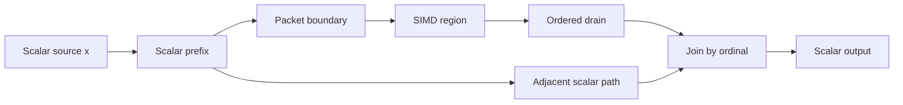
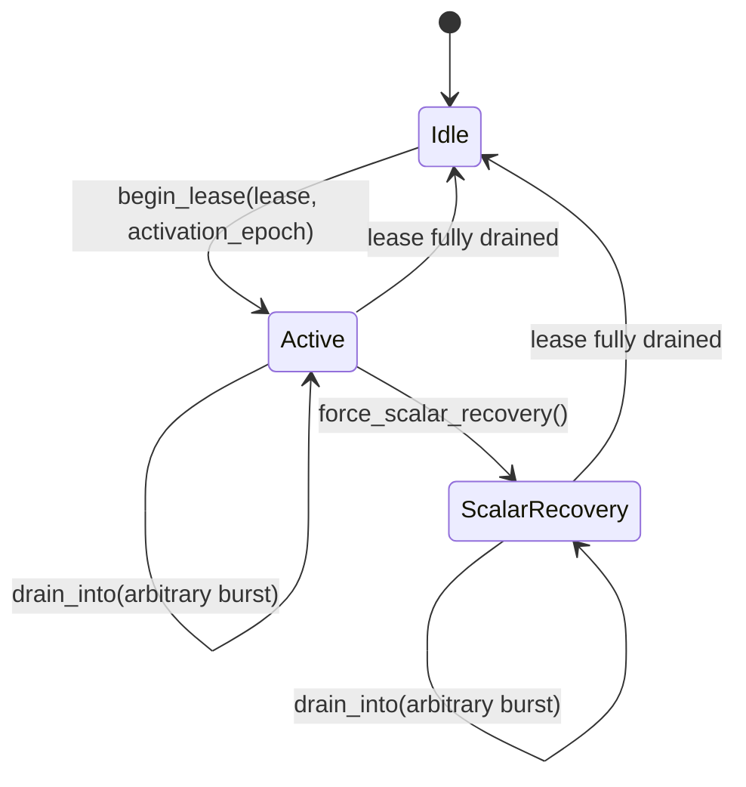

# SIMD ISA Selection and Scalar-Flow Promotion

**Scope:** Effective native-ISA discovery, typed SIMD node variants, promotion
qualification, ordinal packet execution, ordered scalar drain, and recovery.

This specification extends:

- [The Runtime Model](runtime_model.md), especially scalar-cycle consistency and
  invalidation;
- [The Graph Compiler](graph_compiler.md), especially fusion and engine
  selection;
- [The Evaluation Model](evaluation_model.md), especially per-fiber state;
- [Engines](engines.md) and [JIT Boundary](jit_boundary.md);
- [The Type System](type_system.md), especially the fixed 128-bit register
  plane; and
- [Cross-Fiber Cell Invalidation](cross_fiber_invalidation.md).

The optimization processes an owned scalar ordinal sequence as 128-bit lane
packets while preserving scalar graph signatures and scalar result order. It
does not place several logical cycles in the ordinary node cache.

---

## 1. Normative decisions

1. **Polydat's native register plane is 128 bits.** AVX2 and AVX-512 are host
   feature facts, not 256- or 512-bit Polydat types. A graph may use only
   register types that the installed Cranelift backend lowers.
2. **The planner and JIT use the same effective ISA.**
   `cranelift_native::builder()` supplies the host triple and OS-enabled target
   features to both qualification and compilation.
3. **SIMD variants are explicitly typed.** A scalar node such as
   `u64 -> u64` names an exact register variant such as
   `RegI64x2 -> RegI64x2`. Promotion never infers equivalence from names or bit
   widths.
4. **Public graph signatures remain scalar.** Packet construction and scalar
   drain are execution-plan boundaries. They are not general type adapters.
5. **Reservation is not semantic consumption.** Source advancement grants an
   executor ownership of ordinal tokens. A token is consumed only when its
   scalar result crosses the ordered drain frontier.
6. **Packet state is per-fiber stream state.** It is not stored in
   `node_clean`, an ordinary scalar slot, or a node object shared by a compiled
   program.
7. **Token identity is independent of value equality.** A token is identified
   by stream identity, source generation, activation epoch, and ordinal.
8. **Recovery does not rewind a cursor.** Uncommitted results are regenerated
   from stable ordinal identity or evaluated through the retained scalar graph.
9. **Downstream invalidation does not travel upstream.** Only state whose
   provenance includes the changed source is invalidated.
10. **Promotion is explicit and conservative.** Ordinary compilation and
    `Kernel::pull` remain scalar-cycle APIs. The supported promoted
    executor has one perfect-ordinal `u64` input, one selected output, exact
    `RegI64x2` variants, and stable broadcast boundaries.

---

## 2. Capability and type boundary

### 2.1 Effective ISA

`EffectiveIsa::detect()` is the process-local record used by native JIT
compilation and SIMD qualification. It contains:

```text
EffectiveIsa
  triple
  polydat_register_bits = 128
  cranelift_version
  enabled_flags
  fingerprint()
```

The fingerprint includes all four fields and is suitable for compiled-plan
cache identity. A compiled plan must not be reused when the fingerprint differs.
Architecture lookup without native feature inference is not an effective-ISA
probe.

The `jit` feature depends on Cranelift 0.116 (the crate's `Cargo.toml`); the
x64 lowering boundary for ordinary vector SSA values in that backend is 128
bits. Wider physical registers or instruction sets do not change the graph type
plane.

### 2.2 Type shapes

`promotable_type_shape` defines the mechanical scalar/register correspondence:

| Scalar shape | Register shape | Lanes | Integrated Tier-1 execution |
| --- | --- | ---: | --- |
| `u8`, `i8` | `RegI8x16` | 16 | No |
| `u16`, `i16` | `RegI16x8` | 8 | No |
| `u32`, `i32` | `RegI32x4` | 4 | No |
| `u64`, `i64` | `RegI64x2` | 2 | `u64` only |
| `f32` | `RegF32x4` | 4 | No |
| `f64` | `RegF64x2` | 2 | No |

This correspondence is necessary but not sufficient for promotion. The
integrated executor supports only scalar `u64` carried through `RegI64x2`.
`Reg128` has no homogeneous lane semantics and is not a promotion target.
`f16`, `u128`, and `i128` are outside the promotable shape catalog.

Signedness remains part of `SimdTypeShape`. A shared physical integer register
does not make signed comparison, unsigned comparison, division, shifts, min/max,
or widening interchangeable. Strings, bytes, JSON, extensions, handles, heap
vectors, boolean masks, lane-count-changing conversions, and `None` lanes are
outside the Tier-1 contract.

### 2.3 Variant proof

A scalar node may declare a SIMD variant through node metadata:

```rust,ignore
#[polydat_node(
    category = Arithmetic,
    simd = "reg_add_i64",
    simd_total
)]
fn u64_add(a: u64, b: u64) -> u64 {
    a.wrapping_add(b)
}
```

`validate_simd_variant` accepts a variant only when all of these facts hold:

- the scalar node and vector node are pure;
- the mapping is exact, total, and lane-independent;
- every scalar input and output has one uniform promotable shape;
- vector arity matches scalar arity; and
- every vector input and output has the exact register type for that shape.

For a scalar function `f`, vector function `F`, and lane width `W`, exactness
means:

```text
unpack(F(pack(x0, ..., xW-1)))
    = [f(x0), ..., f(xW-1)]
```

Integer equality is equality at the declared modular width. Floating-point
variants preserve one scalar operation and rounding point per lane. Horizontal
reduction, reassociation, FMA contraction, saturation, approximate operations,
and different exception behavior are not exact variants.

Static validation is followed by compilation of the complete register cone
with the effective ISA. A lowering failure rejects the promoted plan without
changing the scalar graph.

---

## 3. Why scalar cache widening is invalid

Consider a scalar fan-out:



If `W` advances four inputs and stores only one register as the current value,
the adjacent path cannot recover which scalar inputs those lanes represent.
Later invalidation can then duplicate, skip, or join the wrong logical cycles.
A `node_clean` bit cannot simultaneously mean “current scalar value,” “several
reserved values,” and “some values already drained.”

The valid model has two separate states:

```text
scalar node cache                 promoted stream state
-------------------------------   --------------------------------
one value for current inputs      owned ordinal lease
clean/dirty provenance            next scalar ordinal
ordinary scalar-cycle lifetime    optional stamped ready packet
                                  activation and stream identity
                                  ordered drain statistics
```

The scalar graph remains the semantic oracle and recovery path. The promoted
register graph is a parallel execution plan.

---

## 4. Stable ordinal sources

### 4.1 Replay contract

Every `DataSource` reports a `SourceReplayContract`:

```text
SourceReplayContract
  stability: Consumptive | StableByOrdinal
  generation: u64
  value_form: Opaque | Ordinal
```

`generation` changes whenever rendering the same ordinal can produce a
different value. `StableByOrdinal` means rendering an owned ordinal is pure,
total, repeatable for that generation, and does not advance shared state.
`value_form = Ordinal` means the ordinal is also the yielded scalar value.
`is_perfect_ordinal()` is true only for this combination.

The executor, rather than the source contract, supplies stream identity and
activation identity. The complete logical token key is:

```text
(stream_id, source_generation, activation_epoch, ordinal)
```

This key distinguishes equal values, replaced sources, and a phase that
intentionally evaluates the same ordinal again.

### 4.2 Cursor bits are the packet clock

Every homogeneous 128-bit integer lane shape has a power-of-two lane count:

| Lane width | Lanes `W` | Low cursor bits |
| ---: | ---: | ---: |
| 8 | 16 | 4 |
| 16 | 8 | 3 |
| 32 | 4 | 2 |
| 64 | 2 | 1 |

For ordinal `o`:

```text
packet(o)   = o >> log2(W)
lane(o)     = o & (W - 1)
base(o)     = packet(o) << log2(W)
lane_bit(o) = 1 << lane(o)
suffix(o)   = FULL_MASK << lane(o)
```

The low bits are a lane index; selector and suffix masks are derived from that
index. A perfect ordinal sequence therefore supplies all of these facts without
an independent pacing counter:

- packet identity;
- lane selection;
- ready-packet reuse across arbitrary drain bursts;
- contiguous remaining-lane masks; and
- a compact replay address.

For `RegI32x4`, ordinal 10 identifies packet base 8, lane 2, selector `0100`,
and remaining suffix `1100`. Although the production Tier-1 executor is
`RegI64x2`, `OrdinalLaneClock<W>` verifies this arithmetic for every common
supported lane count.

### 4.3 Ownership and alignment

Alignment does not grant ownership. A packet may expose only:

```text
[packet_base, packet_base + W) ∩ owned_lease ∩ source_extent
```

The production executor vectorizes full `u64x2` packets and evaluates unaligned
lease fragments through the scalar graph. It never enlarges or realigns a shared
reservation. A partial ready packet remains private to its executor and drains
in increasing ordinal order.

Stable ordinal identity eliminates payload retention for the driving input, but
it does not reconstruct mutable side inputs. Tier 1 consequently freezes every
non-driving input before a lease begins and rejects rebinding while a lease is
active.

---

## 5. Tier-1 qualification

There are two supported SIMD execution forms:

- **Explicit register graph:** the author supplies register-typed nodes and
  normal type checking and engine selection apply.
- **Explicit Tier-1 scalar-flow promotion:** the caller selects a driving input
  and output through the Tier-1 compile API.

Tier-1 compilation succeeds only when all of these conditions hold:

1. The selected output exists, is its node's sole output port, is not `init`,
   and has no visibility modifier.
2. The driving input exists and is in the selected output's ancestry.
3. The selected ancestry contains at least two promoted member nodes.
4. Every member has a valid pure, exact, total, lane-independent SIMD variant.
5. Every member has the same `u64`/`RegI64x2` shape.
6. No member accepts `None` inputs.
7. Every boundary is the driving input, a pure constant, or a scalar input
   frozen as a broadcast.
8. No second externally writable input enters the promoted cone.
9. The synthesized register DAG compiles with the effective native ISA.

The following graph shapes and effects are ineligible:

- multi-output or multi-source advancement;
- externally mutable side inputs during a lease;
- shared-cell dependencies or publications;
- nondeterministic or side-channel nodes;
- horizontal reductions and cross-lane shuffles;
- data-dependent control that would execute a scalar branch prematurely;
- `None` lanes or per-lane validity semantics;
- checked operations whose failure prefix is observable;
- open-ended demand, filters, limits, or short-circuit consumers that allow
  reservation to outrun demand; and
- any operation declined by the effective Cranelift ISA.

Convex multi-exit packet graphs, epoch-segmented dynamic inputs, and
transactional shared-cell batching are not Polydat promotion modes. Supporting
one of them requires a separate specification and implementation; Tier-1 state
must not be interpreted as providing those semantics.

---

## 6. Compilation and runtime API

### 6.1 Explicit compilation

`compile_with(Engine)` on any engine, and `Kernel::pull`, do not select
scalar-flow SIMD promotion.

The public DSL entry point is:

```rust,ignore
compile_polydat_tier1_simd_ordinal(source, driving_input, output)
    -> Result<Tier1SimdExecutor, String>
```

The corresponding assembler entry point is
`try_compile_tier1_simd_ordinal`. Compilation follows this fixed sequence:


The register kernel the executor owns is a pure native raw kernel
(`JitKernelRaw`): the whole register DAG as one native function over the slot
buffer, with no provenance tracking, because the executor sequences every
packet itself and the scalar kernel it also owns is the oracle and the
recovery path. Beside the engine differential, this executor is the reason the
pure native tier exists ([Engines](engines.md)).

Any qualification or register-lowering failure is a compile error for this
explicit API. It does not alter or invalidate ordinary scalar compilation.

### 6.2 Immutable descriptor

`Tier1SimdDescriptor` reports:

```text
output
driving_input
scalar_type
register_type
lanes
member_nodes
broadcast_inputs
effective_isa_fingerprint
```

The descriptor is immutable. The executor owns the scalar kernel, compiled
register kernel, boundary description, active lease, ready packet, activation
identity, expected lease sequence, stream identity, and statistics. Executors
are per-fiber and do not share this mutable state.

### 6.3 Lease lifecycle

The runtime contract is:



- `set_broadcast` is allowed only while idle and enforces exact scalar type.
- `begin_lease` validates driving-input identity, lease sequence, stream and
  generation continuity, and nondecreasing activation epoch.
- A rejected lease is returned in `Tier1LeaseStartError`; ownership is never
  silently lost.
- `drain_into` accepts arbitrary output slice lengths, returns values in ordinal
  order, and retains a partly consumed ready packet.
- Full aligned packets execute through the register graph. Lease fragments
  execute through the scalar graph.
- `force_scalar_recovery` discards only the uncommitted ready register packet
  and evaluates the remaining ordinal suffix through the scalar graph.
- Finishing a lease increments the expected lease sequence and releases all
  associated packet state.

`Tier1SimdStats` records completed leases, vector packets, scalar fragment
lanes, scalar recovery lanes, and drained values. These counters are diagnostic
state and never graph-visible values.

---

## 7. Invalidation, errors, and recovery

Tier-1 avoids mid-packet dependency invalidation by sealing its dependencies:
the driving value is determined by ordinal, constants are immutable, and scalar
broadcasts cannot change during an active lease. Shared cells and externally
writable side inputs are rejected during qualification.

The required behavior at each boundary is:

| Event | Behavior |
| --- | --- |
| Lease head or tail contains fewer than two owned ordinals | Evaluate only those ordinals through the scalar graph. |
| Source generation changes between leases in one activation | Reject the lease and return it to the caller. |
| Stream identity changes between leases in one activation | Reject the lease and return it to the caller. |
| Lease arrives out of reservation order | Reject the lease and return it to the caller. |
| Activation epoch moves backward | Reject the lease and return it to the caller. |
| Broadcast write during an active lease | Reject with `ActiveLease`. |
| Caller requests recovery | Keep the next ordinal unchanged, discard the ready register packet, and scalar-evaluate the remaining lease. |
| Downstream scalar state is invalidated | Apply ordinary forward provenance invalidation; do not mutate an independent upstream lease. |
| Executor or fiber is abandoned with an active lease | The caller remains responsible for the owned reservation under the source contract. |

Cursor rewind is forbidden as packet recovery. Rewinding a shared cursor can
duplicate another fiber's reservation, reorder work, cross allocation
boundaries, and cannot reconstruct dependency values from the original epoch.

The retention strategy is the stable ordinal replay key plus the consumer
frontier. The compiled scalar graph is retained as the oracle. There are no
intermediate-stage checkpoints, retry transactions, or shared-cell snapshot
protocol in Tier 1.

---

## 8. Normative invariants

**AP1 — Backend truth.** No selected register type or operation exceeds the
effective backend capability set.

**AP2 — Signature preservation.** Promotion does not change declared scalar
graph inputs or outputs. Internal register types come only from explicit variant
signatures.

**AP3 — Sequence identity.** Every reserved logical evaluation is identified by
stream, generation, activation, and ordinal rather than by value equality.

**AP4 — Reservation precedes consumption.** A source lease grants ownership;
only ordered scalar drain consumes results.

**AP5 — Ordered visibility.** Results become visible in increasing ordinal
order, including across arbitrary burst sizes and recovery.

**AP6 — Sealed dependencies.** No mutable dependency other than the owned
ordinal may change while a Tier-1 lease is active.

**AP7 — Forward-only invalidation.** Downstream invalidation does not erase an
upstream ordinal or packet whose provenance excludes the changed source.

**AP8 — Replay sufficiency.** Every uncommitted ordinal can be regenerated and
evaluated through the scalar graph without cursor rewind.

**AP9 — Scalar oracle.** Scalar recovery preserves the same value order as
unpromoted execution for the remaining lease.

**AP10 — No speculative observables.** Promoted members are pure and cannot
publish shared state, diagnostics, or other side effects.

**AP11 — Lease bounds.** No visible or evaluated scalar fragment lies outside
the owned lease. Full packet execution is used only when both lanes are owned.

**AP12 — Per-fiber state.** Compiled program sharing never shares leases,
packets, frontiers, or statistics.

---

## 9. Performance model

For lane width `W`, let:

- `H_s` be scalar per-item runtime overhead;
- `K_s` be scalar work in the candidate region;
- `H_b` be per-packet scheduling overhead;
- `K_v` be one SIMD execution;
- `P` and `U` be packet construction and drain cost; and
- `D` be unavoidable scalar suffix work per item.

The approximate steady-state speedup is:

```text
speedup ~= W * (H_s + K_s)
           / (H_b + K_v + P + U + W * D)
```

Deep lane-independent arithmetic, full packets, stable ordinals, small scalar
suffixes, and long-lived compiled plans improve the ratio. Cheap single nodes,
memory-bound work, frequent fragments, mutable dependencies, and short-lived
plans do not.

Promotion is explicit; there is no automatic cost threshold in the normal
compiler. The descriptor and runtime counters provide the facts needed by a
caller or profiling layer to make that selection without changing semantics.
The measured reason the packet clock is worth its complexity is that packet
reuse stays effective when the caller's burst size is smaller than the vector
width: a ready packet drained one value at a time still amortizes its native
call over its lanes. The measurements do not establish multi-consumer,
shared-state, per-lane error, or automatic-selection semantics.

---

## 10. Verification contract

The behavior is covered by two complementary suites.

The tier-1 executor tests (`tests/core_with_library.rs`) verify:

- selected scalar-cone discovery and typed register-plan compilation;
- scope-stable scalar broadcasts;
- arbitrary drain bursts and unaligned lease fragments;
- recovery after part of a register packet has committed;
- out-of-order lease rejection with ownership returned;
- rejection of a second externally writable input; and
- an explicit Cranelift `i32x4` register graph.

`iteration::simd_ordinal` verifies:

- cursor-clock arithmetic for every common lane count;
- every lease alignment against the scalar oracle;
- packet reuse across arbitrary burst partitions;
- scalar and padded fragment policies without out-of-lease visibility;
- payload-free checkpoint rematerialization by ordinal;
- dependency invalidation without consumer-frontier rewind; and
- stream, generation, activation, and lease identity checks.

Every change to Tier-1 qualification or execution must preserve AP1–AP12 and
must compare the promoted result stream with the retained scalar oracle.

---

## 11. Result

Polydat SIMD promotion is an owned, sequence-stamped micro-batch executed
through an explicitly equivalent register graph and revealed through ordinary
scalar order. The ordinal is simultaneously the replay key, logical value,
packet number, and low-order lane clock for a perfect sequence. This removes
redundant pacing and payload state without weakening ownership or ordering.

The supported production boundary is intentionally exact: explicit compilation,
one `u64` perfect-ordinal driver, one selected output, `RegI64x2` member
variants, immutable constants or frozen broadcasts, full-packet native
execution, scalar fragments, and forward-only scalar recovery. All other
promotion shapes remain outside this specification.
