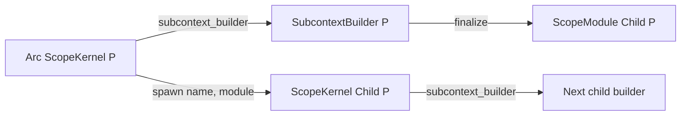

# Parent-Gated Subcontext Construction

This document specifies the typed construction boundary for a Polydat child
scope. It is the concrete enforcement mechanism for lifecycle isolation and
cross-tier write-through in [The Composition
Substrate](composition_substrate.md), and it composes with [The Scope
Model](scope_model.md) and [Wire Materialization](wire_materialization.md).

The governing rule is:

> A child `ScopeKernel` is constructed from a closed `ScopeModule` by its
> parent `ScopeKernel`. `finalize` closes and compiles module matter; `spawn`
> is the single point at which parent/child wiring becomes live.

---

## 1. Public model



The construction types are:

- `ScopeKernel<M>` — a typed wrapper around a live `PolydatKernel`, with a
  structured name, source context, named-child registry, pull consumers, and
  write-through bindings;
- `SubcontextBuilder<P>` — an accumulator that owns an `Arc` to the parent and
  records imports, exports, body fragments, consumers, diagnostics, and compile
  options;
- `ScopeModule<Child<P>>` — the closed artifact produced by `finalize` and
  consumed by `ScopeKernel<P>::spawn`;
- `ScopeContract<M>` — typed import and export handle bundles branded by `M`;
- `ImportSpec` and `ExportSpec` — named declarations carrying port type and
  lifecycle classification;
- `ChildName` — a hierarchical registry key; and
- `SourceContext` — a diagnostic label with optional file and line range.

`Child<P>` records the parent type in the child type. This prevents handles for
different module brands from being interchanged at compile time. Runtime child
identity is additionally enforced by `ChildName` in the parent's registry.

---

## 2. Builder inputs

### 2.1 Body fragments

`SubcontextBuilder::body` accepts either:

```rust,ignore
BodyFragment::PolydatSource(String)
BodyFragment::Statements(Vec<Statement>)
```

Source fragments are lexed and parsed during `finalize`. Statement fragments
enter the same compiler without a text round trip. Multiple fragments are
concatenated in registration order. An empty body is a contract error.

### 2.2 Imports and exports

Imports classify a name as `CompileConst`, `Extern`, `Shared`, or
`IterationExtern`. Exports classify a name as `Local`, `Final`, `Shared`,
`Coordinate`, or `Volatile` and carry the corresponding binding modifier.

The implemented enforcement boundary is exact:

- `finalize` requires every declared import name to exist among the parent's
  input or output names;
- the compiled body must type-check under the ordinary Polydat compiler;
- an import unused by the compiled body is retained in the module contract and
  emits a module diagnostic;
- a child export cannot shadow a same-named parent `const` output; and
- a child export matching a shared cell visible at the parent becomes a typed
  write-through binding.

`ImportSpec::port_type` and `ImportSpec::classification` are preserved in the
public `ScopeContract`, but `finalize` does not independently compare them with
a typed parent-export manifest. Actual child input slots and shared-cell writes
remain protected by the compiler and kernel slot type checks.

### 2.3 Compile options

The subcontext builder's `CompileOptions` (`kernel::subcontext::CompileOptions`,
distinct from `dsl::compile::CompileOptions`, into which `finalize` maps it)
carries the compile-time inputs that affect the child program:

```text
workload_dir
polydat_lib_paths
strict
required_outputs
context_label
cursor_limit
kernel_opt
```

All options go through the one compiler: default options compile the
statements under the default `dsl::compile::CompileOptions` (charged to the
parent's ledger); non-default options are mapped into
`dsl::compile::CompileOptions` and compile the (possibly rewritten)
statements, or the re-joined source when no rewrite fired and every fragment
is source. `KernelOptLevel` also
controls whether result binding support keeps only referenced injected slots or
retains all diagnostic slots.

### 2.4 Pull consumers

`register_pull` stores `Arc<dyn PullConsumer>` registrations in the closed
module and spawned kernel. A consumer supplies a stable diagnostic label and an
ordered list of names. Resolution of those names into a host pull plan is a
consumer-layer operation; this protocol owns only their collection and
transport.

---

## 3. Finalization

`SubcontextBuilder::finalize` performs these operations in order:

1. Snapshot the parent input and output name sets.
2. Reject declared imports that have no matching parent name.
3. Reject a child export that shadows a parent `const` output.
4. Discover shared cells visible at the parent, including cells inherited from
   an ancestor.
5. Parse every source body fragment and concatenate all statements.
6. Rewrite shared export collisions into explicit write-through form.
7. Compile the rewritten statements with the requested compile options,
   charging the compile to the parent's `CompileLedger`; the module's
   program carries that ledger.
8. Apply inherited-output marking before the program `Arc` is shared.
9. Bake write-through metadata into the compiled program.
10. Diagnose declared imports not represented in the compiled input/output
    closure.
11. Verify every write-through has both its child input slot and synthetic
    output.
12. Seal program, contract, context, consumers, write-through bindings, and
    diagnostics into `ScopeModule<Child<P>>`.

The resulting artifact has no live parent reference. Its parent-dependent
decisions have already been made by the builder that held the parent.

### 3.1 Shared write-through rewrite

When a child export `X := expr` matches a shared cell named `X` visible at the
parent, finalization rewrites the single-target binding conceptually as:

```polydat
extern X: <cell-type>
__write_X := expr
```

It also records:

```text
WriteThroughBinding {
  export_name: "X",
  source_output: "__write_X"
}
```

Tuple-target bindings are not write-through shapes. They are left to ordinary
compiler validation and cannot silently update one shared cell.

### 3.2 Result bindings

`add_result_bindings` parses result-source statements and applies the same
write-through path. It has these additional rules:

- empty source is a no-op;
- `body: Json`, `count: u64`, and `ok: bool` externs are injected only when
  referenced under release optimization;
- diagnostic optimization retains all three slots;
- assignments to `body`, `count`, or `ok` are rejected because those names are
  runtime-injected inputs; and
- only result LHS names that collide with an in-scope shared cell are declared
  as shared exports for rewriting.

Non-colliding result bindings remain ordinary child outputs with their inferred
types.

The names `body`, `count`, and `ok` and their types are a host convention: a
host that binds an operation's result into a child scope injects them. Polydat
hosts the convention here because the write-through rewrite is the mechanism
it needs; nothing in the language depends on the three names.

---

## 4. Spawn

`ScopeKernel<P>::spawn(name, module)` is the live construction chokepoint.

1. It locks the parent registry and rejects an existing `ChildName`, reporting
   the prior and current `SourceContext` values.
2. It records the child name.
3. It materializes the closed child program under the parent, as a kernel
   state of its own that owns its outputs and their storage
   ([Runtime Model](runtime_model.md) R4). Shared cells visible at the
   parent attach to matching child slots and remain available for transitive
   descendant wiring.
4. It transfers context, consumer registrations, and write-through bindings to
   the new `ScopeKernel<Child<P>>`.

No subsequent API changes the child's parent or cross-binding shape.

### 4.1 Named-child registry

`ChildName` is a segment vector with constructors for phases, operations,
iterations, and composed paths. Segment equality defines identity.

A second live registration under the same name returns
`ContractViolation::DuplicateChild`. `release_child(name)` removes only the
registry entry; it does not invalidate an already returned child kernel. After
release, the parent may spawn a replacement under that name. This explicit
transition supports iteration re-traversal without weakening duplicate-spawn
detection.

### 4.2 Cross-generation sharing

`shared_cells_in_scope` enumerates both cells owned by the parent and cells
attached from its ancestors. Spawn forwards this visibility through silent
intermediate scopes. A root shared cell can therefore bind a grandchild even
when the intermediate body's graph never reads the name.

This transit behavior affects cell availability only. Ordinary non-shared
values follow normal parent/child import and materialization rules.

---

## 5. Write-through after evaluation

`ScopeKernel::commit_write_throughs` is called after the child has produced its
values for a coordinate. It is a no-op when the module has no write-through
bindings.

For each binding it:

1. pulls the synthetic `__write_X` output;
2. resolves the child input slot for `X`;
3. validates or applies the permitted boundary conversion against the slot's
   fixed `PortType`; and
4. writes the value through that input slot to the attached `SharedCell`.

The implementation uses a two-pass pull-then-write sequence to avoid competing
mutable borrows of the kernel. An unhealable type mismatch returns an error at
the write site. Shared-cell concurrency remains last-write-wins by mutex
acquisition order as specified in [The Scope Model](scope_model.md).

---

## 6. Lifecycle and ownership

```text
parent live
  └─ builder open
       ├─ module matter mutable
       └─ finalize
            └─ closed ScopeModule
                 └─ parent.spawn
                      └─ live child ScopeKernel
```

- The builder owns an `Arc` to the parent for its complete lifetime.
- `finalize` consumes the builder.
- `spawn` consumes the module artifact.
- A compiled `PolydatProgram` is immutable and shareable.
- The spawned `ScopeKernel` owns one synchronized mutable kernel state.
- Independent kernels for other fibers are created from the immutable program
  through `KernelProgram::create_kernel`; they are not created by repeating
  `spawn` for the same named child.
- Hot rebinding and multi-parent construction are unsupported.

Direct compilation (`compile_polydat_with`) creates a root kernel on any
engine, but it does not create a typed child relationship. The second
sanctioned construction path is `PolydatKernel::build_subscope(PolydatMatter)`:
matter built by `PolydatMatter::builder()` from source, pre-parsed statements,
or a compiled program (exactly one). Source and statement matter route through
a transient typed parent (`wrap_root_kernel`) and this protocol's `finalize`;
program matter is materialised directly with its iteration bindings. No
free-function bridge remains.

---

## 7. Error contract

The active construction errors are:

| Error | Boundary |
| --- | --- |
| `UnboundImport` | A declared import name is absent from the parent input/output closure. |
| `FinalShadow` | A child export collides with an immutable parent output. |
| `DuplicateChild` | The parent registry already contains the child name. |
| `Compile` | Parsing, rewriting, type checking, or write-through structural validation fails. |
| `StrictNonePropagation` | Strict intermediate-scope materialization would silently fall through after a `const` binding produced `None`. |

`SourceContext` accompanies construction diagnostics so failures identify their
logical scope and, when supplied, source file and line range.

---

## 8. Normative invariants

**SC1 — Parent gate.** A typed child kernel is produced only by its parent from
a finalized child module.

**SC2 — Closed artifact.** Module body, program, contract, consumers,
write-throughs, and diagnostics cannot be amended after `finalize`.

**SC3 — One binding point.** Parent/child cell attachment occurs during
`spawn`; no public hot-rebind path exists.

**SC4 — Name closure.** Every declared import resolves to a parent-visible name
before body execution.

**SC5 — Immutable shadow protection.** A child cannot redefine a same-named
parent `const` output.

**SC6 — Explicit shared writes.** A child assignment updates an ancestral
shared cell only when finalization produced a `WriteThroughBinding` and
`commit_write_throughs` publishes it.

**SC7 — Type-stable publication.** Every write-through is checked against the
fixed target slot type before publication.

**SC8 — Transitive cells.** A shared cell remains visible through intermediate
scopes that do not consume it.

**SC9 — Named ownership.** Duplicate live child names are errors; reuse requires
an explicit registry release.

**SC10 — Program/state separation.** Program sharing does not imply mutable
state sharing between independent kernel instances.

---

## 9. Beside traversal activation

Polydat has two ways to produce a child kernel bound to outer wires, and this
protocol is one of them. Both produce a child state of its own (R4) over a
program compiled once; both bind the child's declared externs to the outer scope by
name, through typed writes; both leave the child's own buffers and currency
fresh. They differ in who composes the child and what crosses the boundary:

- **Subcontext construction** is for a host-composed child with a contract:
  the host supplies imports, exports, body fragments, consumers, and result
  bindings, and the parent's `spawn` binds the child through the full binder
  ([Scope Model](scope_model.md) §4) — shared cells and transit cells
  attached, computed parent outputs attached as broadcast cells, scope-init
  `const` outputs pulled, scope coordinates threaded. The child is an
  interpreter kernel.
- **Traversal activation** is for the language's own `for`: the body is
  compiled with the parent, and `TraversalStream::activation_on` creates one
  kernel per tuple on the engine the host asks for, binding the
  tuple's elements and a snapshot of the cascaded wires by value and
  narrowing every cursor ([for_traversal.md](for_traversal.md)).

Either way, what the child contains is not the iteration's to decide. A
comprehension determines the order and the values of the tuples; a host's
scope walker decides the imports, the exports, and the body fragments that
become a child from one of them, and this protocol's `finalize` validates the
contract between them. Compiling the module matter and binding the named
child are polydat's; releasing a replaceable iteration child is the host's,
through `release_child`.

The difference today is that the subcontext path is interpreter-only and
carries cells, while the traversal path runs on every engine and carries
values. The intent is that both call one binder expressed over the `Kernel`
trait (`shared_cells`, `attach_shared_cell`, `input_value`, `pull`,
`set_input`), so that a host-composed child can run on any engine and a
traversal body can share a cell rather than a snapshot.
