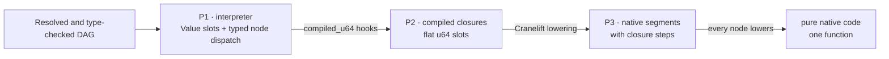

# Engine-ladder performance

Polydat can execute one statically typed function graph at three progressively
lower-overhead levels, and the benchmark adds a fourth rung, pure native code,
the differential tier behind P3. This page makes that claim concrete with a checked-in
graph, a semantic-equivalence test, and a focused Criterion benchmark.

The benchmark is intentionally small enough to understand. It is not a claim
that every Polydat graph will have the same ratios: node mix, graph shape,
invalidation, requested outputs, host ISA, and compiler version all matter.

## The graph

The example models four fields derived for a workload operation. A changing
`cycle` is combined with tenant and operation seeds. Shared entropy fans out
into identity, routing, payload, and final event-token paths:


The graph is useful as a first performance example because it contains three
inputs, four outputs, fan-out, fan-in, shared intermediate products, and eleven
non-trivial nodes while remaining readable. Every wire is `u64`, and every node
has P1 semantics, a P2 compiled closure, and a P3 lowering. P3 therefore cannot
silently fall back while this benchmark is being assembled.

The exact source is
[`examples/engine_ladder.polydat`](../../examples/engine_ladder.polydat):

```polydat
input cycle: u64
input tenant_seed: u64
input operation_seed: u64

seeded_cycle := u64_add(cycle, tenant_seed)
identity_entropy := hash(seeded_cycle)
account_id := mod(identity_entropy, 10000000)

route_seed := u64_xor(account_id, operation_seed)
route_entropy := hash(route_seed)
shard := mod(route_entropy, 64)

payload_seed := u64_add(identity_entropy, operation_seed)
payload_entropy := hash(payload_seed)
payload_class := mod(payload_entropy, 8)

token_seed := u64_add(route_entropy, payload_entropy)
event_token := hash(token_seed)
```

## One graph, three execution levels

The ladder changes the representation and dispatch cost, not the graph's typed
contract:



| Level | Construction used by this benchmark | Timed execution |
| --- | --- | --- |
| P1 | `JitMode::Off` plus `PolydatAssembler::compile()` | Set three typed inputs and demand-pull four pre-resolved outputs through the interpreter. |
| P2 | `try_compile_raw()` | Copy three coordinates, execute all compiled closures over flat slots, then read four pre-resolved slots. |
| P3 | `try_compile_jit_raw()` | Copy the same coordinates, run the native segments and closure steps over the shared slots (on this graph, one segment), then read the same four slots. |
| pure | `try_compile_pure_jit_raw()` | Copy the same coordinates, call the one generated native function, then read the same four slots. |

The P2, P3, and pure `raw` variants are deliberate. Every cycle changes the driving
input and all four outputs are consumed, so the test isolates execution-level
overhead without mixing in provenance strategies. A host's default,
`Engine::default()`, is the P3 hybrid kernel with provenance chosen by the
selector; `JitMode::Auto` applies only when the interpreter is named, where
it keeps P1 as the host and embeds eligible cones.

## Measurement contract

One Criterion iteration means one complete logical cycle:

1. Increment `cycle`; keep the two seed inputs stable.
2. Supply all three inputs.
3. Evaluate the eleven graph nodes.
4. Consume `account_id`, `shard`, `payload_class`, and `event_token`.

Graph parsing, validation, compilation, JIT code generation, and output-name
resolution happen before timing. Criterion reports both time per cycle and
cycles per second. The benchmark uses a two-second warm-up, three-second
measurement window, and 60 samples per level.

Before comparing timings, the integration test evaluates boundary and ordinary
input cases and requires P2, P3, and pure native code to return exactly the
same four `u64` values as P1. It also checks all bounded outputs.

## Local reference result

The following run was recorded on 2026-09-14. Each interval is Criterion's
reported confidence interval; the middle value is the point estimate. Because
one benchmark element is one complete graph cycle, `Melem/s` is reported here as
million cycles per second.

| Level | Time per cycle | Throughput | Speed relative to P1 |
| --- | ---: | ---: | ---: |
| P1 interpreter | 322.25 ns `[322.13, 322.38]` | 3.103 M cycles/s `[3.102, 3.104]` | 1.00× |
| P2 closures | 71.006 ns `[70.958, 71.057]` | 14.083 M cycles/s `[14.073, 14.093]` | 4.54× |
| P3 native segments | 25.347 ns `[25.332, 25.364]` | 39.452 M cycles/s `[39.426, 39.475]` | 12.71× |
| pure native code | 14.212 ns `[14.181, 14.250]` | 70.363 M cycles/s `[70.174, 70.517]` | 22.67× |

For this graph, moving from typed node dispatch to flat-slot closures removes
most of the execution cost. Native lowering then provides another 2.80× over
P2. Every node of this graph lowers and it is connected, so P3 is one native
segment; pure native code is the same code as one block of a function that
dispatches over the units a pull needs, and the two rungs differ in that
bookkeeping and in how each keeps a nondeterministic node or a side channel
current. These are end-to-end cycle measurements, including
input copies and four output reads, rather than isolated instruction timings.

Reference environment:

- Intel Xeon Platinum 8375C at 2.90 GHz, 64 cores and 128 logical
  processors across two sockets;
- Linux 6.8.0-1047-aws, `x86_64-unknown-linux-gnu`;
- Rust and Cargo 1.98.0, optimized `bench` profile with thin LTO;
- Cranelift 0.116.1, the 0.3.0 release tree at commit b3a7fa5; and
- 60 samples per level after a two-second warm-up, with a three-second
  measurement window, on an otherwise idle machine.

This graph uses scalar `u64` operations. The P3 result demonstrates native
machine-code lowering, not SIMD auto-promotion.

The previous record, from 2026-09-10 on an AMD Ryzen 9 3900X under Windows,
read 441.83 ns, 121.05 ns, 76.104 ns, and 75.942 ns for P1, P2, P3, and
pure native code, with P3 at 5.81× P1. The machine changed between the
records, so the absolute times are not comparable; the ratios moved for
reasons in the code as well. Since 2026-09-13 every node with a kit lowers
natively, native code that calls no helper runs without the failure-catching
trampoline, and the hybrid kernel schedules its constant steps first. On the
earlier machine, native timings drifted between 57 ns and 76 ns across runs
in one day. Compare rungs within one run, not runs across days or machines.

## The tile ladder

A second ladder, `benches/tile_render.rs`, renders one JSON document
through the same four levels. The document is the reading of the toy test
definition (`examples/toy_test_definition.polydat`): a static arm, seven
holes of four types with two formats, a nested object, one projection of
four tuples with a formatted hole, and a declared boolean. Each case is
one complete cycle that pulls the rendered tile, and the five are chosen
so that subtracting one from another isolates a cost:

| Case | What it isolates |
| --- | --- |
| `reading` | the reading's eight wires read directly, no tile: subtract it from any other case to get that case's render cost |
| `one_hole` | one numeric hole in a two-byte skeleton: the floor for a render |
| `flat` | the document without its projection: encode and copy cost per hole |
| `projected` | the document as written: what the projection's tuples and body add |
| `wide` | the flat document with twenty holes of three types: how cost scales with hole count |

The pairing is the point. A tile's cost is the bytes it copies plus the
holes it encodes plus, per projection, the tuples times the body
([Polytile](../design/polytile.md) §7.3), and each of those three terms
has a case that isolates it. A render cost that grows with the skeleton
rather than the hole count, or a projection that costs more than its
tuples, is a regression the shape of the ladder names.

The current record, taken on 2026-09-14 in the same session as the engine
ladder above, on the same machine and tree. Each entry is Criterion's point
estimate in nanoseconds per cycle. Pure native code now runs every case,
since every node lowers; when the tile work was measured it ran the
one-hole case alone.

| Case | P1 interpreter | P2 closures | P3 native segments | pure native |
| --- | ---: | ---: | ---: | ---: |
| `reading` | 1490 | 1145 | 1073 | 1049 |
| `one_hole` | 190 | 140 | 141 | 136 |
| `flat` | 2389 | 1518 | 1401 | 1365 |
| `projected` | 3732 | 2906 | 2675 | 2651 |
| `wide` | 4000 | 2877 | 2349 | 2312 |

Taking each case less `reading`: the seven-hole `flat` document costs about
330 ns on P3 and 900 ns on P1, under 50 ns and 130 ns per hole; the
twenty-hole `wide` document costs 1.3 µs on P3, 64 ns per hole; and the
four-tuple projection adds 1.3 µs on P3 over `flat`, about 320 ns per tuple.
The last paired run on the earlier machine, on 2026-09-11, put `projected`
at 7949 ns on P1, 7104 on P2, and 6693 on P3, from 18810, 17479, and 14851
before the work began. The same drift caveat applies: compare rungs within
one run.

## Run it locally

Run the semantic gate first:

```sh
cargo nextest run -p polydat --test suite engine_ladder_equivalence::
```

Then run only the focused performance target. The engine ladder measures each
compiled tier from its own kernel type as well as through `dyn`, and naming a
kernel type is the one thing the normative surface does not let a caller do, so
the target is behind `bench-tiers` and cargo refuses it without the feature:

```sh
cargo bench -p polydat --features bench-tiers --bench engine_ladder
```

The tile ladder runs the same way:

```sh
cargo bench -p polydat --bench tile_render
```

The P3 and pure cases require the default `jit` feature. A no-default-features
run still builds and measures P1 and P2:

```sh
cargo bench -p polydat --no-default-features --features bench-tiers --bench engine_ladder
```

## `polydat perf`

The binary measures programs itself, through the surface a host uses:
`set_inputs` and `pull_at` on a `Box<dyn Kernel>`, on every engine. Its numbers
are therefore what a host pays per cycle, and they are larger than the engine
ladder's, which times `eval` and slot reads on a kernel named by its own type.
Use the ladder bench to look inside an engine and `polydat perf` to see what a
program costs a host.

```sh
polydat perf                                   # the built-in suite
polydat perf --group conversions --rounds 20   # one group, more rounds
polydat perf --print-config > suite.toml       # a suite file to start from
polydat perf --config suite.toml --save before.json
polydat perf --config suite.toml --compare before.json
```

A suite is TOML. Each `[[group]]` is one program, from `program` (a path
relative to the suite file) or `source`, measured on each of its `engines`
(`interpreter`, `interpreter-cones`, `closures`, `native`, `pure-native`).
`outputs` lists what each cycle pulls, every output when it is left out;
`cycle` names the input advanced each cycle, and `inputs` fixes the others.
`[settings]` holds `rounds`, `warmup_ms`, `measure_ms`, `batch_ms`, and
`provenance`, which defaults to `auto`, what a host gets. The command line's
`--rounds`, `--warmup-ms`, `--measure-ms`, `--provenance`, `--group`, and
`--engine` override the file.

A group can also build its program, with `generate` in place of `program`
or `source`, to measure how an engine scales with the shape of a graph and
how much of it a pull's cone covers:

```toml
[[group]]
name = "chains-64-one"
generate = { shape = "chains", width = 64, depth = 16 }
outputs = ["o0"]
```

`chains` is `width` independent chains of `depth` hash steps, so one
output's cone is `1 / width` of the graph. `trunk` is one shared chain of
`depth` steps fanning out into `width` branches of `branch` steps, so the
cones overlap in the trunk. `lattice` is `depth` layers of `width` nodes,
each mixing two neighbours of the layer below, so a cone widens a node a
layer until it covers the layer. The outputs are `o0`, `o1`, …, and a group
pulls all of them unless `outputs` names some. Each group's heading gives
the shape, the number of bindings, and how many outputs a cycle pulls.
[`examples/perf/cone_spectrum.toml`](../../examples/perf/cone_spectrum.toml)
is a suite across the three shapes, several widths, one pull against all,
and a single chain at three depths.

Each rung (one group on one engine) is calibrated into batches of about
`batch_ms`, warmed, and measured; its value for a round is the median batch.
Rounds interleave every rung and rotate their order, so drift during the run
falls on every rung alike. Progress goes to stderr. The results are a table per
group: ns per cycle (the median of the rounds), the spread across rounds, the
fastest round, and the speedup over the slowest engine, with a check that the
interpreter, closure, and native engines are in ladder order. The compiler's
warnings about the suite's programs are listed once each after the table.

## Reading a comparison

Checking for a regression means **building both binaries first and then
alternating them**, never rebuilding between the legs you compare. A release
build of this workspace takes a minute or more at full load, so a leg measured
straight after one starts on a hotter machine than the leg before it. That
drift is monotonic over a session and larger than the effects worth finding:
on 2026-09-22 `p1_interpreter` walked from 429 ns to 520 ns across a morning
without a line of its code changing. Compiling between legs bakes that walk
into the difference and attributes it to the diff.

Build each commit once, keep the executable, and leave the compiler out of the
measurement:

```sh
git checkout --detach <baseline>
cargo build --release -p polydat
cp <target dir>/release/polydat /tmp/polydat-base
git checkout <branch>
cargo build --release -p polydat
cp <target dir>/release/polydat /tmp/polydat-head
md5sum /tmp/polydat-base /tmp/polydat-head   # they must differ
```

The target directory is shared (`~/.cargo/config.toml`), so it is not under
this repository, and a stale local `target/` will hand you a different binary
that looks plausible. Watch the build for `Compiling polydat`; its absence
means cargo thought the tree unchanged. The hashes are the check that the two
legs are two programs; if they match, the comparison is meaningless and
nothing else in the output will say so.

Then pair them. `--against` runs both binaries one round each, in an order that
alternates round by round, so drift falls out of each round's delta:

```sh
/tmp/polydat-head perf --against /tmp/polydat-base --rounds 30
```

It reports each rung as the two medians and the mean of the per-round deltas
with its 95% interval; a delta inside the interval is not a difference. The
baseline has to have `polydat perf` too, so a commit older than the command
cannot be paired this way; for those, `cargo bench --no-run` each commit's
`engine_ladder` and alternate the two executables by hand, as the command does.

One pairing
cannot resolve a few percent: the round-to-round standard deviation of a single
rung here is about 4 percent, so a lone A/B has a confidence interval near ±10
and will flag differences that are not there. Thirty paired rounds bring it to
about ±1.6, which is what it took on 2026-09-22 to turn an unreproducible
result into a measured +2.6 percent at p≈0.003.

Carry a **canary**: a rung the change under test cannot reach, read in the same
runs. If it moves more than the effect you are chasing, the comparison is
telling you about the machine and not the code, and no amount of reasoning
about the diff will fix that. Both false alarms of 2026-09-21 were caught this
way — `p1_interpreter` moved 17 percent and a tile rung 41 percent between legs
whose diff could not touch either.

Do not use two worktrees. Every cargo project on this machine builds into one
target directory (`~/.cargo/config.toml`), and two worktrees of this repository
produce the *same* artifact filename while cargo tracks freshness per package
path. So each worktree believes its own artifact is current, neither relinks,
and both run whichever binary was built last — `cargo bench --no-run` in each,
alternately, reports `Finished` in 0.3 s and compiles nothing. A pair measured
that way can be the same binary twice, and it will not say so. If you must use
a second worktree, give it a `CARGO_TARGET_DIR` of its own.

Watch each `--no-run` build for `Compiling polydat`. Its absence means cargo
thought the tree was unchanged and you are about to copy the previous leg's
binary over the new one's name.

Criterion's `Performance has regressed` is a statement about the samples it
took, not about the code, and it is the wrong verdict to read. Its statistics
see inside a run rather than across runs, so it cannot know that the process
before it was laid out differently or that the machine had warmed, and two runs
of one unmodified binary flag each other with p below 0.05 routinely. Read the
per-round deltas above instead, and treat any single flagged cell as a prompt to
collect rounds rather than to start reading diffs — on 2026-09-21 three of the
four cells the first pairing flagged did not survive one. A run whose
confidence intervals are several times wider than its neighbours' was
disturbed, and is worth discarding before it is compared against.

The benchmark source is
[`benches/engine_ladder.rs`](../../benches/engine_ladder.rs), and its cross-engine
gate is
[`tests/engine_ladder_equivalence.rs`](../../tests/engine_ladder_equivalence.rs).

## Interpreting results

Use the absolute times to estimate whether graph execution matters in the
surrounding workload. Use the ratios to understand dispatch and representation
overhead for this topology on the tested machine. Do not treat a single-machine
ratio as a universal constant.

This benchmark does not include graph compilation latency, partially clean
graphs, selective output pulls, mixed P1/P3 cones, SIMD auto-promotion, strings
or reference-backed values, host I/O, or application-level scheduling. Those
are separate questions with different cost centers. See the detailed
[engine design](../design/engines.md) and [SIMD ISA and auto-promotion
study](../design/simd_isa_autopromotion.md) for those execution modes.
