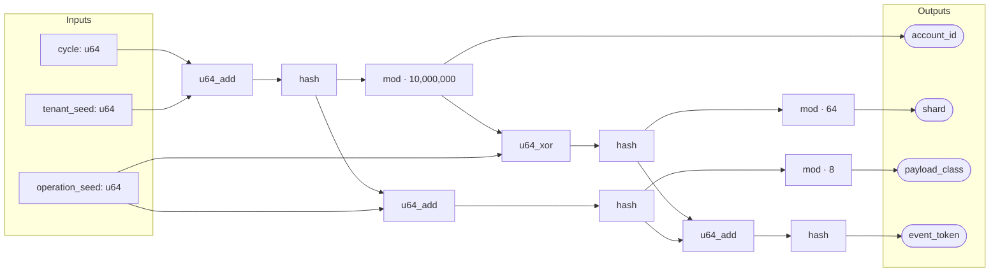
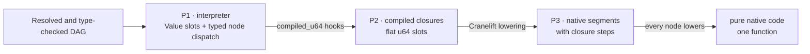

# Engine-ladder performance

Polydat can execute one statically typed function graph at three progressively
lower-overhead levels, and the benchmark adds a fourth rung, pure native code,
the differential tier behind P3. This page makes that claim concrete with a checked-in
graph, a semantic-equivalence test, and a focused Criterion benchmark.

The benchmark is intentionally small enough to understand. It is not a claim
that every Polydat graph will have the same ratios: node mix, graph shape,
invalidation, requested outputs, host ISA, and compiler version all matter.

## The graph

The example models four fields derived for a workload operation. A changing
`cycle` is combined with tenant and operation seeds. Shared entropy fans out
into identity, routing, payload, and final event-token paths:



The graph is useful as a first performance example because it contains three
inputs, four outputs, fan-out, fan-in, shared intermediate products, and eleven
non-trivial nodes while remaining readable. Every wire is `u64`, and every node
has P1 semantics, a P2 compiled closure, and a P3 lowering. P3 therefore cannot
silently fall back while this benchmark is being assembled.

The exact source is
[`examples/engine_ladder.polydat`](../../examples/engine_ladder.polydat):

```polydat
input cycle: u64
input tenant_seed: u64
input operation_seed: u64

seeded_cycle := u64_add(cycle, tenant_seed)
identity_entropy := hash(seeded_cycle)
account_id := mod(identity_entropy, 10000000)

route_seed := u64_xor(account_id, operation_seed)
route_entropy := hash(route_seed)
shard := mod(route_entropy, 64)

payload_seed := u64_add(identity_entropy, operation_seed)
payload_entropy := hash(payload_seed)
payload_class := mod(payload_entropy, 8)

token_seed := u64_add(route_entropy, payload_entropy)
event_token := hash(token_seed)
```

## One graph, three execution levels

The ladder changes the representation and dispatch cost, not the graph's typed
contract:



| Level | Construction used by this benchmark | Timed execution |
| --- | --- | --- |
| P1 | `JitMode::Off` plus `PolydatAssembler::compile()` | Set three typed inputs and demand-pull four pre-resolved outputs through the interpreter. |
| P2 | `try_compile_raw()` | Copy three coordinates, execute all compiled closures over flat slots, then read four pre-resolved slots. |
| P3 | `try_compile_jit_raw()` | Copy the same coordinates, run the native segments and closure steps over the shared slots (on this graph, one segment), then read the same four slots. |
| pure | `try_compile_pure_jit_raw()` | Copy the same coordinates, call the one generated native function, then read the same four slots. |

The P2, P3, and pure `raw` variants are deliberate. Every cycle changes the driving
input and all four outputs are consumed, so the test isolates execution-level
overhead without mixing in provenance strategies. Production `JitMode::Auto`
instead keeps P1 as the semantic host and embeds eligible P3 cones.

## Measurement contract

One Criterion iteration means one complete logical cycle:

1. Increment `cycle`; keep the two seed inputs stable.
2. Supply all three inputs.
3. Evaluate the eleven graph nodes.
4. Consume `account_id`, `shard`, `payload_class`, and `event_token`.

Graph parsing, validation, compilation, JIT code generation, and output-name
resolution happen before timing. Criterion reports both time per cycle and
cycles per second. The benchmark uses a two-second warm-up, three-second
measurement window, and 60 samples per level.

Before comparing timings, the integration test evaluates boundary and ordinary
input cases and requires P2, P3, and pure native code to return exactly the
same four `u64` values as P1. It also checks all bounded outputs.

## Local reference result

The following run was recorded on 2026-09-14. Each interval is Criterion's
reported confidence interval; the middle value is the point estimate. Because
one benchmark element is one complete graph cycle, `Melem/s` is reported here as
million cycles per second.

| Level | Time per cycle | Throughput | Speed relative to P1 |
| --- | ---: | ---: | ---: |
| P1 interpreter | 322.25 ns `[322.13, 322.38]` | 3.103 M cycles/s `[3.102, 3.104]` | 1.00× |
| P2 closures | 71.006 ns `[70.958, 71.057]` | 14.083 M cycles/s `[14.073, 14.093]` | 4.54× |
| P3 native segments | 25.347 ns `[25.332, 25.364]` | 39.452 M cycles/s `[39.426, 39.475]` | 12.71× |
| pure native code | 14.212 ns `[14.181, 14.250]` | 70.363 M cycles/s `[70.174, 70.517]` | 22.67× |

For this graph, moving from typed node dispatch to flat-slot closures removes
most of the execution cost. Native lowering then provides another 2.80× over
P2. Every node of this graph lowers, so P3 is one native segment; pure native
code is the same function without a clean flag per step, and the two rungs
differ in that bookkeeping and in how each keeps a nondeterministic node or a
side channel current. These are end-to-end cycle measurements, including
input copies and four output reads, rather than isolated instruction timings.

Reference environment:

- Intel Xeon Platinum 8375C at 2.90 GHz, 64 cores and 128 logical
  processors across two sockets;
- Linux 6.8.0-1047-aws, `x86_64-unknown-linux-gnu`;
- Rust and Cargo 1.98.0, optimized `bench` profile with thin LTO;
- Cranelift 0.116.1, the 0.3.0 release tree at commit b3a7fa5; and
- 60 samples per level after a two-second warm-up, with a three-second
  measurement window, on an otherwise idle machine.

This graph uses scalar `u64` operations. The P3 result demonstrates native
machine-code lowering, not SIMD auto-promotion.

The previous record, from 2026-09-10 on an AMD Ryzen 9 3900X under Windows,
read 441.83 ns, 121.05 ns, 76.104 ns, and 75.942 ns for P1, P2, P3, and
pure native code, with P3 at 5.81× P1. The machine changed between the
records, so the absolute times are not comparable; the ratios moved for
reasons in the code as well. Since 2026-09-13 every node with a kit lowers
natively, native code that calls no helper runs without the failure-catching
trampoline, and the hybrid kernel schedules its constant steps first. On the
earlier machine, native timings drifted between 57 ns and 76 ns across runs
in one day. Compare rungs within one run, not runs across days or machines.

## The tile ladder

A second ladder, `benches/tile_render.rs`, renders one JSON document, the
reading of the toy test definition, through the same four levels in five
cases: the reading's wires with no tile, a one-hole floor, the document
without its projection, the document as written with a four-tuple
projection, and a twenty-hole variant. Its design, its baseline, and the
measurement after each step of the rendering work are recorded in
[Native Tile Rendering](../design/tile_native_rendering.md) §6.

The current record, taken on 2026-09-14 in the same session as the engine
ladder above, on the same machine and tree. Each entry is Criterion's point
estimate in nanoseconds per cycle. Pure native code now runs every case,
since every node lowers; when the tile work was measured it ran the
one-hole case alone.

| Case | P1 interpreter | P2 closures | P3 native segments | pure native |
| --- | ---: | ---: | ---: | ---: |
| `reading` | 1490 | 1145 | 1073 | 1049 |
| `one_hole` | 190 | 140 | 141 | 136 |
| `flat` | 2389 | 1518 | 1401 | 1365 |
| `projected` | 3732 | 2906 | 2675 | 2651 |
| `wide` | 4000 | 2877 | 2349 | 2312 |

Taking each case less `reading`: the seven-hole `flat` document costs about
330 ns on P3 and 900 ns on P1, under 50 ns and 130 ns per hole; the
twenty-hole `wide` document costs 1.3 µs on P3, 64 ns per hole; and the
four-tuple projection adds 1.3 µs on P3 over `flat`, about 320 ns per tuple.
The last paired run on the earlier machine, on 2026-09-11, put `projected`
at 7949 ns on P1, 7104 on P2, and 6693 on P3, from 18810, 17479, and 14851
before the work began. The same drift caveat applies: compare rungs within
one run.

## Run it locally

Run the semantic gate first:

```sh
cargo nextest run -p polydat --test suite engine_ladder_equivalence::
```

Then run only the focused performance target:

```sh
cargo bench -p polydat --bench engine_ladder
```

The tile ladder runs the same way:

```sh
cargo bench -p polydat --bench tile_render
```

The P3 and pure cases require the default `jit` feature. A no-default-features
run still builds and measures P1 and P2:

```sh
cargo bench -p polydat --no-default-features --bench engine_ladder
```

The benchmark source is
[`benches/engine_ladder.rs`](../../benches/engine_ladder.rs), and its cross-engine
gate is
[`tests/engine_ladder_equivalence.rs`](../../tests/engine_ladder_equivalence.rs).

## Interpreting results

Use the absolute times to estimate whether graph execution matters in the
surrounding workload. Use the ratios to understand dispatch and representation
overhead for this topology on the tested machine. Do not treat a single-machine
ratio as a universal constant.

This benchmark does not include graph compilation latency, partially clean
graphs, selective output pulls, mixed P1/P3 cones, SIMD auto-promotion, strings
or reference-backed values, host I/O, or application-level scheduling. Those
are separate questions with different cost centers. See the detailed
[engine design](../design/engines.md) and [SIMD ISA and auto-promotion
study](../design/simd_isa_autopromotion.md) for those execution modes.
