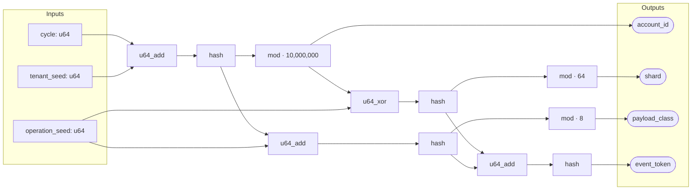
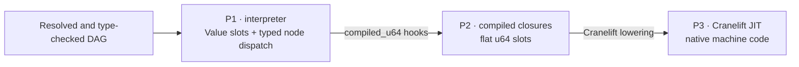

# Engine-ladder performance

Polydat can execute one statically typed function graph at three progressively
lower-overhead levels. This page makes that claim concrete with a checked-in
graph, a semantic-equivalence test, and a focused Criterion benchmark.

The benchmark is intentionally small enough to understand. It is not a claim
that every Polydat graph will have the same ratios: node mix, graph shape,
invalidation, requested outputs, host ISA, and compiler version all matter.

## The graph

The example models four fields derived for a workload operation. A changing
`cycle` is combined with tenant and operation seeds. Shared entropy fans out
into identity, routing, payload, and final event-token paths:



The graph is useful as a first performance example because it contains three
inputs, four outputs, fan-out, fan-in, shared intermediate products, and eleven
non-trivial nodes while remaining readable. Every wire is `u64`, and every node
has P1 semantics, a P2 compiled closure, and a P3 lowering. P3 therefore cannot
silently fall back while this benchmark is being assembled.

The exact source is
[`examples/engine_ladder.polydat`](../examples/engine_ladder.polydat):

```polydat
input cycle: u64
input tenant_seed: u64
input operation_seed: u64

seeded_cycle := u64_add(cycle, tenant_seed)
identity_entropy := hash(seeded_cycle)
account_id := mod(identity_entropy, 10000000)

route_seed := u64_xor(account_id, operation_seed)
route_entropy := hash(route_seed)
shard := mod(route_entropy, 64)

payload_seed := u64_add(identity_entropy, operation_seed)
payload_entropy := hash(payload_seed)
payload_class := mod(payload_entropy, 8)

token_seed := u64_add(route_entropy, payload_entropy)
event_token := hash(token_seed)
```

## One graph, three execution levels

The ladder changes the representation and dispatch cost, not the graph's typed
contract:



| Level | Construction used by this benchmark | Timed execution |
| --- | --- | --- |
| P1 | `JitMode::Off` plus `PolydatAssembler::compile()` | Set three typed inputs and demand-pull four pre-resolved outputs through the interpreter. |
| P2 | `try_compile_raw()` | Copy three coordinates, execute all compiled closures over flat slots, then read four pre-resolved slots. |
| P3 | `try_compile_jit_raw()` | Copy the same coordinates, call the generated native function, then read the same four slots. |

The P2 and P3 `raw` variants are deliberate. Every cycle changes the driving
input and all four outputs are consumed, so the test isolates execution-level
overhead without mixing in provenance strategies. Production `JitMode::Auto`
instead keeps P1 as the semantic host and embeds eligible P3 cones.

## Measurement contract

One Criterion iteration means one complete logical cycle:

1. Increment `cycle`; keep the two seed inputs stable.
2. Supply all three inputs.
3. Evaluate the eleven graph nodes.
4. Consume `account_id`, `shard`, `payload_class`, and `event_token`.

Graph parsing, validation, compilation, JIT code generation, and output-name
resolution happen before timing. Criterion reports both time per cycle and
cycles per second. The benchmark uses a two-second warm-up, three-second
measurement window, and 60 samples per level.

Before comparing timings, the integration test evaluates boundary and ordinary
input cases and requires P2 and P3 to return exactly the same four `u64` values
as P1. It also checks all bounded outputs.

## Local reference result

The following run was recorded on 2026-08-21. Each interval is Criterion's
reported confidence interval; the middle value is the point estimate. Because
one benchmark element is one complete graph cycle, `Melem/s` is reported here as
million cycles per second.

| Level | Time per cycle | Throughput | Speed relative to P1 |
| --- | ---: | ---: | ---: |
| P1 interpreter | 398.66 ns `[392.63, 405.15]` | 2.508 M cycles/s `[2.468, 2.547]` | 1.00× |
| P2 closures | 93.855 ns `[92.307, 95.470]` | 10.655 M cycles/s `[10.475, 10.833]` | 4.25× |
| P3 native | 45.923 ns `[45.517, 46.374]` | 21.776 M cycles/s `[21.564, 21.970]` | 8.68× |

For this graph, moving from typed node dispatch to flat-slot closures removes
most of the execution cost. Native lowering then provides another 2.04× over
P2. These are end-to-end cycle measurements, including input copies and four
output reads, rather than isolated instruction timings.

Reference environment:

- AMD Ryzen 9 3900X, 12 cores and 24 logical processors;
- Windows NT 10.0.26200.0, `x86_64-pc-windows-msvc`;
- Rust and Cargo 1.96.0, optimized `bench` profile;
- Cranelift 0.116, repository revision `df4cded` plus the benchmark changes
  documented on this page; and
- 60 samples per level after a two-second warm-up, with a three-second
  measurement window.

This graph uses scalar `u64` operations. The P3 result demonstrates native
machine-code lowering, not SIMD auto-promotion.

## Run it locally

Run the semantic gate first:

```text
cargo test -p polydat --test engine_ladder_equivalence
```

Then run only the focused performance target:

```text
cargo bench -p polydat --bench engine_ladder
```

The P3 case requires the default `jit` feature. A no-default-features run still
builds and measures P1 and P2:

```text
cargo bench -p polydat --no-default-features --bench engine_ladder
```

The benchmark source is
[`benches/engine_ladder.rs`](../benches/engine_ladder.rs), and its cross-engine
gate is
[`tests/engine_ladder_equivalence.rs`](../tests/engine_ladder_equivalence.rs).

## Interpreting results

Use the absolute times to estimate whether graph execution matters in the
surrounding workload. Use the ratios to understand dispatch and representation
overhead for this topology on the tested machine. Do not treat a single-machine
ratio as a universal constant.

This benchmark does not include graph compilation latency, partially clean
graphs, selective output pulls, mixed P1/P3 cones, SIMD auto-promotion, strings
or reference-backed values, host I/O, or application-level scheduling. Those
are separate questions with different cost centers. See the detailed
[engine design](design/engines.md) and [SIMD ISA and auto-promotion
study](design/simd_isa_autopromotion.md) for those execution modes.
